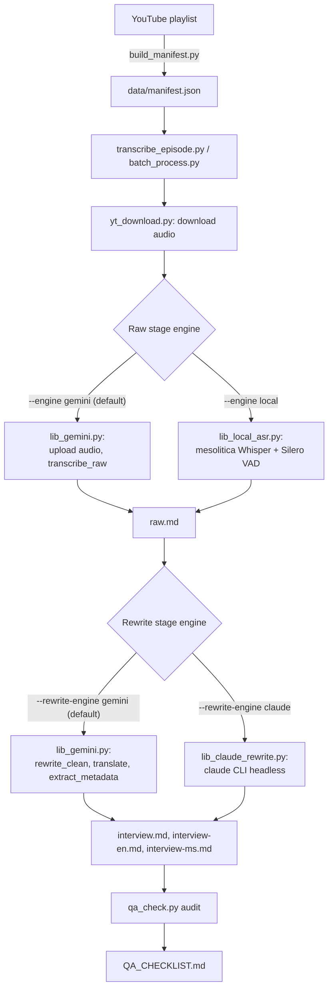

# Architecture

How an episode goes from a YouTube URL to four transcript files: the models and tools
in the stack, how to set it up and run it, and how the output gets verified.

This file describes the stack **as it currently stands**. Every failure I hit while
building it is in [ENGINEERING_LOG.md](ENGINEERING_LOG.md),
numbered `1.x` for the transcription stage and `2.x` for the rewrite stage. References
below of the form "1.17" point there.

## Pipeline



Each episode goes through two independent stages, and each stage can run on either
of two engines:

| Stage | Default engine | Fallback engine | Flag |
|---|---|---|---|
| Raw transcription | Gemini (audio in, transcript out) | Local ASR (`mesolitica/malaysian-whisper-medium-v2`) | `--engine local` |
| Rewrite, translate, metadata | Gemini (chunked text calls) | Claude CLI (`claude -p`, headless) | `--rewrite-engine claude` |

The two stages are split on purpose: a failure partway through the slow,
audio-dependent raw stage never loses work from the (comparatively fast) rewrite
stage, and the two stages turned out to need different fallbacks for different
reasons (see below).

## The stack

| Job | Tool | Why this one |
|---|---|---|
| Playlist and metadata | `yt-dlp` via `build_manifest.py` | Also the source of every episode description, which settles guest names (1.20) |
| Audio download | `yt-dlp` + `bgutil` PO-token server + Node | The only client/format combination YouTube still serves (see setup) |
| Raw transcription (default) | Gemini `gemini-3.7-flash` | Transcribes and diarizes in one pass; handles a 3.5hr episode inside the 65k output limit (1.4) |
| Raw transcription (fallback) | `mesolitica/malaysian-whisper-medium-v2` + Silero VAD | Malay-specific; runs offline when Gemini is unavailable or billing-blocked (1.2, 1.15) |
| Speaker labels, fallback path | `pyannote.audio` 3.1 + forced alignment | Local ASR has no diarization of its own. Unreliable on some episodes -- see Known limitations |
| Rewrite / translate / metadata (default) | Gemini, chunked text calls | |
| Rewrite / translate / metadata (fallback) | `claude` CLI, headless (`claude -p`) | Uses an existing Claude Code seat rather than an API key (2.1) |
| Ground truth for verification | YouTube auto-captions (`audio/<video_id>.ms.vtt`) | Free, already downloaded, and they cover the full runtime (1.11) |
| Second, independent recording | `@mediarakyat` re-uploads of the same episodes | Their captions are generated separately, so a finding can be confirmed without reusing the same caption run. They also supplied captions for two episodes that had none. They do not cover ep03-14 (1.16) |
| Timing sanity | `check_timestamp_drift.py` | Head-phrase match against captions (1.23) |
| Content-loss detection | `check_caption_coverage.py` | 4-gram coverage, starts from the audio (1.25) |
| Everything else | `qa_check.py` into `QA_CHECKLIST.md` | Runs every known failure signature; verdicts persist in `data/qa_reviewed.json` (1.21) |

Hardware: one RTX 2070 (8GB). A second GTX 970 in the same machine is too old for the
CUDA builds used here, so always set `CUDA_VISIBLE_DEVICES=0` (1.3).

**Episode tags are ambiguous and the tools used to resolve them wrongly.** Both shows have
an ep01 through ep06, and they are different episodes; every tool picked its match with
`[0]`, silently taking whichever the manifest listed first, and all six of those tags are in
the rewrite backlog. Use `common.resolve_tag`, which raises with the candidates listed, and
disambiguate with `ep03:bakar` / `ep03:berhenti`. `splice_gap.py` still carries the old
pattern (2.3).

## One-time setup

Requires Python 3, Node.js, ffmpeg, and a `GEMINI_API_KEY`. The local ASR fallback
additionally needs `HF_TOKEN` for pyannote.

YouTube blocks most `yt-dlp` client/format combinations behind PO tokens, SABR-only
streaming, or DRM. The working combination is the `web_embedded` client, a locally-run
PO-token server, and Node.js for JS challenge solving.

```bash
pip install -r requirements.txt

# Build the PO token server once
git clone https://github.com/Brainicism/bgutil-ytdlp-pot-provider ~/bgutil-ytdlp-pot-provider
cd ~/bgutil-ytdlp-pot-provider/server && npm ci && npx tsc

# ffmpeg is required to remux yt-dlp's raw DASH audio fragments into a valid
# container; without it, Gemini's Files API rejects the upload outright.
winget install Gyan.FFmpeg
```

`scripts/yt_download.py` starts the PO token server automatically if it isn't already
running, and passes `--ffmpeg-location` explicitly (falling back to the winget install
path if `ffmpeg` isn't on `PATH`).

Uploads must force the mime type to `audio/mp4`: the SDK auto-detects `.m4a` as
`video/m4a`, which Gemini's backend silently fails to process (no video track).
`scripts/lib_gemini.py`'s `upload_audio()` handles this.

**Environment variables on Windows.** `HF_TOKEN`, `SPEECHMATICS_API_KEY` and
`GEMINI_API_KEY` are persisted at User scope, but a fresh shell doesn't always
inherit them, and re-persisting appears to work then fails again next session. Read
them from the user environment inside the script, or set them per-run:

```powershell
$env:HF_TOKEN = [Environment]::GetEnvironmentVariable('HF_TOKEN','User')
```

## Running

```bash
# Refresh the episode manifest from the playlist (only episodes >= 1 hour)
python scripts/build_manifest.py

# Process one episode, or everything not yet done (oldest first)
python scripts/transcribe_episode.py <video_id>
python scripts/batch_process.py

# Same, but with either stage on its fallback engine
python scripts/batch_process.py --engine local
python scripts/batch_process.py --rewrite-engine claude

# Audit every episode for known failure signatures, writes QA_CHECKLIST.md
python scripts/qa_check.py
```

### Repair tools

For an episode that's missing content or badly mistimed. **Run the alignment first.**
Establish ground truth before you cut any audio. That is the lesson of 1.18 and 1.24,
and I wasted two transcription runs learning it.

```bash
# Where does each block's text ACTUALLY occur in the audio?
python scripts/align_blocks.py ep48
python scripts/block_origin_map.py ep48

# Replace only the damaged middle, keeping the verified head and tail verbatim
python scripts/splice_gap.py ep48 --clip-start 8500 --keep-until 8960 --gap-from 8960 --gap-to 11071 --tail-from 8966

# Text is fine, clock is wrong: move the timestamps to where the caption says the text
# is, touching nothing else. Needs align_blocks.py first. Dry run by default (1.42)
python scripts/retime_blocks.py ep61
python scripts/retime_blocks.py ep61 --write

# One person's continuous speech arrives as several turns, because the diarizer cuts at
# PAUSES not speaker changes: ep41 had "[2:53:13] Rafizi ... / [2:54:43] Rafizi: Aku /
# [2:54:44] Rafizi: orang cakap pasal Climate change". Merges same-NAMED-speaker runs, and
# folds an unknown backchannel turn ("Hmm", "Hehe") into the named turn before it. Two
# consecutive `Speaker ?` turns are NOT merged -- that would assert one unidentified
# person where nobody claimed one (2.6)
python scripts/merge_same_speaker.py
python scripts/merge_same_speaker.py --write

# Free the derived scratch: 8.2 GB of decoded WAVs that ffmpeg rebuilds on demand, plus
# gate backups and frame caches. Never touches audio/*.m4a or audio/*.vtt (both sources),
# never touches a git-tracked file, and refuses to run while a gate is mid-flight
python scripts/cleanup_scratch.py
python scripts/cleanup_scratch.py --write

# Re-extract an episode's `topics:` and keep it only if it covers more of the episode's
# own YouTube chapter markers. The metadata prompt used to say nothing about topics, so
# five episodes carried ONE line for three hours. Coverage decides, not line count (2.8)
python scripts/gate_topics.py --report
python scripts/gate_topics.py ep35 --write
bash scripts/gate_topics_batch.sh --all

# Put every frontmatter list item back on one line. yaml.dump wrapped at 80 chars and the
# regex readers stop at the first continuation, so 24 episodes' topic lists were silently
# truncated -- ep11's twelve read as three (2.8)
python scripts/normalize_frontmatter_lists.py --write

# Speaker labels that appear in interview*.md but never in raw.md
python scripts/label_drift_audit.py

# A turn marker buried mid-paragraph inside another speaker's block, so the words after
# it publish under the wrong name. Also drops a leading label holding NO words, which is
# a diarizer segment the ASR returned nothing for. ep53 hid six of these plus four
# wordless labels, one of them a whole run-sheet segment publishing as Rafizi (2.6)
python scripts/split_inline_turns.py
python scripts/split_inline_turns.py ep53 --write

# Correct ASR-garbled proper nouns from a reviewed map, one entry per owner decision.
# NOT a majority-vote normaliser: the majority spelling is wrong for Fuziah Salleh and
# right for Akmal Saleh, in the same corpus (2.5). Re-run after any gate batch, which
# copies its own output back over the episode directory
python scripts/fix_proper_nouns.py
python scripts/fix_proper_nouns.py --write

# Remove the Whisper subscribe-boilerplate hallucination, `Sila berasa bebas untuk
# menyukai, melanggan, ... lajur Der Spiegel dan Diandian`, a sentence nobody on the show
# says. Only the SPAN goes, never the enclosing sentence: it lands mid-sentence inside real
# speech. A span is deleted only if every word in it comes from the hallucination's own
# lexicon, which is what refuses a pattern that has drifted into real speech or stopped
# mid-word. `Jangan lupa untuk melanggan` is a REAL host plug and must survive (2.9)
python scripts/remove_asr_boilerplate.py
python scripts/remove_asr_boilerplate.py --write

# Name the `Speaker N` labels the rewrite left in the PUBLISHED files, using raw.md as
# the key. Dry run by default; it prints the agreement it found and refuses anything a
# literal trace of the turn's opening clause does not confirm (1.40).
python scripts/name_published_placeholders.py
python scripts/name_published_placeholders.py ep54 --apply

# Does a transcript cover the whole episode, measured per 5-minute window against the
# YouTube caption track? A WHOLE-FILE word count cannot answer this: gemini-3.8-flash's
# ep62 transcript stopped 30 minutes early and still scored 1.10x the captions, because it
# was 26% more verbose than they are over the part it did cover, which paid for the hole.
# ep61's reviewed raw.md scores 1.11, so the two are indistinguishable by that number. The
# engine's own timestamps are no use either -- this one wrote "[3:55:22] [end of audio]"
# and read as 100% covered (2.10)
python scripts/check_content_coverage.py ep62
python scripts/check_content_coverage.py --raw data/_gem38_<id>/raw.md ep62
python scripts/check_content_coverage.py --all

# Regenerate a rewrite into a sandbox and keep it ONLY if it measures better than what
# is already there, on completeness, Malay density, generic-label count, attribution
# agreement with raw.md, and whether any speaker raw.md names reaches no published file at
# all. A re-run is a coin flip -- ep61 gave 24/32/63/39% on identical input -- so
# regenerate_rewrites.sh overwriting in place is not safe on an episode whose rewrite is
# merely imperfect (2.3). The last two axes were each added after the gate restored a worse
# incumbent: percentages could not see a fixed label, then could not see a lost cast member
# -- ep61's Farhan (Pa'an) speaks once, for 16s, in 2h54m, so dropping him moved the score
# by less than the tolerance. Every axis that raises a flag needs a veto (ATTRIBUTION_PASS.md)
python scripts/gate_rewrite.py ep02:berhenti --score-only
python scripts/gate_rewrite.py ep02:berhenti --tries 2
```

For an episode whose speakers may be named wrongly. **Confirm against the audio before
renaming anyone.** A whole-episode mislabel is invisible from inside that episode, so
text evidence alone is not enough (1.27).

```bash
# Which label is really Rafizi? Voiceprints, no LLM involved
python scripts/verify_speaker_voiceprint.py --all-suspect

# Is one label hiding two voices?
python scripts/verify_speaker_voiceprint.py --episodes ep42 --per-block "Zikri Kamarulzaman"

# No labels at all, because diarization collapsed? Score the blocks, not the clusters
# (1.31) -- mean similarity says who a block mostly is, and the agreement between a
# block's own samples says whether it is one voice at all.
python scripts/verify_speaker_voiceprint.py --episodes ep45 --per-block Rafizi

# Apply the rename. A swap needs a single pass, which is the whole point of this tool
python scripts/relabel_speakers.py ep36 "Cincong=Rafizi" "Rafizi=Cincong" --dry-run

# When both methods above have run out: one HTML page of every unresolved numbered
# cluster, each linked into the video 6s early with the turn either side for context.
# Prints no guess, because text adjacency does not carry direction (2.6)
python scripts/adjudicate_speakers.py

# A co-host buried inside a long block labelled Rafizi. Two text signals, both independent
# of the label under suspicion: a vocative "YB" (never Rafizi, he IS the YB) and run-sheet
# phrasing. Locates the SECOND to look at, via word-level caption timings.
# CAVEAT (2.6): it windows each block as [start, next_block_start), so it under-scans when
# a block's words run past the next block's timestamp. That false negative is why ep41's
# buried question survived a pass with this tool -- fix the timing first
python scripts/cohost_candidates.py ep41 ep53 --min-block=120
```

Timestamps for a turn split out of a long block come from the episode's caption track
(`audio/<video_id>.ms.vtt`), not from reusing the parent block's stamp. ep41's split sits at
95% of a 13,756-character block, where reuse would have been 17 minutes early. The caption
`>>` markers are NOT a speaker-change signal, however much they look like one (2.6).

After relabelling `raw.md`, regenerate the rewrites rather than renaming inside them:
`interview*.md` label sets drift from `raw.md` in ways no mapping can express (1.27).

**Every regeneration needs the same three steps after it.** The metadata stage rewrites
`hosts`/`guests` from scratch and reverts speaker labels to `Rafizi Ramli` each time, so
skipping these silently undoes work:

```bash
python scripts/rebuild_roster.py --write            # hosts/guests, incl. presence calls
python scripts/normalize_speaker_labels.py --write  # short-name convention in the bodies
python scripts/build_episode_index.py               # episode tables in both READMEs
python scripts/qa_check.py                          # then read QA_CHECKLIST.md
```

Regenerate several episodes as separate OS processes rather than sequentially or in
threads: six episodes took 33 minutes in parallel against 26 minutes *each* in series, and
`lib_claude_rewrite` keeps the current model in module-level state that would interleave.

```bash
python -c "import sys; sys.path.insert(0,'scripts');   from transcribe_episode import process_rewrite;   process_rewrite('KYJN-OhRdEA', force=True, rewrite_engine='claude')"
```

The full restoration recipe, including how speakers in newly-transcribed stretches get
named from the episode's existing verified labels, is 1.26.

## Cross-checks: what catches what

No single check is sufficient. Each one misses something another catches. The history
behind this table is 1.11, 1.14, 1.17, 1.23 and 1.25.

| Check | Catches | Blind to |
|---|---|---|
| `coverage` | A transcript ending well before the episode does | Loss backfilled by duplicate or displaced blocks, which leaves the timeline looking full |
| `content-loss` | Gaps between timestamps too large for the text at their start | The same backfill, plus loss papered over with `[silence]` markers (1.25). Also cannot tell absent content from content filed under the wrong second, so `caption-coverage` overrules it -- see `hole-is-mistimed` below (1.42) |
| `hole-is-mistimed` | Not a check of its own: what `content-loss` becomes when caption coverage confirms the text is all present and only the timing is wrong (1.42) | Episodes whose coverage verdict is `inconclusive` or stale, where the loss reading stands unchallenged |
| `caption-coverage` | Audio whose speech has no counterpart anywhere in the transcript | Episodes whose wording diverges from the captions throughout, which report `inconclusive` rather than clean |
| the video itself | Guest and stand-in-host names, from on-screen lower-third graphics and thumbnails, produced by the people in the room (1.28) | Anyone never captioned on screen |
| `drift` | Blocks timestamped far from where they were actually spoken | Sparse or wrong-language captions. Isolated false phrase-locks still need adjudicating by hand |
| `duplicates` | The same block re-emitted at another timestamp | Near-duplicates differing by a word |
| `backward-jump` | Timestamps that decrease | Forward-only corruption |
| `round-timestamps` | Timing invented rather than measured, i.e. a fabricated outline (1.18) | A fabrication that copies plausible timings |
| `wall-of-text` | Turns merged into one undifferentiated block | Genuine long monologues, excluded on purpose by counting inline speaker markers |
| `truncated` | A rewrite disproportionately short against its raw transcript | Condensation that stays above the ratio |
| `language` | A mixed-language transcript silently rewritten to English only | |
| `speaker-attribution` | Most of an episode credited to someone other than Rafizi (1.27) | Wrong names on the *smaller* labels, and legitimately guest-led episodes, which it reports for judgement rather than assuming |
| `generic-label`, `published-placeholder`, `label-mismatch`, `duplicate-turn`, `malay-loss`, `inline-turn-marker` (`check_published.py`) | Defects in the three `interview*.md` files a reader actually sees (1.39) | Anything the rewrite got wrong that still reads as well-formed |
| `raw-unnamed-speaker` | A real person `raw.md` never names, on a role word like `Moderator` or `Audience` that `placeholder-label` misses because it only matches numbered clusters. Split out of `generic-label`, which was blaming the rewrite for 351 turns it had faithfully copied (2.4) | Nothing yet -- but the fix is speaker attribution, not regeneration, so it will not clear from a rewrite batch |
| `unlabelled-turn` | A published turn with NO speaker label at all, its first sentence bolded where the label belongs. `TURN_RE` requires the colon, so this was invisible to every label check -- and therefore scored BETTER than a generic label, which is how `gate_rewrite.py` came to promote one (2.6) | Nothing yet. Note the CAUSE is upstream: raw.md burying a second speaker inside a named block, which no check finds -- see `cohost_candidates.py`, and note its windowing caveat in 2.6 |
| `unsourced-figure` (`check_figures.py`) | A figure in the published text with no counterpart in `raw.md` -- a changed digit or a changed scale word, e.g. `8.2 bilion` for raw's `8.2 juta` (1.39) | Figures whose digits are all present but REGROUPED, e.g. raw's `10, RM300` printed as `RM10,300`. Bare years, excluded on purpose |

Every check above the last two rows reads `raw.md`. **`raw.md` is not what anybody
publishes.** Until 1.39 nothing read the `interview*.md` files except for existence, a
length ratio and a Malay-density floor set below anything the corpus could produce, so the
suite reported 0/67 clean while the published text carried thousands of placeholder labels.
When a suite reports clean, ask which file it read.

`caption-coverage` runs in the opposite direction from the others. **It starts from the
audio and asks what the transcript is missing.** Every other check reads the transcript
and asks what looks odd there. Duplicated blocks, displaced blocks and `[silence]`
markers all fill the timeline, and none of them can fake a 4-gram match, which is how
this check caught ep48 (1.25).

Because `caption-coverage` measures content directly, it is allowed to overrule
`content-loss`, which only infers it from a timestamp gap. That inference cannot separate
absent content from content filed under the wrong second, and it reports the alarming
reading of the two -- ep61 claimed 1393s missing while all 175 of its caption buckets
matched (1.42).

**Two caches feed the suite from outside, and a stale one is now dangerous.**
`data/caption_coverage.json` and `data/timestamp_drift.json` hold verdicts computed in an
earlier run, and one of them can suppress a content-loss report. So each entry carries
`raw_sha`, the `common.body_digest()` of the `raw.md` body it was computed from, and
`qa_check.py` drops any verdict whose stamp does not match what is on disk -- unstamped
counts as mismatched. Re-run the two checkers after any batch that rewrites `raw.md`, or
their flags silently vanish from the checklist:

```bash
python scripts/check_timestamp_drift.py     # minutes
python scripts/check_caption_coverage.py    # slower; 4-gram scan of every caption
```

Verdicts live in `data/qa_reviewed.json`, keyed by episode and signature name, so a
reviewed issue stays reviewed instead of being re-investigated every session (1.21).
**A wrong entry there does more harm than no entry at all.** It turns an open question
into a settled answer, so nobody checks again. Only suppress an issue on evidence from
outside the file being reviewed.

## Why a clean exit code isn't enough

This pipeline has produced eight distinct bugs that returned exit code 0 with no
visible error, while quietly corrupting or skipping output: a free-tier quota check
that never matched its target string, a transcript-wiping edge case in fragment
trimming, hallucinated runaway timestamps that satisfied a naive coverage check,
missing paragraph breaks that silently bypassed text chunking, an argument-parsing
bug that made a 17-episode batch process zero episodes, a continuation-loop
hallucination that duplicated whole passages under fabricated timestamps that stayed
within a plausible range (1.6), a retry wrapper that validated
nothing but the absence of an exception, letting a placeholder metadata stub through
as a "successful" result (2.1), and the same validate-nothing-but-the-
exception gap letting Claude silently condense a heavily disfluent chunk instead of
fully rewriting it (2.2). None of them raised an exception.

That's why `scripts/qa_check.py` exists. Run it after every batch, and read
`QA_CHECKLIST.md` rather than the exit code. It checks for all of
the failure signatures found so far: timestamp coverage against episode duration,
wall-of-text blocks with no paragraph breaks, duplicate blocks repeated at different
timestamps, rewrite files disproportionately short against their raw transcript,
leaked model reasoning in place of transcript content, inconsistent turn
formatting, timestamps that drop backward (1.16), content dropped from the middle
of an episode (1.17), and timing invented rather than measured (1.18). It also
cross-references `data/manifest.json` against the `episodes/` folder to flag
episodes that were never processed at all.

The checklist is only ever as good as the checks in it. I reported the corpus as 53/67
clean until I added 1.17 and 1.18, and then two of those "clean" episodes turned out to
be missing 41% and 80% of their content. Treat a clean row as "no *known* signature
fired", and not as verified.

Every output file's frontmatter also records which model actually produced it
(`model:`), and `qa_check.py` flags any file made by one of the fallback chain's
weakest, most degradation-prone models (`gemini-3.1-flash-lite` and the `gemini-2.5`
line) for a closer look, even when the other checks pass. This field is only
populated for episodes (re)processed after it was added: older episodes show no
model line in `QA_CHECKLIST.md` until reprocessed.

## Speaker naming convention

The recurring cast use short (first) names as the speaker label in **every** file,
`raw.md` and all three `interview*.md` rewrites alike: `Rafizi`, `Haziq`,
`Farhan (Pa'an)`, `Iqbal`, `Wan Afiq`. Every other speaker (guests, one-off
panelists) keeps their full name as the label.

The `hosts` and `guests` frontmatter fields carry the **fullest** form of a person's
name, since they are metadata about who took part.

**`hosts` records who took part, not who got a label.** A cast member is often plainly
present and still unlabelled, because a coarse block swallowed his interjections. The
field is metadata about participation rather than a transcript label, so it goes on
dialogue evidence, held to a deliberate bar: direct address ("Haziq, aku cabar kau"), or a
reference to what the person said earlier in *that* episode ("yang Haziq sebut tadi"). A
passing third-person mention is not enough, and absence is recorded just as carefully --
ep46 and ep50 say outright that Haziq was away ("Haziq tak ada so kita cover lain lah"),
which is exactly where the stand-ins appear. The per-episode calls live in
`PRESENT_UNLABELLED` in `scripts/rebuild_roster.py`, each with the line that justifies it.

**A speaker label names the person, so it uses their real name even when the show only
ever uses a nickname.** ep36's guest is called `Cincong` throughout the audio and is
labelled `Lee Chean Chung`. Words spoken inside the dialogue are never touched to match:
that episode keeps its 25 spoken "Cincong" mentions, and so do ep45, ep50 and ep58.
The label says who is talking; the transcript says what they said.

**This changed on 2026-08-28, on the archive owner's call, and it reversed what this
file said before.** The old convention was short names in `raw.md` and full names in
`interview*.md`, which left `Rafizi` and `Rafizi Ramli` both in play as labels for the
same man and made every cross-file comparison need a mapping table. One form
everywhere removes that. If you find older commit messages or code comments
describing the two-form split, they predate this decision.

Three gotchas keep recurring around these labels: a local-ASR redo wipes names that were
already applied, Rafizi sometimes delivers the show's own third-person intro line
himself, and a label found wrong in one episode does not generalise to the others. All
three, with the evidence, are [ENGINEERING_LOG.md 1.29](ENGINEERING_LOG.md#129-three-speaker-label-gotchas-that-keep-recurring).

## Retrying Gemini on a previously-failed episode

Landing on a weak fallback model (e.g. `gemini-3.5-flash`) doesn't always mean the
episode's content triggers `PROHIBITED_CONTENT` on every stronger model: that's
confirmed deterministic for ep13 (see above), but the fallback chain also advances on
plain free-tier quota exhaustion (20 requests/day per model) or a model being
temporarily unavailable, which a standalone single-episode retry (full quota, not
mid-batch) can sidestep entirely. Confirmed on ep53, 2026-08-25: a fresh single-episode
`--engine gemini` retry succeeded (via `gemini-3.6-flash` -> `gemini-3.1-pro-preview` ->
`gemini-3.5-flash` on quota/availability fallbacks, not a content block) and produced a
completely different, much smaller class of error than the original attempt's
~140,000-char repetition-loop degeneration: 14 duplicate blocks from a
continuation-loop hallucination (see `dedupe_raw.py`), not a repetition loop. Worth a
standalone retry before assuming `--engine local` is required, unless the episode has
already shown a *deterministic* content block on retry (ep13's case).

**New duplicate pattern found while fixing ep53's residual duplicates**: after
`dedupe_raw.py` resolved every duplicate group its caption cross-check could confirm,
6 groups remained unresolved (captions didn't cover those phrases). All 6 shared an
exact, systematic pattern: the same content appeared twice with identical MM:SS but a
different hour digit (e.g. `[1:38:29]` and `[2:38:29]`): a continuation-loop
hallucination that re-emitted an already-covered block but mislabeled its hour. Since
one of the 6 pairs was the episode's closing sign-off ("terima kasih... jumpa lagi
minggu depan"), and a sign-off can only be near the true end of a long episode (this
one is 3h0m), narrative logic alone (independent of captions) confirmed the later
timestamp (`2:xx:xx`) was correct in every pair and the earlier one (`1:xx:xx`) was the
fabricated duplicate: the opposite of a naive "keep the first occurrence" heuristic,
which would have been wrong here. Worth checking for this exact hour-shifted pattern
before falling back to manual case-by-case judgment on caption-unresolved duplicates.

**A hand-rolled fix caused its own bug here, worth remembering**: repairing those 6
duplicates via a one-off script that split the body on `"\n\n"` and rejoined the kept
blocks with a single `"\n"` silently collapsed every paragraph break in the whole file
into one undifferentiated block, caught immediately by `qa_check.py`'s wall-of-text
check, not silently shipped, but a reminder that block-splitting logic needs the exact
same separator on the way back out as the way in.

## MAI-Transcribe-2 via Azure: an evaluation path, and its three undocumented limits

Not part of the pipeline. `scripts/transcribe_mai.py` and `scripts/reconcile_mai_speakers.py`
transcribe an episode with Microsoft's MAI-Transcribe-2 into `data/_mai_<video_id>/`, for
comparison against the local ASR. Nothing writes to `episodes/`.

    python scripts/transcribe_mai.py <video_id> --dry-run        # request, chunk plan, cost
    python scripts/transcribe_mai.py <video_id> --extra-phrase FELDA
    python scripts/reconcile_mai_speakers.py <video_id> --matrix

Credentials are `AZURE_SPEECH_KEY` and `AZURE_SPEECH_ENDPOINT`, both User-scope environment
variables that the script also reads from the registry, because a fresh shell does not
inherit them. **The endpoint is not the host the portal shows on its Foundry tab.** That tab
gives `https://<resource>.services.ai.azure.com`, which serves Agents and model inference;
the Speech REST API needs `https://<resource>.cognitiveservices.azure.com`. Only six regions
carry the model (`centralindia eastus northeurope southeastasia westus westus2`) and a
resource elsewhere fails rather than falling back.

**Limit 1: diarization dies above roughly 30 minutes.** Laddered on ep62 audio:

| audio | size | result |
| --- | --- | --- |
| 10 min | 4.8 MB | HTTP 200, 149 phrases, 2 speakers |
| 30 min | 14.4 MB | HTTP 200, 406 phrases, 2 speakers |
| 60 min | 28.8 MB | HTTP 503 `diarization_unavailable` |

The error names its own cause, and it is the diarization sub-service rather than the
transcription. Published ceilings are under 5 hours and 300-500 MB, so the 3h55m 113 MB file
was inside every documented limit. Chunks are therefore 30 minutes.

**Limit 2: leading silence makes a long request return HTTP 500.** ep62 opens with 43
seconds of digital silence, exact zeros, and every request starting there failed
deterministically -- 0-1200s, 0-1790s, 0-1800s, 0-1810s, stream-copied and re-encoded alike
-- while 15-1800s and 30-1800s returned 200 and 0-600s returned 200. Prepending 45 seconds
of silence to a clip that returns 200 makes that same clip return 500, which is the proof
rather than the correlation. So `cut_chunks()` starts each chunk at its first sound less one
second of run-up, measured with `silencedetect`, and adds the trim back onto the offsets. The
opaque 500 on the full file was this, not the 503 above: two different limits, two different
errors, neither documented.

**Chunking costs speaker continuity, and that is what the second script is for.** MAI numbers
speakers per REQUEST, so chunk 3's `speaker 0` is not chunk 0's, and a chunked run refuses to
write `raw.md`. `reconcile_mai_speakers.py` embeds each chunk's clusters from their own speech
spans, groups them across chunks by cosine similarity (single-link, and two clusters of one
chunk never merge), then names each group against the same cast voiceprints
`verify_speaker_voiceprint.py` uses. Groups that come back with the same name are joined
afterwards, which is needed: MAI split Rafizi into two clusters inside ep62's chunk 6, so his
207 minutes arrived as two groups scoring 0.962 and 0.939 against his reference.

Two guards were recalibrated for this granularity, both against measurements rather than
taste. The distinct-speaker floor is now applied PER CHUNK, since a union across eight chunks
hides a single chunk's collapse. The duplicate-text share now counts only turns of 20
characters or more, and a separate check refuses more than 4 identical turns in a row: ep62's
MAI output repeats short backchannels constantly -- 322 turns of "Hmm.", 93 of "Mm." -- which
is 34% of all turns, 0.0% of turns over 20 characters, and no repeated text over 80
characters at all. The loop this guard exists for, ep61's Gemini raw, was long text.

What ep62 measured, MAI against the same audio's local-ASR `raw.md`:

| | local ASR | MAI chunked |
| --- | --- | --- |
| blocks | 184 | 1,613 |
| mean gap between stamps | 76.8s | 8.7s |
| longest gap | 1,259s | 271s |
| words | 26,206 | 29,810 |
| coverage per 5-min window | no holes | no holes |
| Rafizi share of words | 93.4% | 90.7% |

The 93% one-label share is therefore not a diarizer collapse: two independent engines
measure it. `Grand Plaza Kensington`, `FIC London Hotel` and `Koperasi Permodalan FELDA`
survive as bias phrases, the last of which the local ASR never produced at all.

**MAI loses the third host, and the video says so.** `Farhan (Pa'an)` holds 279 words in the
local raw and 94 in MAI's. `frames_at.py` was run on ten regions where the two disagree, with
the three faces first fixed from turns both engines agree on -- Rafizi in black with a
tablet, Haziq in a light blue shirt with a laptop, Farhan in a black "97" hoodie. Eight of
the ten show Farhan on camera mid-speech in a single close shot, so the local raw is right
and MAI folded those words into Rafizi or Haziq: 0:11:48, 1:00:12, 2:27:17, 2:50:13, 3:12:26,
3:37:39, 3:53:51 and 3:54:15. One goes the other way: 3:53:48 "4 jam kau gila kau" is
Rafizi, which MAI got and the local raw split mid-sentence between Haziq and Farhan. The
last, the one-line 3:27:09 interjection, is unresolved -- the camera holds Rafizi through his
own surrounding turn and never cuts, so no frame in the window carries evidence.

The mechanism is visible in MAI's own output. Its chunk-6 cluster `c6s2` holds 22.5 minutes
and contains both Rafizi's reading and Farhan's question at 3:12:26, which is why chunk 6
produced two clusters that both scored as Rafizi (0.962 and 0.939) -- one of them is
contaminated, and a high voiceprint score on a 22-minute cluster cannot see a 15-second
passenger. So MAI's finer granularity is not uniform: `[3:11:35]` is a single 1,000-word turn
with three people's speech in it. What MAI does add is Farhan's backchannels, which the local
raw mostly drops.

**The eleven remaining disagreements, read off the video by a model.**

    python scripts/verify_speakers_video.py 0M5hweswMpE --candidates data/_ep62_todo11.json         --out data/_ep62_video_verdicts.json

`verify_speakers_video.py` muxes the downloaded video with the local audio and sends a
14-second clip per candidate to `gemini-3.8-flash`, with the same three clothing descriptions
used above. 0:11:50 was included as a control because the frames had already been read by
hand; it came back Farhan. Read the `seen` field and not just the verdict -- three of the
five "unclear" answers describe a mouth that is not moving, which eliminates one of the two
candidate speakers and settles the case.

Three labels in ep62's `raw.md` changed as a result, all Haziq to Rafizi: 0:55:54, 1:50:25
and 3:35:00. Each is a block sandwiched between two Rafizi blocks with the boundary falling
mid-sentence, so the local diarizer had invented a boundary rather than heard a speaker
change. The other eight were not applied. Two carry no evidence (a two-shot, and a stamp
still out after the retime), one was not a real disagreement, and five are long blocks where
the clip only covers the head -- 0:36:24 holds Rafizi speaking and then Haziq replying inside
one block, which needs the turn cut and not the label changed.

Beyond those three labels, nothing has been adopted into `episodes/`.

**The third limit: diarization does not fit the gateway's timeout under load.** On 2026-09-10
every request of 15 or 30 minutes returned HTTP 408 after a fixed 122 seconds for four
hours, while a one-minute clip returned in 2 s. Probed apart: 5 minutes WITH diarization took
98 s; 15 minutes WITHOUT took 5 s. The gateway cuts at 120 s and the diarization sub-service
is the part too slow to fit. Nothing downstream uses MAI's per-request speaker ids (the
voiceprint join loses Farhan, and the split tool takes clusters from pyannote and its
reference from the camera), so the mode for the re-cut is:

    python scripts/transcribe_mai.py <video_id> --no-diarization

**Building raw.md from MAI's words** (`mai_camera_raw.py epNN`, ENGINEERING_LOG 2.11): where an
episode has MAI words and a camera reference, this replaces the local-ASR text with MAI's and
labels every word from the camera at its own time; turns of three words or fewer keep MAI's
label, uncovered words fall back to it. It changes the words, so `verify_words_unchanged.py`
does not apply -- the guard is that the output's word sequence equals MAI's, and the file is
read before it is adopted. ep62 is the first episode written this way.

Two guards came with it. A chunk file is reused only if its duration matches the plan --
chunk files are named by index and start, and a 30-minute plan once picked up a 15-minute
`chunk00` left by an earlier run, dropping 900-1800 s of ep61 without any check noticing. And
the verdict refuses a transcript whose last turn ends before 95% of the runtime or that has
more than 300 s between two turns, which is the hole the last-stamp check cannot see.

## Writing the interview files from segments

The shipping path for ep62 (2026-09-10) and for every episode after it; the whole-episode
rewrite in transcribe_episode.py remains for the older files. The source is raw.md itself: ep62's
raw.md is MAI's words under the camera's names (`mai_camera_raw.py`, ENGINEERING_LOG 2.11),
so the interview and `check_figures.py` read the same file.

    cp episodes/.../ep62/raw.md data/_ep62_rewrite_source.md
    python scripts/strip_filler_turns.py data/_ep62_rewrite_source.md --write
    python scripts/segment_episode.py ep62 --raw data/_ep62_rewrite_source.md --out data/_ep62_segments.json
    python scripts/rewrite_segments.py ep62 --only 10 21 26 --stage mixed --tries 1   # bake-off
    python scripts/rewrite_segments.py ep62 --instructions data/_ep62_rewrite/instructions.txt
    python scripts/rewrite_segments.py ep62 --write

`rewrite_segments.py` runs one segment at a time, measures each result (length 0.70-1.50 of
the input, Malay function-word density at least 0.80 of the input, every figure present with
small integers allowed as number words, the speaker set identical to the input's, no stamps,
headings or preamble), keeps a passing segment on disk and retries only the failures. The
English stage must LOSE Malay density (ceiling 0.30) or it did not translate; the Malay stage
must keep it. `--write` refuses while any segment of any stage has no accepted file.
`--instructions` appends owner facts to the prompt, such as ep62's two title corrections.

**The published interview reads like newspaper copy** (owner's rule, 2026-09-10;
`clean_interview.py`, applied inside `--write` and runnable on any episode). Three closed-lexicon
edits: a turn that is only an acknowledgement, grunt or laugh is dropped ("Ya.", "Okey.",
"Hmm."; "2.3 billion." and "Koperasi?" carry information and stay); filler tokens are removed
inside a turn ("Uh,", "Um.", "Aaa", "Eh,") with the next word capitalised when the filler opened
the sentence; a speaker's consecutive turns become one paragraph (`merge_adjacent_turns.py`).
Every removed word must be in the lexicons and the rest is asserted identical. On ep62's
first output: 1,100 turns -> 382, 49 retort turns, 678 filler words. The prompt asks for the
same, so the post-process should have little to do; it is the guarantee, not the method.

**raw.md is the verbatim layer, minus grunts.** `strip_filler_turns.py` runs on raw.md too
(ep62: 1,689 -> 1,145 blocks, all 27,903 content words unchanged): the owner's standing rule
is that grunts, laughs and retorts that add nothing leave even the verbatim file. Answers stay
-- its lexicon has no "Ya", "Okey" or "Betul".

**What ep62 measured (ENGINEERING_LOG 2.12).** Model: Sonnet, at about $0.10 a segment with
lib_claude_rewrite's flags; gemini-flash-lite passed every gate by copying the input 99%
word-for-word and was dropped, Haiku translated the Malay away. 78 segment outputs, all
accepted: 60 on the first try, 9 on a retry, 9 by hand after a person read the printed
figure context (a self-correction, a false start, "tahun 60-an" written as "the 1960s").
Four segments were refused twice because the raw carried a garbled figure and the model
resolved it by guessing a digit; each went back to the owner's ear and raw.md was fixed first.
A guessed figure never passes.

**Why the filler strip is a step and not a regex.** MAI transcribes the backchannels the
local ASR drops, so 527 of ep62's 1,613 merged turns are one grunt each and 426 of those are
Haziq's. They belong in a raw transcript and they are noise in a rewrite source, where they
cut a speaker's argument into a dozen pieces. `strip_filler_turns.py` drops a turn only when
EVERY token in it is in a closed lexicon of vocalisations, so an inline `Uh,` inside a real
sentence is untouched and `Ya`, `Okey`, `Betul` and `Yes` survive as the answers they are. It
counts every non-lexicon word before and after and refuses to write unless the two multisets
match.

**Why segments.** Every cheap model rejected for the rewrite stage failed on length, not on
comprehension: Haiku dropped about half a translation, a local Sailor2 truncated 32% and
invented a claim, Gemini finished 73-82%. At about 1,200 words none of that appears, and a
segment that fails its gate can be retried alone instead of re-running three hours of text.
Boundaries come from the show's own chapter marks in the YouTube description, with long
chapters re-cut at turn boundaries; ep62 gives 29 segments.

**Why a merged transcript.** MAI-Transcribe-2 beats the local ASR on text, turn granularity
and timing, and loses the third host: `Farhan (Pa'an)` gets 94 words from MAI against 279
from the local ASR, and the camera backs the local ASR 8 times out of 10.
`merge_mai_local_labels.py` keeps MAI's words and transplants Farhan's label where the local
raw's words match, matching on words rather than time spans and anchoring the video-verified
regions on a phrase rather than a timestamp.

**What the bake-off found.** `gemini-flash-lite-latest` kept every figure and all the Malay
on all three segments in 6 seconds each; Sonnet kept 17 of 24 figures on one of them, because
it polishes hardest and polishing is what drops a repeated number; `gemini-3.5-flash` lost
figures on two of three; OpenRouter's free `nemotron-3.5-lightning` translated the Malay into
English wholesale (density 0.05), kept 2 figures of 24 and dropped a speaker. Read
ENGINEERING_LOG 1.48 before choosing, because the trade-off is not "flash-lite wins" -- it is
nearly a verbatim copy, so it passes a completeness gate by editing very little.

**Azure Foundry cannot serve text models on the Speech key alone.** It returns
`DeploymentNotFound` until a model is deployed in the portal, so the credit that expires
around 2026-10-07 is unavailable to this stage until then.

## Reading the speaker off the camera

`scripts/camera_speakers.py` builds a speaker reference from the video instead of from
audio. The show cuts to whoever is talking, so the camera is an observer of the answer that
no audio model can be confounded with. Three MIT models do the work: LR-ASD asks whether the
visible mouth matches the audio, YuNet plus SFace ask whose face it is, and PySceneDetect
finds the shot boundaries. Five stages, each resumable: `census`, `cluster`, `gallery`,
`run`, `reference`.

The output is an RTTM plus a **UEM**, and the UEM carries as much information as the RTTM. A
camera-derived reference is certain in some places and blind in others, so scoring a
diarizer where the reference has no opinion measures noise. Report UEM coverage next to any
DER computed against it -- 88% on ep62.

`cluster` stops and writes a contact sheet for a human to look at. Naming a face is the one
step with no independent check, and the standing rule here is that a speaker is never
inferred from text.

Four defects found while building it, each of which yields a plausible wrong answer rather
than an error:

1. **`-ss` before `-i` with `-c:v copy` desyncs every chunk.** Stream-copied video starts at
   the nearest keyframe before the requested time, then resets timestamps to zero, while
   re-encoded audio starts on time. Six frames of offset, fed to a lip-sync model. Fix:
   coarse-seek early, seek accurately on the output, re-encode.
2. **Eyewear splits one person into several face clusters.** Rafizi owns five of ep62's
   eight. Use a multi-vector gallery per person, matched on maximum similarity, not a
   centroid.
3. **No global similarity threshold separates these three.** Within-person minimum 0.35,
   cross-person maximum 0.40. Only nearest-neighbour argmax works.
4. **Greedy label mapping fabricates per-speaker results.** It reported MAI recalling 0% of
   Haziq when MAI had labelled 389 of his 457 seconds correctly. Use maximum-weight
   matching, as DER does.

The measured results are in `MODEL_LANDSCAPE.md`; the method and its validation are in
`ENGINEERING_LOG.md` 1.55.

**Guests, and running more than one episode.** Each episode's tracks go to their own
`data/_camera_tracks_<vid>/` (the `run` stage records the video it belongs to and refuses a
mismatch, because chunk files are named by offset only and a second episode into the same
directory used to reuse the first one's chunks). A face the gallery cannot name still counts
toward the overlap test, so a guest's crosstalk is no longer credited to a host. And
`scripts/guest_gallery.py <epNN>` names a guest's face without a person, only when exactly one
real label in `raw.md` is not in the gallery and one cluster of unidentified faces holds at
least 90% of the unidentified talking seconds; it writes `data/_face_gallery_<vid>.json`
(gitignored, biometric) for `reference --gallery`. ep60: 1,659 of 1,660 seconds, coverage 80%
-> 93%. Anything less clean stops and prints the clusters for a person. The full per-episode
procedure is at the top of `ATTRIBUTION_PASS.md`.

## Known limitations

- **The gap is in block cutting, and on ep62 it is now closed.** Measured against the camera
  reference, the pipeline's unaided output recovered 67% of Haziq's speaking time while
  pyannote's own clusters recovered 85% -- eighteen points lost after diarization, in the
  step that turns clusters into transcript blocks, not in the diarizer and not in naming.
  `scripts/split_mixed_blocks.py` re-cuts those blocks and ep62 now sits at 92%.
  **The other 67 episodes have not been done, and the method has been validated on one
  episode only.** Corpus-level DER hides all of this: Rafizi holds 95.5% of ep62's audio,
  and a continuously tiled transcript scores 0% missed by construction. Read confusion.

- **Turn-level attribution is not solved, and it is the largest open defect.** 341
  published turns of 400+ words across 63 episodes sit under one label, and every checker
  in the suite is green while that is true, because no check reads whether a turn holds two
  voices. The diarizer fails in both directions -- long monologues collapse into one label,
  short interjections get absorbed by whoever is next to them -- so no blanket correction
  works and the labels cannot be used as evidence about themselves.

  `scripts/sense_speakers.py` is the proof of concept, measured against the owner's
  hand-written gold passage in `data/speaker_ground_truth.json`: **83% against `raw.md`'s
  61%, with Rafizi recall lifted from 2/9 to 7/9 and boundary recall from 50% to 100%**.
  It takes boundaries from caption word gaps rather than the diarizer, and names each
  segment on a two-ended voice axis seeded by the `YB` vocative. Every attempt, including
  the two that scored at or below the baseline, is recorded in
  `data/diarization_bakeoff.json`, and
  [ENGINEERING_LOG.md 1.43](ENGINEERING_LOG.md#143-sensing-the-speaker-instead-of-trusting-the-label-measured-against-gold-data)
  has the reasoning.

  **It is not ready to rewrite anything.** The evidence is one passage of 18 turns, so a
  single turn is 5.6%, and the parameters were tuned on it (untuned: 78%). A second
  hand-checked passage is the blocking input. Two limits are already known and measured:
  sub-second backchannels are unreachable, because the embedder needs 0.6s and the three
  turns it misses are the three shortest; and the co-host label cannot seed a reference,
  because 6 of the 8 blocks ep61's `raw.md` calls Haziq measure as Rafizi.


- **5 episodes have a cast member present with no speaker label**: three guests
  (ep02, ep05, ep08) and `Farhan (Pa'an)` in ep39 and ep55. This read 20 until the
  speaker-attribution work of 1.35-1.38, and then read 35 too high for a different reason
  -- `RAW_LABEL` excluded parentheses from the name class, so it could not see
  `Farhan (Pa'an)` in any of the 35 episodes that label him that way (1.39). Coarse blocks absorb
  short interjections, so the speech ends up inside someone else's turn and the leftover
  generic clusters are 0.0-2.4 minutes, too short to carry it. The `hosts` field records
  these people anyway (see the naming convention above); what is still missing is the
  block-level attribution, which needs blocks split at speaker boundaries as ep45's were
  (1.31). **Careful if automating: ep60 contains two different Farhans** -- the co-host,
  and a politician described as "anak emas Dato' Seri Anwar".
- **`interview*.md` speaker labels are still generic in 18 episodes.** 121 turns across
  ep03, ep16, ep37, ep51, ep54 and ep56 were named from `raw.md` by
  `name_published_placeholders.py` (1.40), which renames a `Speaker N` only when a literal
  trace of the turn's opening clause confirms the match at 80%. Role labels (`Host`,
  `Interviewer`, `Hos`) are deliberately out of its scope: measured, they sit at 55-76%
  agreement per turn, so they need the rewrite re-run with the names in the prompt rather
  than a better matcher. The pre-1.40 figure was 2,836 labels across 26 episodes:
  `Host` 963, `Speaker 2` 817, `Speaker 1` 418, `Speaker 3` 216, `Interviewer` 209,
  `Moderator` 83, `Hos` 73, `Speaker` 57. Re-measured with `label_drift_audit.py` on
  2026-08-28; the previous figure of 1,366 across 35 episodes predated the re-cuts.
  9 of those episodes ship a numbered diarizer cluster id straight to the reader
  (`published-placeholder`, 1.39), ep54 for all 97 of its turns.
  The rewrite stage invented these where `raw.md` already carries a real name, so the
  information exists -- it just was not carried across. 558 were resolved on 2026-08-28
  in the six episodes where the mapping was forced (exactly one non-Rafizi speaker in
  `raw.md`, that speaker a known recurring host, and no `Speaker N` among the generics).
  The rest need a person, because two or more candidates fit and guessing would put a
  named person on words that may not be theirs.

  A generic label is vague rather than wrong, which is why this is a limitation and not
  a bug. `scripts/label_drift_audit.py` lists the mismatches, and
  [ENGINEERING_LOG.md 1.30](ENGINEERING_LOG.md#130-why-the-obvious-generic-label-rule-is-wrong)
  records the rule that looks right and is not.


- **Fixed, 2026-08-24**: episodes transcribed via `--engine local` previously had
  no speaker diarization at all: `raw.md` was one undifferentiated stream of
  text, and the rewrite stage had to infer who's speaking purely from context.
  **Confirmed as a real, not just theoretical, problem** before the fix: a
  Gemini audio spot-check on one episode's opening exchange found the
  model-inferred rewrite had folded a real Rafizi Ramli line into a generic
  "Podcast Host" turn: an actual misattributed quote. A cheaper alternative,
  asking Gemini for just a chronological speaker-change list (not a full
  transcript) to merge onto existing local-ASR text, was tried and
  abandoned: this show's speakers change every few seconds, so a speaker-only
  pass needs roughly as many continuation rounds as a full transcript would,
  with no real quota saving.

  **The actual fix**: `scripts/lib_diarization.py`, a pyannote.audio pipeline
  run as a separate acoustic pass on the same audio local ASR already
  transcribes: pure voice-embedding clustering, no LLM involved at all, so
  it's immune to every content-based failure mode found elsewhere in this doc
  (PROHIBITED_CONTENT blocks, fallback-model degradation, and the per-run
  label inconsistency confirmed directly on ep13/ep39, where the same real
  speaker got a different invented name in different Gemini attempts). Output
  is anonymous "Speaker N" labels (numbered by first appearance, consistent
  within an episode since they're real voice clusters). It still needs a
  manual naming pass afterward, same as Gemini's own generic labels do, just
  without the added risk of the label itself drifting between attempts.

  **Chunk-level labeling was itself a real bug, fixed 2026-08-24**: originally
  each up-to-28-second VAD chunk from `lib_local_asr.py` was labeled with
  whichever diarized speaker had the most time overlap with the *whole*
  chunk, so a short interjection from a second speaker inside a longer
  chunk was silently swallowed into the dominant speaker's line, with zero
  trace in the output. Confirmed as a real, not just theoretical, problem via
  direct audio listening on ep30: a 25-second span containing two short
  interjections from a third voice ("Farhan") produced only one Rafizi-Ramli
  line, the interjections nowhere in the transcript. Root cause was NOT
  pyannote's clustering (it correctly detects the second voice at the right
  moments); it was throwing away that resolution by labeling per chunk
  instead of per word.

  Considered and rejected: (1) NVIDIA NeMo / the `whisper-diarization`
  GitHub project's full pipeline: its diarization module still doesn't
  handle overlapping speech either (same gap as pyannote), and re-running ASR
  through `faster-whisper` would mean converting the existing
  `mesolitica/malaysian-whisper-medium-v2` checkpoint to CTranslate2 format,
  a bigger lift for no proven gain over what's already working. (2)
  `ctc-forced-aligner` (the PyPI package `whisper-diarization` itself uses for
  precise word timing): needs a native C++ extension that fails to build on
  this Windows/Python 3.14 setup (`error LNK2001: unresolved external symbol
  PyInit_align_ops`), no prebuilt wheel exists for this platform.

  **What shipped instead**: `scripts/lib_forced_align.py`, using torchaudio's
  official MMS forced-aligner (`torchaudio.pipelines.MMS_FA`): pure Python,
  no native extension, already an implicit dependency via pyannote.audio.
  Each VAD chunk is still transcribed once as a whole (preserves ASR
  quality/context), then the transcript is force-aligned word-by-word against
  that chunk's audio, and each word gets its own speaker label via
  `lib_diarization.label_for_range`. Consecutive same-speaker words are
  grouped back into lines. Numbers and punctuation-only tokens (e.g.
  "RM11,000") have no letters in the aligner's label set (a-z plus apostrophe)
  and get their timestamps interpolated from neighboring aligned words.
  **Needs torchaudio's CUDA build installed explicitly**: the default PyPI
  torchaudio wheel is CPU-only, version-mismatched against torch's own CUDA
  build, and only registers a CPU kernel for the `forced_align` op: moving
  the model to CUDA against that wheel fails outright, not just slower.
  Fixed via `pip install torchaudio==<ver>+cu130 --index-url
  https://download.pytorch.org/whl/cu130` (matching torch's own cu130 build).
  Confirmed on the ep13 redo: ~21s/chunk on the wrong (CPU) wheel vs.
  ~4.5s/chunk after installing the matching CUDA build, a real difference at
  full-episode scale (339 chunks), even though it's still slower than the
  pre-forced-alignment baseline (~2s/chunk) since alignment is genuine added
  work, just a cheap single feed-forward pass rather than autoregressive
  generation.

  **CTC's own length constraint can crash this outright**: forced alignment
  requires the target token sequence to be no longer than the audio's frame
  count. Violated directly on the ep13 redo when one ASR chunk degenerated
  into a repetition-loop hallucination (~140k chars repeated, producing an
  889-token target against a 114-frame emission): `RuntimeError: targets
  length is too long for CTC`, crashing the whole run partway through instead
  of just that one chunk. Fixed in `lib_forced_align.align_words`: on that
  RuntimeError, fall back to one span covering the whole chunk (same as the
  old chunk-level behavior) so the pathological chunk's garbage text still
  comes through and `qa_check.py`'s existing repetition-loop detector can
  flag it exactly as before, instead of the whole redo dying.

  **Residual limitation, not fully solved**: word-level attribution fixed the
  *invisibility* problem (a second speaker's words now reliably show up
  labeled differently), but pyannote's own turn-boundary placement is still
  off by a few hundred milliseconds on split-second interjections, so a word
  or two right at a speaker-change boundary can still land on the wrong
  label. This is close to the practical limit for any turn-based acoustic
  diarizer on genuinely fast back-and-forth speech, not something a
  different tool would cleanly fix, confirmed by testing both the old
  chunk-level and new word-level approaches side by side on the same ep30
  clip. Worth re-checking by ear on episodes with heavy rapid-fire banter,
  same as any diarization output. **Validated as a real net improvement, not
  just a synthetic-test win**: on ep13's full redo, a passage the old
  chunk-level approach had flattened entirely into one continuous "Rafizi
  Ramli" block turned out, on the repo owner's direct audio confirmation, to
  be genuine fast back-and-forth between Rafizi and Haziq, exactly the class
  of previously-invisible content this fix targets.

  Also fixed in the same pass, discovered while testing this:
  - The local ASR call didn't pin `language`/`task` in `generate_kwargs`, so
    this multilingual Whisper checkpoint's auto-detection occasionally
    misfired on short/atypical chunks and silently produced an English
    translation instead of a Malay transcription (confirmed directly on the
    same ep30 test clip). Now pinned to `language="ms", task="transcribe"`.
  - VAD chunking splits audio every ~28s regardless of speaker continuity, so
    one uninterrupted speaker turn spanning multiple chunks used to produce
    several separate output lines with no new information in the extra
    timestamps (confirmed on ep13: 442 lines collapsed to 131 after fixing
    this). `transcribe_raw_local` now merges consecutive same-speaker lines
    across chunk boundaries before writing `raw.md`.

  **ep13 naming pass done, 2026-08-24, redone after the above fixes**: sample
  clips extracted per speaker and confirmed by the repo owner by ear
  (`Speaker 1` = Rafizi Ramli; `Speaker 2` = Haziq Azfar) before applying the
  labels to
  `raw.md` and the three `interview*.md` rewrites: confirm-before-applying
  this way avoids guessing from turn count or content alone.

  Requires a Hugging Face token with access to 3 gated repos (accept terms
  for all three, or the pipeline 403s partway through loading):
  `pyannote/segmentation-3.0`, `pyannote/speaker-diarization-3.1`, and
  `pyannote/speaker-diarization-community-1` (a transitive dependency not
  listed on the model card). **Gated-access propagation lag confirmed
  directly**: the HuggingFace web UI and the `model_info()` API both reported
  access as granted well before the actual file-download (resolve) endpoint
  stopped 403ing; don't trust either of those as proof the pipeline will
  actually load; the only real test is trying the download.
- **Proper nouns are checked by corpus comparison, not by a dictionary.**
  `scripts/check_proper_nouns.py` reports names whose spelling is a near-miss of a form
  used consistently elsewhere, and names the episode's own captions never heard. It
  found and fixed 82 mangled mentions of six public figures on 2026-08-28. Roughly 250
  candidates remain queued for a human.

  An earlier plan here was to validate against Dewan Bahasa dan Pustaka's PRPM
  dictionary via the `malaya` library's `dictionary.keyword_dbp()`. **That was dropped,
  for two measured reasons.** The speech is colloquial and code-switched, so a
  standard-Malay check flags well over 100,000 legitimate tokens (`kan` appears 19,493
  times in the corpus, `tak` 18,961, `lah` 14,042). And it fails on the case that
  matters most: `Cincong`, which concealed a sitting MP's name for months, *is* a valid
  Malay word for fuss, so a dictionary would have marked it correct. A dictionary
  answers "is this a word", and the question here is "is this the right person's name"
  (ENGINEERING_LOG.md 1.28).
- Crosstalk-driven entity errors are possible in any Whisper-family transcription,
  local or cloud.
- Gemini's free-tier quota is unreliable for raw transcription on episodes longer
  than roughly an hour in a single call: use `--engine local` for those.
- **The published files can carry the rewrite's own commentary, and no check reads for
  it.** Four instances found by hand on 2026-08-29, all in `interview-en.md`: ep34's
  `RM172,000 [per classroom actually higher -- wait]`, ep53's `[sic -- should be a
  population figure, not currency]`, ep16's `[translator's note: sentence unclear in
  source]`, and ep28's `[Note: he was asked for his view, and he turned the question back
  around.]`. Each was the model reasoning out loud inside text attributed to a named
  speaker. Two of them were even RIGHT about the underlying defect, which is the point:
  the aside was doing the job a check should do.

  A signature is calibrated but not yet wired in. Bracketed spans are a legitimate house
  convention -- 518 of them across the published files are translation glosses
  (`[party]`, `[million]`, `Teguran [a reprimand/note]`) -- so the pattern must key on
  meta-commentary vocabulary (`sic`, `translator`, `wait`, `unclear`, `actually`,
  `probably`, `^Note:`), not on brackets. That vocabulary matches exactly the four
  instances above and nothing else in the corpus. `should be` was tried and dropped: it
  hits ep50's legitimate `who [should be appointed]`.
- **Whisper's subscribe-boilerplate hallucination: FIXED, 142 spans across 98 files**
  (`scripts/remove_asr_boilerplate.py`). The sentence is `Sila berasa bebas untuk
  menyukai, melanggan, maju dan memberi ganjaran untuk menyokong lajur Der Spiegel dan
  Diandian`, a Malay rendering of the Chinese YouTube-subtitle boilerplate that
  mesolitica's Whisper inherited from its training data (Mingjing / 明镜 is Der Spiegel;
  Diandian / 点点 is the other channel). Nobody on this podcast says it. It was found from
  the other end: ep28's published text carried `[aside about liking, subscribing and
  supporting Der Spiegel and Diandian omitted from context]`, the rewrite noticing the
  hallucination and writing a note about it instead of dropping it.

  Deletion was justified BEFORE it was done, not after. `_boilerplate_probe.py` took the
  words either side of each occurrence in raw and asked whether both sides land inside one
  window of the episode's YouTube caption track. 41 of 41 checkable occurrences: yes, zero
  counter-examples, so the hallucination was inserted beside real speech and never
  displaced any. ep05's and ep12's 6 occurrences have no caption file on disk and are the
  unverified remainder. An earlier version of that probe scored the two sides
  independently and measured the distance between them; it reported 5 replacements, all of
  which were the scorer landing 33-106 words early. Contiguity inside ONE window has no
  such failure mode.

  **Four self-inflicted bugs, each caught by a check rather than by luck. This is the
  entry to read before writing another bulk text edit.**
  1. *Whole-file punctuation tidy.* `([.,]) ?\1+` -> `\1` collapses every `...` in a
     transcript into a single full stop. It would have damaged all 98 files, and a dry run
     would not have shown it, because a dry run only prints what it deletes. Repair is
     local to the join now.
  2. *`\s` matches newlines.* A `\s*` in the closing pattern let a span swallow the `\n\n`
     after it and weld the next speaker's block onto the previous turn. ep12, ep37, ep42
     and ep46 lost a paragraph break and qa_check went 0/68 -> 4/68 on buried turn
     markers. Every whitespace class in the patterns is `[ \t]` now.
  3. *Fixed-length trailing runs cut words in half.* A `{0,20}` tail landed inside `der`
     and left `r Spiegel and Diandian` in ep21. The pattern that needed it was deleted
     outright once a greedy body covered the same cases.
  4. *A survivor check keyed on the giveaway vocabulary is blind to fragments.* ep20's
     `Sila berasa bebas untuk menyukai,` carries no channel name, so the checker called
     the corpus clean while three fragments sat in it. `LEFTOVER` keys on the
     translationese lead-in instead.

  **The guard that makes it safe:** a span may be deleted only if every word in it comes
  from the hallucination's own lexicon. The boilerplate is built entirely from that list,
  so any span reaching into real speech is refused automatically -- including a
  half-eaten word. Complete spans must ALSO carry the giveaway vocabulary, since
  `dan ini untuk` is all lexicon and all real Malay.

  **What must NOT be deleted, and nearly was:** `Jangan lupa untuk melanggan` is real
  speech. The hosts plug Rafizi's own channel, and ep16 has Haziq joking about having to
  (`melanggan dan melanggan, celaka teruk`). It is also one of the hallucination's
  lead-ins, and every word of it is in the lexicon, so the guard cannot separate the two --
  only the sentence shape can. Lead-ins are split into `LEAD_SAFE` (translationese with no
  spoken equivalent) and `LEAD_RISKY` (genuinely spoken), and a fragment under a risky lead
  needs the hallucination's own comma list before it can go.
