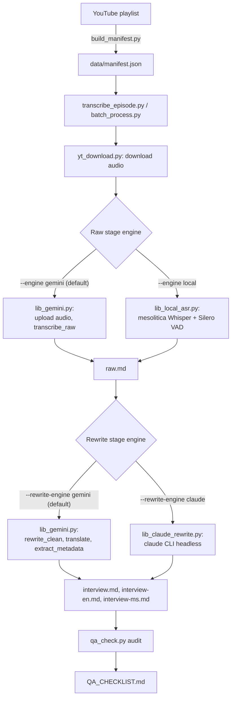

# Architecture

How an episode goes from a YouTube URL to four transcript files, which models were
tried along the way, and why the pipeline ended up with two fallback paths instead of
one straight line.

## Pipeline

Each episode goes through two independent stages, and each stage can run on either
of two engines:

| Stage | Default engine | Fallback engine | Flag |
|---|---|---|---|
| Raw transcription | Gemini (audio in, transcript out) | Local ASR (`mesolitica/malaysian-whisper-medium-v2`) | `--engine local` |
| Rewrite, translate, metadata | Gemini (chunked text calls) | Claude CLI (`claude -p`, headless) | `--rewrite-engine claude` |

The two stages are split on purpose: a failure partway through the slow,
audio-dependent raw stage never loses work from the (comparatively fast) rewrite
stage, and the two stages turned out to need different fallbacks for different
reasons (see below).

## Model evaluation history

### Raw transcription: earlier LLM-based candidates (rejected before the Whisper comparison)

Before settling on a fine-tuned Whisper model, an earlier round tested whether a
general-purpose local LLM with native audio input could replace Gemini outright. Five
models across three architectures were run against the same real clip (a segment of
episode 9 containing "Ahli Parlimen Ampang"), via LM Studio / llama.cpp on the RTX
2070:

| Model | Result |
|---|---|
| `whisper-large-v3-turbo` (hosted on Groq) | Corrupted "Ampang" to "Ambang"; fabricated a plausible-sounding passage not present in the audio |
| `Qwen3-ASR-1.7B` (`ggml-org/Qwen3-ASR-1.7B-GGUF`) | Same "Ambang" corruption and near-identical fabricated passage |
| `polyglot-lion-1.7b` (Qwen3-ASR fine-tune for SEA languages, converted to GGUF manually) | Same corruption and fabrication -- confirms the problem lives in the shared audio encoder, not the text decoder a fine-tune would touch |
| `gemma-4-12b-it` (`unsloth/gemma-4-12b-it-GGUF`) | Uncapped: runaway generation, 1488+ tokens for a 70-second clip, never terminated (llama.cpp's Gemma-4 audio path is explicitly experimental). Capped at 154 tokens: got "Ampang" right for the first time, but substituted Tagalog for the opening Malay line and mangled the show's own name |

All five models, across three unrelated architectures, hallucinated the same
fabricated passage at the same point in the clip -- most likely a shared
training-data reaction to an ambiguous moment in the audio (background chatter or
cross-talk) that Gemini correctly ignored. That result, plus the runaway-generation
and language-substitution failures, closed out this line of investigation: stay on
Gemini for raw transcription. The later local-ASR fallback (below) used a
deliberately narrower starting point -- Malay-specific Whisper fine-tunes rather than
general-purpose multimodal LLMs -- and got a working result.

### Raw transcription: which local ASR model

Five candidates were tested directly against real episode audio (a 13-minute clip,
plus two full episodes -- a plain interview and a heavy-crosstalk debate format):

| Model | Result |
|---|---|
| `mesolitica/malaysian-whisper-medium-v2` | **Selected.** No repetition-loop hallucinations on any test case. |
| `mesolitica/malaysian-distil-whisper-large-v3` | Repetition-loop hallucinations |
| `mesolitica/malaysian-whisper-small-v3` | Repetition-loop hallucinations |
| `openai/whisper-large-v3` (non-fine-tuned) | Repetition-loop hallucinations, plus entity errors at crosstalk moments (for example, hearing "Ampang" as "abang") |
| A malaysia-ai custom VQ/turbo model | Repetition-loop hallucinations |

The crosstalk entity errors showed up even on the flagship, non-fine-tuned
`whisper-large-v3` model, not just the smaller fine-tuned ones. That points to a
generic Whisper-family weakness at overlapping speech, not something specific to one
model or to Malay/English code-switching.

Speaker diarization for local-ASR episodes is a separate acoustic pass (see
"speaker diarization for local-ASR episodes" under Known Limitations below) --
`[MM:SS] Speaker N: text` turns, documented in each file's frontmatter `note` field.

### Raw transcription: hardware

Local ASR runs on a machine with two GPUs: an NVIDIA RTX 2070 (8GB, used for
inference) and a GTX 970 (4GB, otherwise idle), driver 581.57, PyTorch built for
CUDA 13.0. With both GPUs visible to CUDA, long transcription runs deadlock
unpredictably -- a silent hang at 0% CPU, no error, at a different point in the
run each time. `lib_local_asr.py` sets `CUDA_VISIBLE_DEVICES=0` unconditionally
before torch initializes to force single-GPU use. Harmless on a single-GPU
machine; required on this one.

### Raw transcription: the Gemini model chain

`lib_gemini.py` tries models in order, best-quality-first, and advances to the next
one when the current model's free-tier daily quota (20 requests/day per model) is
exhausted, or when it hits sustained `503 UNAVAILABLE` (a couple of quick retries
first, since a single transient 503 usually self-recovers, then advance):

`gemini-3.7-flash` → `gemini-3.6-flash` → `gemini-3.1-pro-preview` → `gemini-3.5-flash` →
`gemini-3.5-flash-lite` → `gemini-3-flash-preview` → `gemini-3.1-flash-lite` →
`gemini-2.5-pro` → `gemini-flash-latest` → `gemini-flash-lite-latest`

It also advances on a plain `404 NOT_FOUND` (`_is_model_not_found`) -- a wrong or
deprecated model ID in this list 404s identically on every retry, which otherwise
burns a full 10-attempt backoff before failing the whole episode. Caught twice in
practice: this list originally had `gemini-3.1-pro` (missing the `-preview` suffix
the real model ID needs, confirmed against `client.models.list()`), and separately
`gemini-2.5-flash` / `gemini-2.5-flash-lite` turned out to be fully retired --
`404 "no longer available to new users"`, not a quota issue -- so a batch that
genuinely exhausted every model above them cascaded all the way to the end and
dead-ended on two models that could never succeed. Replaced with the `-latest`
rolling aliases (`gemini-flash-latest`, `gemini-flash-lite-latest`), which track
whatever generation Google currently serves instead of a pinned version number that
can be retired later. Treating any 404 as "skip this model" fixes both incidents and
the general class of bug -- a model Google renames or retires again won't need a new
special case.

`gemini-3.7-flash` was originally excluded outright -- it repeatedly returned
sustained `503 UNAVAILABLE` (high demand) since its Aug 13 2026 launch, a Google-side
capacity problem, not a quota problem, so falling back to it used to just waste an
attempt. Re-added once that congestion reportedly cleared, now with real 503 handling
(above) instead of exclusion. `gemini-2.5-pro` and the two `-latest` aliases are kept
at the end as a last resort for quota diversity rather than a first choice. Every
model in this chain -- not just the weakest ones -- has shown it can silently drop
mixed-language code-switching under some conditions (see the model-evaluation history
above); `qa_check.py`'s language-density check is what catches that now, not model
selection alone.

This chain handles *daily request-count* exhaustion well. It doesn't help with a
different quota dimension: *input tokens per minute*. A single raw-transcription call
sends an episode's entire audio as one context, and for a 2+ hour episode that's
enough volume to burn through the free tier's 250,000-input-tokens-per-minute-per-model
limit across all four chained models within a couple of retries -- leaving no further
fallback to advance to. That's the actual reason `--engine local` exists for the raw
stage: not a transcription-quality problem, a quota-shape problem specific to
long-form audio in a single call.

### Raw transcription: the PROHIBITED_CONTENT safety block

While redoing the raw stage through Gemini across the archive, two episodes
discussing corruption allegations against named public officials failed every retry
with an identical error: `finish_reason=None,
prompt_feedback=block_reason=PROHIBITED_CONTENT`.

This is not the same thing `SAFETY_SETTINGS` above controls. Gemini's API has two
independent safety layers: the five adjustable harm categories (harassment, hate
speech, sexual content, dangerous content, civic integrity) this pipeline already
sets to `BLOCK_NONE`, and a separate built-in "prohibited use policy" layer that no
safety-setting combination can disable. `PROHIBITED_CONTENT` belongs to the second
layer, so widening `SAFETY_SETTINGS` further would not have helped. Retrying the same
model against it is also pointless -- the classification is deterministic, not a
transient failure -- so the original 10-attempt exponential backoff wasted roughly 15
minutes per blocked episode before giving up.

Reports on Google's own AI Developer forum note this block triggers more readily on
the newest model generation (Gemini 3.x) than older ones, particularly for
audio/video-understanding requests -- exactly this pipeline's raw-transcription call
shape. `gemini-3.7-flash` and `gemini-3.6-flash` had only just been promoted to the
front of `MODEL_FALLBACK_CHAIN` (previous section) when this surfaced, which fits.

**Fix**: `generate_content()` detects `PROHIBITED_CONTENT` immediately after the API
call returns and advances to the next model in the fallback chain right away -- the
same mechanism already used for quota exhaustion and sustained `503`s
(`_is_prohibited_content_block` in `lib_gemini.py`). This walks straight to an
older/different-generation model within the same attempt, instead of exhausting ten
identical retries against a model that will never produce output for that content.

### Raw transcription: duplicate-block hallucination in long-episode continuations

`transcribe_raw`'s continuation loop asks the model to "continue from where you left
off" across multiple rounds for long episodes, judging progress purely by the last
`[MM:SS]` timestamp emitted. That heuristic has a blind spot: if the model backtracks
and re-emits an already-covered passage under new, fabricated timestamps instead of
truly continuing, timestamps still climb, so the coverage check reports success while
the content silently repeats. The existing runaway-timestamp check (previous section)
only catches this when the fabricated timestamps overshoot the real episode duration
-- it missed cases where the repeated block's fake timestamps stay in a locally
plausible range.

Found by manually cross-checking a raw.md against YouTube's own auto-generated
captions (`yt-dlp --write-auto-subs`) after a speaker name only appeared in the
captions, not the transcript -- the surrounding ~1,600-word passage turned out to be
duplicated verbatim at three different timestamps in the raw.md. A repo-wide scan
then found the same pattern in 22 of 67 episodes, one with 764 duplicate blocks
(~396,000 characters, 43% of that file). Several already-flagged "interview.md looks
truncated" entries turned out to be a side effect of this: the ratio check looked
catastrophic partly because `raw.md` was artificially bloated with duplicates, not
because the rewrite was actually that incomplete.

**Detection fix**: `qa_check.py` now flags any long block (300+ chars, past the
length a naturally short recurring reaction like "Ya" or "Baik" would hit) that
repeats verbatim at a different timestamp.

**Repair, without re-burning a Gemini call**: `scripts/dedupe_raw.py` cross-checks
each duplicate group against YouTube's own auto-generated captions
(`yt-dlp --write-auto-subs`) to find which occurrence's timestamp is real, then
removes the fabricated copies. The captions are unusable for diarization or
punctuation (YouTube's auto-captions carry no speaker labels at all, confirmed
directly -- ASR word stream only) but their word-level timing is generated
straight from the audio, so it reliably locates where a passage actually
happened. Exact consecutive-word matching against the captions doesn't work --
Gemini's "lightly cleaned" transcript smooths out disfluencies the raw ASR
caption still has, so phrasing rarely lines up word-for-word. Instead, the script
scores each ~40-word window of the caption by how many of the duplicated block's
distinctive (5+ character) words it contains, and keeps whichever occurrence's
own timestamp lands closest to the best-scoring window. Confirmed on a real case:
a ~1,600-word passage duplicated at three fabricated timestamps had its true
occurrence pinned by the caption within seconds of the earliest of the three --
consistent with the failure mode being the model backtracking to repeat something
it already said, not fabricating new timestamps out of nowhere. Where a group's
captions don't confidently resolve (phrase not found, or too generic to be
distinctive), the script leaves that group untouched and prints a warning rather
than guessing -- the continuation loop itself still doesn't reject repeated
content during generation, so a small residue of unresolved duplicates may need a
full raw-stage redo instead of a surgical repair.

### Raw transcription: token-repetition degeneration after repeated retries

Redoing ep13's raw stage (originally flagged for 7 duplicate blocks) hit a new
failure mode instead: a single call succeeded on its 6th attempt after 5
consecutive failures on the same model (`gemini-3.5-flash`) -- a read timeout,
an empty response at `finish_reason=MAX_TOKENS`, an empty response at
`finish_reason=STOP`, and two empty responses at the SDK-unrecognized
`finish_reason=MALFORMED_RESPONSE`. The 6th attempt returned usable text, so
`retry()` accepted it as success -- but a ~90,000-character stretch of that
output degenerated into the same short phrase repeated verbatim roughly 40
times ("SMS ke apa, SMS ke apa, ...") before trailing off into an unrelated
English fragment, all inside what should have been one normal speaker turn.
No new `[MM:SS]` timestamp was ever emitted during the repetition, so the
whole degenerate stretch merged into a single paragraph-break-less block --
`qa_check.py`'s existing wall-of-text check (a single block over 20,000
chars) caught it, but only as a side effect; the actual defect is
token-level repetition, not a missing separator. Root cause not confirmed,
but the failure sequence (timeout -> MAX_TOKENS -> malformed x2 -> finally
"succeeds") is consistent with retry-induced model degradation rather than
a fresh, healthy generation.

**A repo-wide check confirmed this isn't a one-off.** Every other episode
whose raw.md frontmatter records `model: gemini-3.5-flash` (5 at the time)
was scanned for the same pattern: `ep53` had an even larger case (a
140,000-char stretch of one sentence repeated dozens of times), already on
the flagged list but, like ep13, only because the repeat happened to strip
paragraph breaks too -- not because anything detected the repetition itself.
The other 3 were clean. One near-miss worth recording: `ep48` has a real,
non-buggy short repetition ("nyet nyet nyet nyet...", a euphemism the hosts
were joking about on-air) that a naive detector would false-positive on --
distinguishing it from genuine degeneration needed a minimum total repeated
span (150+ chars), not just "the same phrase repeats", since real filler-word
repetition is short and genuine degeneration runs for thousands of characters.

**Fixed**: `qa_check.py` now has a dedicated `repetition_loops` check
(`REPETITION_RE` + a minimum span filter) independent of the wall-of-text
check, so a repetition loop that keeps normal timestamp breaks between
repeats -- which would currently pass every other check silently -- gets
caught directly instead of by coincidence.

### Raw transcription: doubled blank lines between every turn

Every raw.md had two blank lines between turns instead of one, across every
episode regardless of engine or model -- confirmed as a formatting artifact, not
a content bug. Root cause: `_normalize_turn_breaks`'s regex substitution matches
twice at every timestamp boundary -- once consuming the real preceding
whitespace, then again as a redundant zero-width match at the resulting
position -- so every separator got inserted twice. Fixed by collapsing any run
of 3+ newlines to exactly one blank line after the original substitution, rather
than chasing the regex engine's match-order behavior. Applied retroactively
across all existing raw.md files (whitespace-only change, verified via diff).

### Raw transcription: non-canonical timestamps past the first hour

34 of 67 episodes had timestamps like `[96:37]` instead of `[1:36:37]` once the
minutes component passed 59 -- numerically harmless (every consumer here parses
the last two bracket groups as minutes:seconds unbounded, so `96:37` and
`1:36:37` both resolve to the same total-seconds value) but inconsistent with
how the same episode formats timestamps everywhere else. Fixed with a
`_canonicalize_timestamps` pass in `lib_gemini.py` that rolls any `[MM:SS]` with
MM >= 60 over to `[H:MM:SS]`, applied at generation time going forward and
retroactively across all 34 files.

### Raw transcription: verifying timestamps against YouTube's own captions

Two independent tools exist for cross-checking `raw.md` timestamps against
YouTube's auto-generated captions -- unusable for diarization (confirmed: zero
speaker labels of any kind, pure ASR word stream) but their word-level timing is
generated straight from the real audio, making them a genuine independent
accuracy signal Gemini's own self-reported timestamps can't provide.

- **`dedupe_raw.py`** (see the duplicate-block section above): repairs a known
  duplicate group by picking whichever occurrence's timestamp is closest to the
  caption-verified real time. Limitation confirmed directly: if none of the
  duplicate's original occurrences happen to be close to the truth, the "least
  wrong" pick still leaves residual drift -- caught on ep30, where a passage
  survived dedup but stayed off by roughly 11 minutes.
- **`check_timestamp_drift.py`**: a general sweep, independent of any known
  duplicate. Samples ~12 blocks spread across an episode, fuzzy-matches each
  against the caption, and flags episodes where drift exceeds a threshold.
  Writes results to `data/timestamp_drift.json`, folded into `qa_check.py`'s
  own output (`QA_CHECKLIST.md`) as a flagged issue line per episode. A full
  67-episode sweep found 27 flagged -- some are high-confidence real drift
  (high match rate *and* high drift), but a low caption-match count (few of
  the 12 samples locatable near their claimed timestamp) is ambiguous on its
  own: it can mean genuine large-scale displacement, or just that the fuzzy
  caption match fails broadly for that episode (wrong caption language,
  heavy code-switching) with no real timing bug at all. Distinguishing the
  two needs a manual look at the actual caption text around a few
  "not found nearby" samples before trusting the flag as a real bug.

Both tools share the same fuzzy-matching approach and inherited the same tuning
lesson, learned the hard way:

- **Exact phrase matching doesn't work.** Gemini's "lightly cleaned" transcript
  smooths out the disfluencies the raw ASR caption still has, so consecutive-word
  matches rarely line up. Both tools score a window of caption words by how many
  of a block's distinctive (5+ character) words it contains, rather than
  requiring an exact run.
- **An unconstrained search is unsafe for general drift-checking.** A political
  talk show revisits the same topics (e.g. "nepotisme") at many points across a
  2-3 hour episode. `dedupe_raw.py` gets away with searching the whole caption
  because it only ever chooses among a handful of *known* candidate positions --
  even a slightly-off best-match reference still picks a real occurrence.
  `check_timestamp_drift.py` has no such candidate list; an early version that
  searched the entire caption for every sample produced a "58-minutes-off"
  false positive by locking onto a distant but topically-similar segment.
  Fixed by constraining the search to a ±20-minute window around each block's
  own claimed timestamp -- genuine large-scale displacement (whole sections
  off by an hour or more) shows up as "not found nearby" instead of a
  confidently-wrong distant answer, which is a clearer signal, not a weaker one.
- **The matching noise floor is real and must be calibrated against actual
  data, not guessed.** Even correctly-timed blocks showed up to ~250s of
  apparent drift from matching imprecision alone on a known-clean episode.
  The flagging threshold (300s) sits above that floor; ep30's confirmed real
  error (~660s) sits well above the threshold. A threshold picked without this
  empirical check would have either buried the real signal in noise or missed
  it entirely.

### Raw transcription: verifying speaker labels against real audio

Manual speaker-name review (comparing `raw.md` labels against the repo
owner's own knowledge of who's actually speaking) is Gemini diarization's
biggest weak point, and doesn't scale to eyeballing every line of dozens of
multi-hour episodes. `scripts/verify_speakers.py` automates a blind spot-check
instead: it cuts a short audio clip around a sampled turn (optionally all
occurrences of one suspect speaker label) and sends it to Gemini with no
transcript given, asking independently how many voices it hears and whether
anyone is named -- the same method that first confirmed a real misattribution
on a local-ASR episode's opening exchange (see Known Limitations below). It
deliberately doesn't auto-correct `raw.md`; a blind audio read is a strong
disagreement signal, not proof, since it has no reference voice to match
against.

**First real case solved with it**: the label "Farhan Iqbal" appears 615
times across 11 episodes and was suspected of being one blanket bug (either
a hallucinated name or a mixup with "Haziq Azfar"). A text-only pattern check
first split this into two groups: 10 episodes where the label appears as a
genuine minor third voice (never more than 1-2 turns in a row, alongside a
separate Haziq Azfar label) -- consistent with a real, occasional contributor
(the show's producer) -- versus ep39, an outlier with no Haziq label at all,
where "Farhan Iqbal" (217x) and a bare "Iqbal" (84x) run a sustained 3-way
exchange with Rafizi covering 43% of the episode's turns. Audio verification
confirmed both halves of that split: the blind spot-check found two
vocally-consistent, clearly distinct speakers throughout ep39's "Farhan
Iqbal" turns (not silence or noise), and a direct clip-to-clip comparison
between a "Farhan Iqbal"-labeled clip and an "Iqbal"-labeled clip from
elsewhere in the same episode came back same-speaker with high confidence --
proving ep39's split is ONE real person labeled inconsistently by Gemini's
diarization, not two people and not the Haziq mixup that applies to the other
10 episodes. **Lesson**: a label that looks like an obvious bug from text
alone can be two unrelated things at once (a real recurring minor speaker in
most episodes, a diarization-consistency bug in one outlier) -- a blanket
find-and-replace across every occurrence would have been wrong for 10 of the
11 episodes.

A related dead end: 3 separate audio calls (a blind read, a longer clip, and
an explicit "transcribe verbatim, do not summarize" instruction) all cut off
at the identical phrase in ep39's spoken intro, right before the co-host's
name would be stated. Since even an explicit verbatim instruction reproduced
the same cutoff with no additional content, this looks like a genuine gap in
the audio (an edit or jingle) or a name introduced via on-screen text rather
than spoken aloud (this is a video podcast; only audio is extracted here) --
not the model withholding it. Don't keep re-querying the same clip expecting
a different result; check the source video directly instead.

### Rewrite, translate, and metadata: choosing a fallback provider

The rewrite stage originally only used Gemini. When Gemini's account-level billing
was blocked (prepayment credits exhausted -- confirmed across multiple
independently-issued keys, tying the block to the underlying Cloud Billing account
rather than any one key or project), a fallback provider was needed here too.

- **Model:** `claude-sonnet-5`, chosen over `claude-opus-5` for cost (this stage runs
  four calls per episode -- one rewrite plus two translations plus metadata
  extraction -- across dozens of hour-plus episodes) and over `claude-haiku-4-5` to
  avoid losing nuance on mixed-language political content. That Haiku exclusion was
  a judgment call at design time; later tested directly to check whether it was
  worth revisiting for cost. It wasn't -- Haiku silently dropped roughly half of a
  Malay translation on a test episode while still ending the file cleanly (not an
  obvious mid-sentence cutoff), a completion-loop robustness failure specific to
  Haiku, not just a capability gap. Sonnet stays the default.
- **First implementation** called the Anthropic Messages API directly through the
  `anthropic` Python SDK. That needs a standalone `ANTHROPIC_API_KEY`, which wasn't
  available for this project.
- **Rewritten** to shell out to the `claude` CLI in headless mode (`claude -p`)
  instead, which uses whatever Claude Code authentication is already configured
  locally, with no separate API key needed.
- **A real cost issue** surfaced during that rewrite. Without an explicit
  `--system-prompt` override and a full `--disallowedTools` list, each one-off CLI
  call reloaded Claude Code's entire default system prompt and tool schemas fresh --
  about 21,000 cache-creation tokens and $0.08 per call, even on a trivial request.
  Overriding both cut that to about 500 tokens and $0.0016 per call, roughly a 48x
  reduction with no effect on output quality for these pure text-generation calls.

## Why a clean exit code isn't enough

This pipeline has produced six distinct bugs that returned exit code 0 with no
visible error, while quietly corrupting or skipping output: a free-tier quota check
that never matched its target string, a transcript-wiping edge case in fragment
trimming, hallucinated runaway timestamps that satisfied a naive coverage check,
missing paragraph breaks that silently bypassed text chunking, an argument-parsing
bug that made a 17-episode batch process zero episodes, and a continuation-loop
hallucination that duplicated whole passages under fabricated timestamps that stayed
within a plausible range (previous section). None of them raised an exception.

That's why `scripts/qa_check.py` exists, and why it's worth running (and reading
`QA_CHECKLIST.md`, not just the exit code) after every batch. It checks for all of
the failure signatures found so far: timestamp coverage against episode duration,
wall-of-text blocks with no paragraph breaks, duplicate blocks repeated at different
timestamps, rewrite files disproportionately short against their raw transcript,
leaked model reasoning in place of transcript content, and inconsistent turn
formatting. It also cross-references `data/manifest.json` against the `episodes/`
folder to flag episodes that were never processed at all.

Every output file's frontmatter also records which model actually produced it
(`model:`), and `qa_check.py` flags any file made by one of the fallback chain's
weakest, most degradation-prone models (`gemini-3.1-flash-lite` and the `gemini-2.5`
line) for a closer look, even when the other checks pass. This field is only
populated for episodes (re)processed after it was added -- older episodes show no
model line in `QA_CHECKLIST.md` until reprocessed.

## Known limitations

- **Fixed, 2026-08-24**: episodes transcribed via `--engine local` previously had
  no speaker diarization at all -- `raw.md` was one undifferentiated stream of
  text, and the rewrite stage had to infer who's speaking purely from context.
  **Confirmed as a real, not just theoretical, problem** before the fix: a
  Gemini audio spot-check on one episode's opening exchange found the
  model-inferred rewrite had folded a real Rafizi Ramli line into a generic
  "Podcast Host" turn -- an actual misattributed quote. A cheaper alternative
  -- asking Gemini for just a chronological speaker-change list (not a full
  transcript) to merge onto existing local-ASR text -- was tried and
  abandoned: this show's speakers change every few seconds, so a speaker-only
  pass needs roughly as many continuation rounds as a full transcript would,
  with no real quota saving.

  **The actual fix**: `scripts/lib_diarization.py`, a pyannote.audio pipeline
  run as a separate acoustic pass on the same audio local ASR already
  transcribes -- pure voice-embedding clustering, no LLM involved at all, so
  it's immune to every content-based failure mode found elsewhere in this doc
  (PROHIBITED_CONTENT blocks, fallback-model degradation, and the per-run
  label inconsistency confirmed directly on ep13/ep39, where the same real
  speaker got a different invented name in different Gemini attempts). Each
  VAD chunk from `lib_local_asr.py` gets labeled with whichever diarized
  speaker has the most time overlap. Output is anonymous "Speaker N" labels
  (numbered by first appearance, consistent within an episode since they're
  real voice clusters) -- still needs a manual naming pass afterward, same as
  Gemini's own generic labels do, just without the added risk of the label
  itself drifting between attempts.

  Requires a Hugging Face token with access to 3 gated repos (accept terms
  for all three, or the pipeline 403s partway through loading):
  `pyannote/segmentation-3.0`, `pyannote/speaker-diarization-3.1`, and
  `pyannote/speaker-diarization-community-1` (a transitive dependency not
  listed on the model card). **Gated-access propagation lag confirmed
  directly**: the HuggingFace web UI and the `model_info()` API both reported
  access as granted well before the actual file-download (resolve) endpoint
  stopped 403ing -- don't trust either of those as proof the pipeline will
  actually load; the only real test is trying the download.
- Local ASR proper-noun accuracy (names, unusual spellings) isn't verified against
  any reference dictionary yet -- a manual correction pass is planned, guided by the
  repo owner rather than guessed at automatically. Candidate tooling for that pass:
  the `malaya` Python library's `dictionary.keyword_dbp()` and `dictionary.is_malay()`,
  which check a word against Dewan Bahasa dan Pustaka's PRPM reference (scraped, not a
  documented API -- fine for occasional lookups during a correction pass, not for
  validating every word of every transcript at scale).
- Crosstalk-driven entity errors are possible in any Whisper-family transcription,
  local or cloud.
- Gemini's free-tier quota is unreliable for raw transcription on episodes longer
  than roughly an hour in a single call -- use `--engine local` for those.
