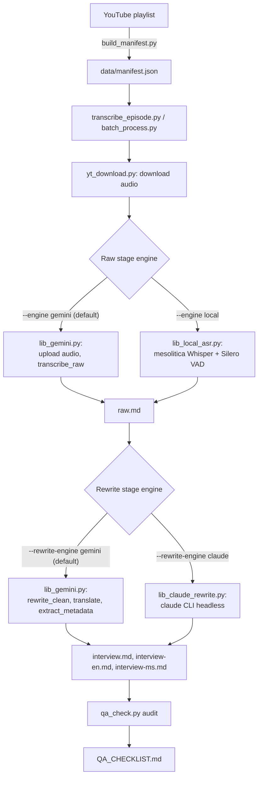

# Architecture

How an episode goes from a YouTube URL to four transcript files, which models were
tried along the way, and why the pipeline ended up with two fallback paths instead of
one straight line.

## Pipeline

Each episode goes through two independent stages, and each stage can run on either
of two engines:

| Stage | Default engine | Fallback engine | Flag |
|---|---|---|---|
| Raw transcription | Gemini (audio in, transcript out) | Local ASR (`mesolitica/malaysian-whisper-medium-v2`) | `--engine local` |
| Rewrite, translate, metadata | Gemini (chunked text calls) | Claude CLI (`claude -p`, headless) | `--rewrite-engine claude` |

The two stages are split on purpose: a failure partway through the slow,
audio-dependent raw stage never loses work from the (comparatively fast) rewrite
stage, and the two stages turned out to need different fallbacks for different
reasons (see below).

## Model evaluation history

Numbered `stage.issue`: 1.x covers the raw transcription stage, 2.x covers the
rewrite/translate/metadata stage.

### 1.1: Earlier LLM-based candidates (rejected before the Whisper comparison)

- **Found:** before settling on a fine-tuned Whisper model, an earlier round tested
  whether a general-purpose local LLM with native audio input could replace Gemini
  outright. Five models across three architectures were run against the same real
  clip (a segment of episode 9 containing "Ahli Parlimen Ampang"), via LM Studio /
  llama.cpp on the RTX 2070:

  | Model | Result |
  |---|---|
  | `whisper-large-v3-turbo` (hosted on Groq) | Corrupted "Ampang" to "Ambang"; fabricated a plausible-sounding passage not present in the audio |
  | `Qwen3-ASR-1.7B` (`ggml-org/Qwen3-ASR-1.7B-GGUF`) | Same "Ambang" corruption and near-identical fabricated passage |
  | `polyglot-lion-1.7b` (Qwen3-ASR fine-tune for SEA languages, converted to GGUF manually) | Same corruption and fabrication: confirms the problem lives in the shared audio encoder, not the text decoder a fine-tune would touch |
  | `gemma-4-12b-it` (`unsloth/gemma-4-12b-it-GGUF`) | Uncapped: runaway generation, 1488+ tokens for a 70-second clip, never terminated (llama.cpp's Gemma-4 audio path is explicitly experimental). Capped at 154 tokens: got "Ampang" right for the first time, but substituted Tagalog for the opening Malay line and mangled the show's own name |

- **Root cause:** all five models, across three unrelated architectures, hallucinated
  the same fabricated passage at the same point in the clip: most likely a shared
  training-data reaction to an ambiguous moment in the audio (background chatter or
  cross-talk) that Gemini correctly ignored.
- **Fix / decision:** that result, plus the runaway-generation and
  language-substitution failures, closed out this line of investigation: stay on
  Gemini for raw transcription. The later local-ASR fallback (below) used a
  deliberately narrower starting point (Malay-specific Whisper fine-tunes rather than
  general-purpose multimodal LLMs) and got a working result.

### 1.2: Which local ASR model

- **Found:** five candidates were tested directly against real episode audio (a
  13-minute clip, plus two full episodes, a plain interview and a heavy-crosstalk
  debate format):

  | Model | Result |
  |---|---|
  | `mesolitica/malaysian-whisper-medium-v2` | **Selected.** No repetition-loop hallucinations on the original test clips. A real one surfaced later in production on ep60 (~19s, "di atas" repeated ~140x on one noisy stretch). See Known Limitations below. |
  | `mesolitica/malaysian-distil-whisper-large-v3` | Repetition-loop hallucinations |
  | `mesolitica/malaysian-whisper-small-v3` | Repetition-loop hallucinations |
  | `openai/whisper-large-v3` (non-fine-tuned) | Repetition-loop hallucinations, plus entity errors at crosstalk moments (for example, hearing "Ampang" as "abang") |
  | A malaysia-ai custom VQ/turbo model | Repetition-loop hallucinations |

- **Context:** the crosstalk entity errors showed up even on the flagship,
  non-fine-tuned `whisper-large-v3` model, not just the smaller fine-tuned ones. That
  points to a generic Whisper-family weakness at overlapping speech, not something
  specific to one model or to Malay/English code-switching.
- **Fix / decision:** `mesolitica/malaysian-whisper-medium-v2` selected, per the table
  above. Speaker diarization for local-ASR episodes is a separate acoustic pass (see
  "speaker diarization for local-ASR episodes" under Known Limitations below):
  `[MM:SS] Speaker N: text` turns, documented in each file's frontmatter `note` field.

### 1.3: Hardware

- **Found:** local ASR runs on a machine with two GPUs: an NVIDIA RTX 2070 (8GB, used
  for inference) and a GTX 970 (4GB, otherwise idle), driver 581.57, PyTorch built for
  CUDA 13.0. With both GPUs visible to CUDA, long transcription runs deadlock
  unpredictably: a silent hang at 0% CPU, no error, at a different point in the run
  each time.
- **Fix:** `lib_local_asr.py` sets `CUDA_VISIBLE_DEVICES=0` unconditionally before
  torch initializes to force single-GPU use. Harmless on a single-GPU machine;
  required on this one.

### 1.4: The Gemini model chain

- **Context:** `lib_gemini.py` tries models in order, best-quality-first, and
  advances to the next one when the current model's free-tier daily quota (20
  requests/day per model) is exhausted, or when it hits sustained `503 UNAVAILABLE`
  (a couple of quick retries first, since a single transient 503 usually
  self-recovers, then advance):

  `gemini-3.7-flash` → `gemini-3.6-flash` → `gemini-3.1-pro-preview` → `gemini-3.5-flash` →
  `gemini-3.5-flash-lite` → `gemini-3-flash-preview` → `gemini-3.1-flash-lite` →
  `gemini-2.5-pro` → `gemini-flash-latest` → `gemini-flash-lite-latest`

- **Found:** a wrong or deprecated model ID in this list 404s identically on every
  retry, which otherwise burns a full 10-attempt backoff before failing the whole
  episode. Caught twice in practice: this list originally had `gemini-3.1-pro`
  (missing the `-preview` suffix the real model ID needs, confirmed against
  `client.models.list()`), and separately `gemini-2.5-flash` /
  `gemini-2.5-flash-lite` turned out to be fully retired (`404 "no longer available
  to new users"`, not a quota issue), so a batch that genuinely exhausted every model
  above them cascaded all the way to the end and dead-ended on two models that could
  never succeed.
- **Fix:** replaced the retired models with the `-latest` rolling aliases
  (`gemini-flash-latest`, `gemini-flash-lite-latest`), which track whatever
  generation Google currently serves instead of a pinned version number that can be
  retired later. `lib_gemini.py` also now advances immediately on a plain `404
  NOT_FOUND` (`_is_model_not_found`) instead of retrying it. Treating any 404 as
  "skip this model" fixes both incidents and the general class of bug: a model
  Google renames or retires again won't need a new special case.
- **Context:** `gemini-3.7-flash` was originally excluded outright: it repeatedly
  returned sustained `503 UNAVAILABLE` (high demand) since its Aug 13 2026 launch, a
  Google-side capacity problem, not a quota problem, so falling back to it used to
  just waste an attempt. Re-added once that congestion reportedly cleared, now with
  real 503 handling (above) instead of exclusion. `gemini-2.5-pro` and the two
  `-latest` aliases are kept at the end as a last resort for quota diversity rather
  than a first choice. Every model in this chain (not just the weakest ones) has
  shown it can silently drop mixed-language code-switching under some conditions
  (see the model-evaluation history above); `qa_check.py`'s language-density check is
  what catches that now, not model selection alone.
- **Found:** this chain handles *daily request-count* exhaustion well. It doesn't
  help with a different quota dimension: *input tokens per minute*. A single
  raw-transcription call sends an episode's entire audio as one context, and for a
  2+ hour episode that's enough volume to burn through the free tier's
  250,000-input-tokens-per-minute-per-model limit across all four chained models
  within a couple of retries, leaving no further fallback to advance to.
- **Fix / decision:** that's the actual reason `--engine local` exists for the raw
  stage: not a transcription-quality problem, a quota-shape problem specific to
  long-form audio in a single call.

### 1.5: PROHIBITED_CONTENT safety block on politically sensitive audio

- **Found:** while redoing the raw stage through Gemini across the archive, two
  episodes discussing corruption allegations against named public officials failed
  every retry with an identical error: `finish_reason=None,
  prompt_feedback=block_reason=PROHIBITED_CONTENT`.
- **Root cause:** Gemini's API has two independent safety layers: the five
  adjustable harm categories (harassment, hate speech, sexual content, dangerous
  content, civic integrity) this pipeline already sets to `BLOCK_NONE`, and a
  separate built-in "prohibited use policy" layer that no safety-setting combination
  can disable. `PROHIBITED_CONTENT` belongs to the second layer, so widening
  `SAFETY_SETTINGS` further would not have helped. Retrying the same model against it
  is also pointless (the classification is deterministic, not a transient failure),
  so the original 10-attempt exponential backoff wasted roughly 15 minutes per
  blocked episode before giving up.
- **Context:** reports on Google's own AI Developer forum note this block triggers
  more readily on the newest model generation (Gemini 3.x) than older ones,
  particularly for audio/video-understanding requests, exactly this pipeline's
  raw-transcription call shape. `gemini-3.7-flash` and `gemini-3.6-flash` had only
  just been promoted to the front of `MODEL_FALLBACK_CHAIN` (1.4 above) when this
  surfaced, which fits.
- **Fix:** `generate_content()` detects `PROHIBITED_CONTENT` immediately after the
  API call returns and advances to the next model in the fallback chain right away,
  the same mechanism already used for quota exhaustion and sustained `503`s
  (`_is_prohibited_content_block` in `lib_gemini.py`). This walks straight to an
  older/different-generation model within the same attempt, instead of exhausting
  ten identical retries against a model that will never produce output for that
  content.

### 1.6: Duplicate-block hallucination in long-episode continuations

- **Found:** found by manually cross-checking a raw.md against YouTube's own
  auto-generated captions (`yt-dlp --write-auto-subs`) after a speaker name only
  appeared in the captions, not the transcript: the surrounding ~1,600-word passage
  turned out to be duplicated verbatim at three different timestamps in the raw.md.
  A repo-wide scan then found the same pattern in 22 of 67 episodes, one with 764
  duplicate blocks (~396,000 characters, 43% of that file).
- **Root cause:** `transcribe_raw`'s continuation loop asks the model to "continue
  from where you left off" across multiple rounds for long episodes, judging
  progress purely by the last `[MM:SS]` timestamp emitted. That heuristic has a
  blind spot: if the model backtracks and re-emits an already-covered passage under
  new, fabricated timestamps instead of truly continuing, timestamps still climb, so
  the coverage check reports success while the content silently repeats. The
  existing runaway-timestamp check (1.10 below) only catches this when the
  fabricated timestamps overshoot the real episode duration; it missed cases where
  the repeated block's fake timestamps stay in a locally plausible range.
- **Context:** several already-flagged "interview.md looks truncated" entries turned
  out to be a side effect of this: the ratio check looked catastrophic partly because
  `raw.md` was artificially bloated with duplicates, not because the rewrite was
  actually that incomplete.
- **Fix (detection):** `qa_check.py` now flags any long block (300+ chars, past the
  length a naturally short recurring reaction like "Ya" or "Baik" would hit) that
  repeats verbatim at a different timestamp.
- **Fix (repair, without re-burning a Gemini call):** `scripts/dedupe_raw.py`
  cross-checks each duplicate group against YouTube's own auto-generated captions
  (`yt-dlp --write-auto-subs`) to find which occurrence's timestamp is real, then
  removes the fabricated copies. The captions are unusable for diarization or
  punctuation (YouTube's auto-captions carry no speaker labels at all, confirmed
  directly: ASR word stream only) but their word-level timing is generated straight
  from the audio, so it reliably locates where a passage actually happened. Exact
  consecutive-word matching against the captions doesn't work: Gemini's "lightly
  cleaned" transcript smooths out disfluencies the raw ASR caption still has, so
  phrasing rarely lines up word-for-word. Instead, the script scores each ~40-word
  window of the caption by how many of the duplicated block's distinctive (5+
  character) words it contains, and keeps whichever occurrence's own timestamp lands
  closest to the best-scoring window. Confirmed on a real case: a ~1,600-word
  passage duplicated at three fabricated timestamps had its true occurrence pinned
  by the caption within seconds of the earliest of the three, consistent with the
  failure mode being the model backtracking to repeat something it already said, not
  fabricating new timestamps out of nowhere. Where a group's captions don't
  confidently resolve (phrase not found, or too generic to be distinctive), the
  script leaves that group untouched and prints a warning rather than guessing; the
  continuation loop itself still doesn't reject repeated content during generation,
  so a small residue of unresolved duplicates may need a full raw-stage redo instead
  of a surgical repair.

### 1.7: Token-repetition degeneration after repeated retries

- **Found:** redoing ep13's raw stage (originally flagged for 7 duplicate blocks)
  hit a new failure mode instead: a single call succeeded on its 6th attempt after 5
  consecutive failures on the same model (`gemini-3.5-flash`): a read timeout, an
  empty response at `finish_reason=MAX_TOKENS`, an empty response at
  `finish_reason=STOP`, and two empty responses at the SDK-unrecognized
  `finish_reason=MALFORMED_RESPONSE`. The 6th attempt returned usable text, so
  `retry()` accepted it as success, but a ~90,000-character stretch of that output
  degenerated into the same short phrase repeated verbatim roughly 40 times ("SMS ke
  apa, SMS ke apa, ...") before trailing off into an unrelated English fragment, all
  inside what should have been one normal speaker turn. No new `[MM:SS]` timestamp
  was ever emitted during the repetition, so the whole degenerate stretch merged
  into a single paragraph-break-less block; `qa_check.py`'s existing wall-of-text
  check (a single block over 20,000 chars) caught it, but only as a side effect; the
  actual defect is token-level repetition, not a missing separator.
- **Root cause:** not confirmed, but the failure sequence (timeout -> MAX_TOKENS ->
  malformed x2 -> finally "succeeds") is consistent with retry-induced model
  degradation rather than a fresh, healthy generation.
- **Context:** a repo-wide check confirmed this isn't a one-off. Every other episode
  whose raw.md frontmatter records `model: gemini-3.5-flash` (5 at the time) was
  scanned for the same pattern: `ep53` had an even larger case (a 140,000-char
  stretch of one sentence repeated dozens of times), already on the flagged list
  but, like ep13, only because the repeat happened to strip paragraph breaks too,
  not because anything detected the repetition itself. The other 3 were clean. One
  near-miss worth recording: `ep48` has a real, non-buggy short repetition ("nyet
  nyet nyet nyet...", a euphemism the hosts were joking about on-air) that a naive
  detector would false-positive on. Distinguishing it from genuine degeneration
  needed a minimum total repeated span (150+ chars), not just "the same phrase
  repeats", since real filler-word repetition is short and genuine degeneration runs
  for thousands of characters.
- **Fix:** `qa_check.py` now has a dedicated `repetition_loops` check
  (`REPETITION_RE` + a minimum span filter) independent of the wall-of-text check,
  so a repetition loop that keeps normal timestamp breaks between repeats (which
  would currently pass every other check silently) gets caught directly instead of
  by coincidence.

### 1.8: Fabricated fake episodes when the continuation loop runs out of real audio

- **Found:** ep60's raw.md transcribed the real 3h18m episode correctly up to a
  genuine sign-off and `[music/outro]` marker at `[1:52:58]`, then kept going: it
  invented a chain of eleven fake mini-episodes (self-labeled episodes 61-71, each
  with its own intro/guest/content/outro) to fill the remaining ~1h25m, including
  fabricated quotes attributed to real government ministers (Fahmi Fadzil, Hannah
  Yeoh, Nik Nazmi, and others) discussing topics they never actually raised.
  Confirmed false against YouTube's real auto-captions at the same claimed
  timestamps: the real audio covers unrelated topics (university funding,
  foreign-worker minimum wage) with no mention of the fabricated ministers or
  subjects.
- **Root cause:** the continuation loop (1.6 and 1.7 above) keeps prompting
  "continue from where you left off" toward the real, correct total duration; once
  there's no real content left to transcribe, Gemini generates plausible-sounding
  fake content instead of stopping. This is a materially different, higher-severity
  risk than the duplicate-block and repetition-loop failures above: those produce
  garbled or repeated *nonsense*, easy to spot; this produces specific,
  internally-consistent false claims attributed to named real people, a
  misinformation/defamation risk if it shipped un-caught.
- **Context:** a related but distinct failure, found in the same sweep, on two other
  episodes (ep05, ep31): instead of fabricating, the model explicitly gave up and
  leaked its own refusal into the transcript (*"I am unable to provide a
  word-for-word transcript..."*), abandoning tens of thousands of characters of real
  content.
- **Fix:** redo the raw stage via `--engine local` for all three. Acoustic ASR
  (Whisper) has no mechanism to invent people or topics that aren't in the audio, so
  this failure class isn't possible with the local fallback, confirmed on ep60's
  redo, which produced a normal, verifiably real sign-off in place of the fabricated
  tail. The local engine surfaced a different, much smaller-stakes failure of its
  own on the redo: short stretches (typically under 20s) where Whisper gets stuck
  repeating one filler sound or word ("di atas" ~140x, "mmmm..." runs, "Maksudnya"
  ~80x) on a noisy or unclear patch of audio: garbled nonsense, not a fabricated
  claim, hand-collapsed to a short reasonable filler rather than guessed at. One
  instance across the redo batch (ep42) was more severe: a full ~4-minute speaker
  turn came out as "T-T-T-T-..." repeated hundreds of times with no recoverable real
  words: genuine content loss, not just an exaggerated filler sound. Left as an
  explicit removal note in raw.md (real gap disclosed, not invented content) rather
  than collapsed to a guessed phrase, since there's nothing in the surrounding text
  to reconstruct it from.
- **Context (detection gap, not yet closed):** no automated check catches
  invented-content fabrication directly (as opposed to its downstream symptoms).
  ep60 was found by manually scanning for a `[music/outro]`-style marker followed by
  unusually long trailing content, then reading the flagged episodes for context,
  not exhaustive, and a repo-wide re-scan after any future Gemini raw-stage batch is
  still worth doing. The leaked-refusal phrasing on ep05/ep31 ("I am unable to", "I
  cannot generate") also isn't covered by the existing leaked-reasoning check
  (`LEAKED_REASONING_RE`), which was tuned for a different phrasing pattern.

### 1.9: Doubled blank lines between every turn

- **Found:** every raw.md had two blank lines between turns instead of one, across
  every episode regardless of engine or model: confirmed as a formatting artifact,
  not a content bug.
- **Root cause:** `_normalize_turn_breaks`'s regex substitution matches twice at
  every timestamp boundary: once consuming the real preceding whitespace, then again
  as a redundant zero-width match at the resulting position, so every separator got
  inserted twice.
- **Fix:** fixed by collapsing any run of 3+ newlines to exactly one blank line
  after the original substitution, rather than chasing the regex engine's
  match-order behavior. Applied retroactively across all existing raw.md files
  (whitespace-only change, verified via diff).

### 1.10: Non-canonical timestamps past the first hour

- **Found:** 34 of 67 episodes had timestamps like `[96:37]` instead of `[1:36:37]`
  once the minutes component passed 59.
- **Context:** numerically harmless (every consumer here parses the last two
  bracket groups as minutes:seconds unbounded, so `96:37` and `1:36:37` both resolve
  to the same total-seconds value) but inconsistent with how the same episode
  formats timestamps everywhere else.
- **Fix:** fixed with a `_canonicalize_timestamps` pass in `lib_gemini.py` that
  rolls any `[MM:SS]` with MM >= 60 over to `[H:MM:SS]`, applied at generation time
  going forward and retroactively across all 34 files.

### 1.11: Verifying timestamps against YouTube's own captions

- **Context:** two independent tools exist for cross-checking `raw.md` timestamps
  against YouTube's auto-generated captions, unusable for diarization (confirmed:
  zero speaker labels of any kind, pure ASR word stream) but their word-level timing
  is generated straight from the real audio, making them a genuine independent
  accuracy signal Gemini's own self-reported timestamps can't provide.
  - **`dedupe_raw.py`** (see 1.6 above): repairs a known duplicate group by picking
    whichever occurrence's timestamp is closest to the caption-verified real time.
    Limitation confirmed directly: if none of the duplicate's original occurrences
    happen to be close to the truth, the "least wrong" pick still leaves residual
    drift, caught on ep30, where a passage survived dedup but stayed off by roughly
    11 minutes.
  - **`check_timestamp_drift.py`**: a general sweep, independent of any known
    duplicate. Samples ~12 blocks spread across an episode, fuzzy-matches each
    against the caption, and flags episodes where drift exceeds a threshold. Writes
    results to `data/timestamp_drift.json`, folded into `qa_check.py`'s own output
    (`QA_CHECKLIST.md`) as a flagged issue line per episode. A full 67-episode sweep
    found 27 flagged: some are high-confidence real drift (high match rate *and*
    high drift), but a low caption-match count (few of the 12 samples locatable near
    their claimed timestamp) is ambiguous on its own: it can mean genuine
    large-scale displacement, or just that the fuzzy caption match fails broadly for
    that episode (wrong caption language, heavy code-switching) with no real timing
    bug at all. Distinguishing the two needs a manual look at the actual caption
    text around a few "not found nearby" samples before trusting the flag as a real
    bug.
- **Root cause (shared tuning lessons, learned the hard way):** both tools share the
  same fuzzy-matching approach and inherited the same lessons:
  - Exact phrase matching doesn't work. Gemini's "lightly cleaned" transcript
    smooths out the disfluencies the raw ASR caption still has, so consecutive-word
    matches rarely line up. Both tools score a window of caption words by how many
    of a block's distinctive (5+ character) words it contains, rather than
    requiring an exact run.
  - An unconstrained search is unsafe for general drift-checking. A political talk
    show revisits the same topics (e.g. "nepotisme") at many points across a 2-3
    hour episode. `dedupe_raw.py` gets away with searching the whole caption because
    it only ever chooses among a handful of known candidate positions: even a
    slightly-off best-match reference still picks a real occurrence.
    `check_timestamp_drift.py` has no such candidate list; an early version that
    searched the entire caption for every sample produced a "58-minutes-off" false
    positive by locking onto a distant but topically-similar segment.
  - The matching noise floor is real and must be calibrated against actual data,
    not guessed. Even correctly-timed blocks showed up to ~250s of apparent drift
    from matching imprecision alone on a known-clean episode. The flagging
    threshold (300s) sits above that floor; ep30's confirmed real error (~660s) sits
    well above the threshold. A threshold picked without this empirical check would
    have either buried the real signal in noise or missed it entirely.
  - A flagged drift can be a timestamp-resolution artifact, not displaced content.
    ep41's local-ASR redo flagged at 819s max drift (well above the 300s threshold
    and close to ep30's confirmed-real ~660s), but a manual read of the flagged
    region found no missing or reordered content: instead, the VAD chunker had
    merged roughly 28 minutes of genuinely continuous speech (no pause long enough
    to split on) into one `[MM:SS]` block covering the episode's entire final
    stretch. Later caption samples inside that block legitimately occur minutes
    after the block's single claimed timestamp, so the drift is real but harmless:
    the transcript is complete and correctly ordered, just coarser-grained than
    usual for that one stretch.
  - **ep44 (RESOLVED 2026-08-27, same artifact as ep41, not a bug)**: 1.16 had
    provisionally classed ep44 alongside ep32/ep33 as "hard reset + constant
    offset" based on `check_timestamp_drift.py`'s reported +910s/+1354s drift.
    A direct re-check (fetching the cached caption and searching for phrases
    spread across each flagged block, rather than trusting the production
    tool's single mid-block sample) found no gap: this episode's local-ASR
    transcript has only 19 candidate blocks for a 3-hour episode, i.e. very
    coarse VAD merging, same root cause as ep41. The two flagged blocks are
    each one continuous Rafizi monologue (confirmed by tracing multiple
    phrases from across each block, which land at strictly increasing real
    timestamps with no gap) -- one spans a ~15-minute FWCMS/TURAP policy
    rant, the other a ~19-minute closing segment (a "cerita Papa Gomo"
    personal story) that ends with the real episode sign-off and even
    self-referential in-dialogue time-checks ("dah 3 jam") matching the
    file's real `duration_seconds`. No content is missing or displaced;
    reclassified out of 1.16's bug catalog entirely.
  - **ep58 (REVIEWED 2026-08-27, same non-bug shape, different trigger
    check)**: flagged only by `qa_check.py`'s wall-of-text check (a
    43,878-char block), not by `check_timestamp_drift.py` at all --
    `data/timestamp_drift.json` shows 12/12 samples matched with only 230s
    max drift, comfortably clean. Confirmed the giant block contains exactly
    one `[timestamp] Speaker:` label at its start and no others embedded
    inside, i.e. it's one genuinely long uninterrupted Rafizi monologue
    (consistent with the same speaking-style pattern as ep41/ep44), not
    multiple turns merged by a missing paragraph break. No fix needed; the
    wall-of-text check has no way to tell "one long real monologue" from
    "several turns merged" short of this kind of manual read, so expect it
    to keep firing here on every future `qa_check.py` run.
  - **ep43 (REVIEWED 2026-08-27, Type C confirmed via deep-probe, no fix
    needed)**: flagged for both wall-of-text (one 23,596-char block, single
    speaker label throughout, same non-bug shape as ep41/ep44/ep58) and
    `check_timestamp_drift.py` (466s max drift, 11/12 matched). Re-ran
    `_deep_drift_probe.py` directly: drift bounces between +1s and +399s
    with no sustained trend or growth (+384, +66, +17, +399, +282, +1, +220,
    +204, +32, +20 across the episode) -- scattered false-positive matches
    on topically-similar content, not real displacement, matching last
    night's original Type C classification.
- **Fix:** for `check_timestamp_drift.py`, constrained the search to a ±20-minute
  window around each block's own claimed timestamp: genuine large-scale
  displacement (whole sections off by an hour or more) now shows up as "not found
  nearby" instead of a confidently-wrong distant answer, which is a clearer signal,
  not a weaker one. Distinguishing a timestamp-resolution artifact (like ep41) from
  genuine displacement needs the same manual read `check_timestamp_drift.py` already
  calls for on ambiguous flags: check whether the block's content spans an
  implausibly long single turn before assuming the timestamp is wrong.

### 1.12: Verifying speaker labels against real audio

- **Context:** manual speaker-name review (comparing `raw.md` labels against the
  repo owner's own knowledge of who's actually speaking) is Gemini diarization's
  biggest weak point, and doesn't scale to eyeballing every line of dozens of
  multi-hour episodes. `scripts/verify_speakers.py` automates a blind spot-check
  instead: it cuts a short audio clip around a sampled turn (optionally all
  occurrences of one suspect speaker label) and sends it to Gemini with no
  transcript given, asking independently how many voices it hears and whether
  anyone is named, the same method that first confirmed a real misattribution on a
  local-ASR episode's opening exchange (see Known Limitations below). It
  deliberately doesn't auto-correct `raw.md`; a blind audio read is a strong
  disagreement signal, not proof, since it has no reference voice to match against.
- **Found (first real case solved with it):** the label "Farhan Iqbal" appears 615
  times across 11 episodes and was suspected of being one blanket bug (either a
  hallucinated name or a mixup with "Haziq Azfar"). A text-only pattern check first
  split this into two groups: 10 episodes where the label appears as a genuine minor
  third voice (never more than 1-2 turns in a row, alongside a separate Haziq Azfar
  label), consistent with a real, occasional contributor (the show's producer),
  versus ep39, an outlier with no Haziq label at all, where "Farhan Iqbal" (217x)
  and a bare "Iqbal" (84x) run a sustained 3-way exchange with Rafizi covering 43%
  of the episode's turns.
- **Fix / root cause:** audio verification confirmed both halves of that split: the
  blind spot-check found two vocally-consistent, clearly distinct speakers
  throughout ep39's "Farhan Iqbal" turns (not silence or noise), and a direct
  clip-to-clip comparison between a "Farhan Iqbal"-labeled clip and an
  "Iqbal"-labeled clip from elsewhere in the same episode came back same-speaker
  with high confidence, proving ep39's split is ONE real person labeled
  inconsistently by Gemini's diarization, not two people and not the Haziq mixup
  that applies to the other 10 episodes. Lesson: a label that looks like an obvious
  bug from text alone can be two unrelated things at once (a real recurring minor
  speaker in most episodes, a diarization-consistency bug in one outlier): a blanket
  find-and-replace across every occurrence would have been wrong for 10 of the 11
  episodes.
- **Context (related dead end):** 3 separate audio calls (a blind read, a longer
  clip, and an explicit "transcribe verbatim, do not summarize" instruction) all cut
  off at the identical phrase in ep39's spoken intro, right before the co-host's
  name would be stated. Since even an explicit verbatim instruction reproduced the
  same cutoff with no additional content, this looks like a genuine gap in the audio
  (an edit or jingle) or a name introduced via on-screen text rather than spoken
  aloud (this is a video podcast; only audio is extracted here), not the model
  withholding it. Don't keep re-querying the same clip expecting a different result;
  check the source video directly instead.

### 1.13: Verifying speaker labels via native YouTube clip processing

- **Context:** a cheaper, more capable alternative to `verify_speakers.py`'s
  download-and-ffmpeg-cut approach: Gemini's `types.Part(file_data=types.FileData
  (file_uri=<youtube_url>), video_metadata=types.VideoMetadata(start_offset="Ns",
  end_offset="Ms"))` lets Gemini watch a clipped time range directly from a public
  YouTube URL: no download, no upload, no local audio file needed at all. Two
  advantages over the audio-clip method: it's watching actual video, so it can use
  visual cues (who's on screen, lip movement) alongside voice, not just audio; and
  clipping server-side means only the requested window's tokens are billed, not the
  whole file.
- **Found (token limit, not a workaround):** sending a whole multi-hour episode this
  way still hits the model's ~1M-token context ceiling (confirmed directly: a
  3h18m video 400s into it). Clipping isn't optional for anything beyond short
  episodes: always pass `video_metadata` with a bounded range, never the bare URL
  alone on a long episode.
- **Fix (trust the timestamp you send, not the one Gemini reports):** Gemini's
  self-reported in-clip timestamps carry their own imprecision (same class of issue
  as LLM-generated timestamps generally). The reliable pattern: pick the timestamp
  to check from `raw.md` (itself worth cross-checking against YouTube's
  auto-captions first, see 1.11 above), clip a window around it, and ask only "who
  is speaking", letting Gemini supply the identity, not the timing.
- **Fix (lean prompt, matched to the question being asked):** for validating a
  single suspected speaker, `verify_speakers.py`'s descriptive prompt (voice pitch,
  tone, named mentions) is right. For mapping raw diarization clusters to real names
  across many turns at once, a much leaner prompt works better and costs far fewer
  output tokens: give Gemini the episode's known-cast list (from the video
  description, below) and ask for a bare `MM:SS - Name` list, nothing else.
- **Context (confirmed effective on ep60 and ep46):** on ep60, clip sampling
  resolved a 6-cluster diarization down to the real 3 people in the episode (Haziq,
  Rafizi, guest "Sum Dek Jo") plus genuine crosstalk, and caught a real ASR
  mishearing in the same pass ("Nurul Izan" heard aloud is actually Nurul Izzah, a
  real, frequently-discussed politician). On ep46 it resolved 2 of 4 diarized
  clusters cleanly (Speaker 1 -> Afiq, Speaker 2 -> Rafizi, consistent across 6+
  samples each) but proved the other two were genuinely mixed: both "Speaker 3" and
  "Speaker 4" turned out to contain turns from two different real people (Farhan and
  guest co-host Amin Sahmat) depending on sample point, not one person mislabeled
  twice. Not every cluster resolves to a single name: when repeated sampling keeps
  returning different real people for the same label, that's a genuine diarization
  merge, and the honest fix is leaving it labeled generically rather than forcing a
  guess.
- **Context (YouTube video descriptions are a high-value, already-available source
  of ground truth):** `data/manifest.json`'s `description` field (fetched once by
  `build_manifest.py`, no extra cost) frequently states the guest's real name
  directly, sometimes with the exact nickname used on-air ("Dato' Syed Azuan ataupun
  lebih dikenali sebagai DSA"). Worth checking before any audio-based verification:
  it's free, and resolves plenty of cases with zero Gemini calls at all.
- **Context (cost note):** the free-tier `GEMINI_API_KEY` caps at roughly 20
  requests/day per model (confirmed by hitting `429 RESOURCE_EXHAUSTED` on
  `gemini-3.6-flash` mid-session). `lib_gemini.py`'s `MODEL_FALLBACK_CHAIN` order is
  the natural fallback when this happens: switching to the next model (e.g.
  `gemini-3.5-flash`) picks up cleanly.

### 1.14: A coverage check that checked the wrong timestamp, and the "content loss" it invented

- **Found:** ep44's `--engine local` raw stage failed repeatedly with an identical
  error, always stopping "1203s before the episode's end (last turn at 9704s of
  10907s)". A first attempt at a fix (periodic `torch.cuda.empty_cache()` every 100
  chunks, on the theory that GPU memory fragmentation across hundreds of sequential
  forward passes was silently dropping chunks past roughly index 524) made no
  difference: a fresh run reproduced the exact same 9704s/1203s numbers, byte-for-byte
  identical to the run before the fix.
- **Root cause:** that exact reproducibility was the tell that this was never a
  content-loss bug at all. Debug logging added directly into
  `transcribe_raw_local()` showed the last **pre-merge** raw chunk actually started at
  10856.9s, essentially the true end of the 10906.8s episode; every one of the final
  586/586 chunks transcribed real content, none empty. The problem was in the
  *merge* step: `transcribe_raw_local` merges consecutive same-speaker turns into one
  line that keeps only the **start** timestamp of the run (see 1.9's doubled-blank-line
  fix and the "VAD chunking splits audio every ~28s" comment for why that merge
  exists at all). ep44's final ~19 minutes were one uninterrupted speaker turn, so all
  of it correctly merged into a single 13,769-character line labeled with its start
  time, 9704s, even though the line's actual content ran all the way to the real end.
  The coverage check I'd just added compared `duration_seconds` against that merged
  line's start timestamp instead of the last chunk actually processed, so it raised a
  loud, perfectly reproducible false alarm on entirely correct output. This is the
  same class of artifact as 1.11's ep41 case (a long uninterrupted block reads as
  "drift" because later content shares one earlier label), just tripping a hard
  failure instead of a soft QA flag.
- **Fix:** check against `turns[-1][0]` (the last **pre-merge** chunk's own start
  time, anchored to real per-chunk VAD/ASR timing) instead of `lines[-1][0]` (the
  last **merged** line's start time, which a long same-speaker run can leave far
  earlier than the content it actually contains).
- **Residual limitation, not fixed:** `qa_check.py`'s own `raw.md timestamp coverage`
  check has the identical flaw, reading the *last* `[MM:SS]` label in the file's text
  rather than any true end-of-content signal, because `raw.md` only ever records a
  turn's **start** timestamp, never its end: merging discards the finer-grained
  timestamps that would be needed to detect this correctly, and that information
  isn't recoverable from the persisted file alone. Fixing this properly would mean
  changing what `raw.md` records (e.g. an end timestamp per merged line), a bigger
  format change not undertaken here. In the meantime, an episode with a genuinely
  long uninterrupted closing turn will keep showing a low coverage percentage and
  drift flag in `QA_CHECKLIST.md` even when, as confirmed directly on ep44, nothing
  is actually missing; treat that combination (low coverage + a single very long
  final block + a real sign-off at the true end of `raw.md`) as this known pattern,
  not a fresh bug, and verify by reading the file's actual ending before assuming
  content is missing.

### 1.15: Gemini audio verification going fully dark; Speechmatics as a working alternative

- **Found, 2026-08-26:** every Gemini call (rewrite, translation, and
  `verify_speakers.py`'s audio spot-check alike) started failing with `429
  RESOURCE_EXHAUSTED: Your prepayment credits are depleted`, on every model
  tier, not just the usual free-tier daily cap from 1.13. Tested across 4
  independently-created API keys, including one on a brand-new Google account
  that had never touched the Gemini API before and whose AI Studio console
  showed "Free tier" with "Set up billing" never clicked. Confirmed via a raw
  HTTP call to `generativelanguage.googleapis.com` (bypassing the `google-genai`
  SDK entirely) that the block is server-side, not a client/SDK bug. This is a
  harder failure than 2.1's original finding (shared Cloud Billing account
  across keys): a project with billing never configured still hit a
  "prepayment" error, suggesting Google's current policy requires an active
  prepay balance for any call at all, even ostensibly free-tier ones. No
  workaround found from this side; needs the account holder to actually
  complete AI Studio's billing setup.
- **Fix (unblocks diarization verification only, not the rewrite pipeline):**
  Speechmatics (`asr.api.speechmatics.com`), a third-party batch
  transcription+diarization API, used as a drop-in alternative to
  `verify_speakers.py` for cross-checking a pyannote diarization split when
  Gemini is unavailable. Recipe: `POST /v2/jobs` (multipart, `data_file` = the
  episode's `.m4a`, `config` = `{"type":"transcription","transcription_config":
  {"language":"ms","diarization":"speaker","operating_point":"enhanced"}}`),
  poll `GET /v2/jobs/<id>` until `status` is `done`, then `GET
  /v2/jobs/<id>/transcript?format=json-v2` and group consecutive same-speaker
  `word`/`punctuation` items into turns. A 3-hour episode takes roughly
  15-45 minutes to process; running 2 jobs concurrently against the same
  account worked without issue.
- **Validated on ep39:** Speechmatics' independent diarization agreed with
  pyannote's existing 3-cluster split (down to which turns land where) and
  resolved a suspected diarization merge as a false alarm: the personal,
  first-person political content ("dia dah saman aku" -- someone is suing me,
  reminiscing about being Economy Minister) that looked like it might be a
  second person mixed into the same "Speaker 1" cluster as the show's opening
  intro was, on both tools' independent read, one continuous speaker: Rafizi
  personally delivers his own third-person-style intro in this episode (see
  the Speaker naming convention section below), not the usual Haziq-does-intro
  pattern. No manual per-turn split was actually needed once that was
  understood.
- **Validated on ep36:** used to break a tie between two plausible readings of
  a fast, overlapping-banter Chinese New Year episode. Both pyannote and
  Speechmatics agreed on the aggregate 2-speaker split; Speechmatics' turn
  boundaries at the disputed points, combined with which speaker used the
  "Wabi" nickname (always addressed at Rafizi, never used by him), confirmed
  which cluster was Rafizi and which was the guest.
- **Not a full replacement:** Speechmatics has no equivalent to 1.13's
  named-identity resolution (Gemini watching video/audio and reporting who's
  speaking by name or visual cue) -- it only gives voice clusters and turn
  boundaries, same as pyannote. It resolves *whether* a diarization split is
  real or a merge/glitch; a human (or Gemini, once billing is fixed) still has
  to supply the actual name.
- **Update, 2026-08-27 afternoon: the Speechmatics diarization recipe above no
  longer diarizes, silently.** Every submission now comes back with all items in
  a single `S1` speaker cluster, while the API reports `status: done`,
  `errors: None`, and echoes the accepted config back as
  `{"diarization": "speaker", ...}`. So it looks like a success and produces a
  perfectly good transcript with no speaker separation in it at all -- read the
  distinct-speaker count, never the job status. Ruled out, one variable at a
  time:
  - **Not audio quality.** A mono 64k downmix and a faithful stereo 44.1kHz/128k
    clip of the same stretch returned all-`S1` and near-identical text (93,192
    vs 93,207 chars).
  - **Not clip length or a hard episode.** A 10-minute clip from a stretch where
    `raw.md` shows the two speakers alternating every few seconds returned
    1,284 items, all `S1`.
  - **Not `speaker_sensitivity`.** Adding
    `speaker_diarization_config: {speaker_sensitivity: 0.6}` changed nothing.
  - **Not Malay-specific.** The same clip with `language: en` returned 756
    items, all `S1`.
  Most likely an account entitlement or API change on Speechmatics' side, which
  can't be diagnosed from here -- same shape as the Gemini billing wall above,
  and it needs the account holder to check the plan. Until then Speechmatics is
  a **transcription** source only, and 1.12/pyannote is the only working
  diarization.
- **What Speechmatics is still good for (new, 2026-08-27):** used as a pure
  transcription source for the first time here, on ep35's fabricated tail
  (1.18), and the text is strong -- 93k chars against YouTube captions' 99.5k
  for the same 8,326 seconds, with the Malay/English code-switching preserved
  ("So orang akan tag aku lah kan? ... Then u know itu troll farm kan") and
  real punctuation and sentence casing, which the captions lack. Its weakness is
  the same proper-noun problem the local engine has: it renders the Mahathir
  nickname "atuk" correctly once and then as "atur", and garbles the same name
  the captions garble. Any spliced output needs the name-correction pass, not a
  spot check.
- **Update, 2026-08-27: Gemini access restored** (but see the further update
  below -- this lapsed the same day). A freshly issued API key
  works end-to-end for full audio transcription, not just text generation --
  confirmed directly via `lib_gemini.upload_audio` + `transcribe_raw` on a
  real clip and then a full ~2-hour episode. The pinned model at the head of
  `MODEL_FALLBACK_CHAIN` had since been retired (404 "no longer available");
  the existing fallback logic (2.1) auto-advanced to `gemini-3.6-flash`
  without any code change needed. A full-episode call succeeded only after
  several automatic retries (one `block_reason=OTHER` content-filter
  false-positive hit three times in a row, one `504 DEADLINE_EXCEEDED`) --
  `lib_gemini.py`'s existing retry loop absorbed all of it silently, just
  took longer than a clean run would. **Lesson for reusing this key**: don't
  hardcode it anywhere in the repo; it's stored as a User-level Windows
  environment variable (`GEMINI_API_KEY`, same convention as `NVIDIA_API_KEY`
  and `HF_TOKEN`), picked up automatically by `genai.Client()`. **Lesson for
  re-transcribing any already-processed episode now that Gemini works
  again**: never blind `--force` redo a file that already has real speaker
  names assigned -- confirmed directly that a fresh Gemini pass on a clip
  used a generic "Host" label for a speaker (Haziq) that the existing,
  already-correct `raw.md` had named correctly, the same regression class as
  the local-ASR-redo-wipes-names bug in the Speaker naming convention
  section below, just via a different engine. Where verification is wanted
  without that risk: transcribe into a scratch file, not the real one, and
  cross-check timestamps/content against the existing `raw.md` (see 1.16).
- **Update, 2026-08-27 afternoon: Gemini went walled, then a new key worked.**
  Within one session the key that had worked hours earlier began returning
  `429 RESOURCE_EXHAUSTED: Your prepayment credits are depleted` on every call,
  and a freshly issued key then worked end-to-end on real audio upload
  (`upload_audio` + `transcribe_raw` on a 133MB clip, model
  `gemini-3.7-flash`). So access is per-key, not per-account-state, and it can
  flip inside a single sitting. Two rules follow:
  - Treat "Gemini access restored" as true only for the key and session that
    verified it. The fresh-test-on-real-audio rule caught the wall before any
    work was committed to a Gemini-dependent splice, which is what it is for.
  - A trivial text call is still not sufficient evidence. The replacement key
    passed a text call and then had to be re-verified on an actual audio upload
    before being trusted.
- **A second silent failure found while hitting that wall:**
  `verify_speakers.py` **exits 0 when every one of its Gemini calls fails.** All
  four samples returned 429, it wrote a `data/speaker_verification.json` full of
  failure entries, printed them, and still reported success to the shell.
  Anything scripting around it reads that as a clean verification run. Not yet
  fixed; it belongs in the "clean exit code isn't enough" list below.
- **A stale fix for `KeyError: 'HF_TOKEN'`.** An earlier session's note said to
  re-persist the variable. That is not the problem -- it is already correctly
  persisted at User scope. It is that a fresh shell here does not inherit it, so
  the fix is per-run injection, and re-persisting an already-persisted variable
  looks like it worked and then fails again next session:
  `$env:HF_TOKEN = [Environment]::GetEnvironmentVariable('HF_TOKEN','User')`.
  Same for `SPEECHMATICS_API_KEY`.

### 1.16: Timestamp corruption bug catalog, and a free corpus-wide detector

- **Context:** 1.11's `check_timestamp_drift.py` sweep flagged roughly a
  fifth of the corpus for drift, but its own search-radius constraint (see
  1.11's Fix) means severe cases beyond ±20 minutes surface only as
  ambiguous "not found nearby" counts, not a quantified drift value --
  undercounting true severity rather than hiding it outright. Manually
  investigating several of these flagged episodes (ep05, ep10, ep26, ep32,
  ep33, ep44, ep45) turned up **four distinct bug shapes**, not one:
  - **Hard reset + constant offset** (ep32, confirmed root cause and fixed):
    the file's own printed timestamp sequence jumps backward at one specific
    line, then runs at a large but *constant* offset (exactly +2400s/40min,
    confirmed via an exact phrase match at the boundary in two unrelated
    captions) for the rest of the file (or until a second reset).
    **Critically, this does NOT necessarily mean missing content** -- ep32's
    initial diagnosis assumed a ~14-minute audio gap purely from comparing
    block-start labels, which was wrong: the mislabeled section's actual text
    picks up with zero gap from the correctly-timed content before it (both
    land at real time 02:04:14 in the caption). The fix that was actually
    needed was pure relabeling (add the measured constant offset to every
    affected timestamp), not re-transcription. Also found, bundled with the
    same bug on ep32: a 3-line literal duplicate of the episode's sign-off,
    once at the mislabeled timestamp and once at the correct one -- removed
    the mislabeled copy. **ep44 was provisionally classed here too but turned
    out to be a false alarm** -- see 1.11's ep44 entry, it's the same
    timestamp-resolution artifact as ep41, no bug at all.
  - **Genuine missing content, not just mislabeled** (ep33, confirmed via
    direct caption dump, NOT yet fixed): unlike ep32, ep33's raw.md has *no*
    backward jump at all in its own printed timestamps (the corpus-wide
    backward-jump scan below returns clean on it) -- the file stays
    monotonic while silently skipping real audio. Found two separate gaps by
    fetching the cached caption directly and searching for phrases from
    specific points within flagged blocks (the production tool's single
    mid-block sample isn't dense enough to catch this): (1) a ~4-minute real
    stretch (FWCMS foreign-worker digital-system procurement, PAC/Ketua Audit
    Negara audit findings, COVID-era contract-legality discussion) dropped
    from the middle of one paragraph, whose opening and closing sentences
    both match the real caption fine but whose middle simply isn't there;
    (2) a ~10-minute real stretch at the very end, where raw.md substitutes a
    plausible-sounding but **fabricated** placeholder --
    `[2:38:20] Music continues...` -> `[2:39:10] Music fades into a
    continuous loop for the remainder of the recording archive` ->
    `[2:48:20] End of Audio]` -- for what the real caption shows is genuine
    substantive dialogue (a Selangor land-sale/governance discussion) followed
    by the actual episode goodbye. A corpus-wide grep for this exact phrase
    (`fades into a continuous loop`) found only one other match, ep00, whose
    own "[Music / Outro]" marker covers a plausible 12-18s and is not this
    bug. Needs real re-transcription of both gaps and re-splicing, not a
    relabel -- a materially bigger fix than the other bug shapes here, left
    unfixed pending that work.
  - **Duplicated content with a fabricated later timestamp** (ep26, ep45,
    confirmed via caption cross-check, NOT yet fixed): the opposite
    direction from the reset case -- a stretch of the file's printed
    timestamps are *larger* than the content's real position, and the
    error grows across the stretch rather than staying constant, consistent
    with a passage that really occurs earlier being re-inserted later in
    the file under invented labels. More complex than ep32's case and
    deliberately left unfixed pending a proper investigation (denser
    caption sampling or a Gemini shadow-transcription of the affected
    range) -- do not assume every near-duplicate passage in a long
    monologue is this bug; real speakers do restate points for emphasis,
    confirmed ambiguous on one of ep26's own late-file passages that looked
    similar but wasn't obviously a verbatim repeat.
  - **Block misordering, correct labels** (ep05, confirmed and fixed): a
    short, internally-coherent exchange had each of its own timestamps
    individually correct (confirmed against the episode's own caption) but
    was physically placed later in the file than chronologically-later
    content. Fix was a pure cut-and-reinsert at the right position, zero
    text changed.
  - **Single mistimed line** (ep10, confirmed and fixed): one isolated line
    sandwiched between two otherwise-correctly-sequenced neighbors, content
    reads as a natural direct reply to what precedes it. Not a sustained
    bug, just one bad timestamp; corrected to a value consistent with its
    neighbors.
  - Separately, a fifth "bug" (ep45) turned out to be a plain formatting
    typo unrelated to the above: `[21:18:55]` for a ~3-hour episode, an
    extra leading digit, corrected to `[2:18:55]` per the very next line's
    `[2:19:15]`. Worth checking for this class of typo specifically (an
    implausible hour count) before assuming any large jump is a real
    content-displacement bug.
- **New detection method, free (no API or caption needed):** scan each
  `raw.md`'s own printed timestamps in file order and flag any point where
  a later line's value drops more than ~30s below the running maximum seen
  so far. This alone found all four fixed bugs above, including two
  (ep45's typo, ep05's reorder) that neither `check_timestamp_drift.py`'s
  caption-based sweep nor a manual caption-based deep-dive had surfaced,
  because both of those bugs preserve locally-correct timestamps and would
  only show up as a hard-to-notice ordering violation, not a drift value.
  Running it across the full 67-episode corpus took seconds and found
  exactly 5 episodes with any jump over 30s -- worth adding as a permanent,
  cheap check in `qa_check.py` rather than a one-off investigation script.
- **Independent verification source discovered:** the YouTube channel
  `@mediarakyat` (channel ID `UCiqdR78bc6Tu7jRpZH7xB5A`) has re-uploaded
  nearly this entire podcast series as separate videos (often both a
  `(LIVE)` raw-stream cut and an edited `(Episod Penuh)` cut per episode),
  usually with their own independent YouTube auto-captions. Matched by
  episode number and duration (within ~1-8%, confirming same recording).
  Used to independently re-confirm ep32/ep33/ep44/ep26's bugs via a
  completely separate recording and caption run, ruling out "one caption's
  fuzzy-match coincidence" as an explanation. Also recovered usable
  captions for 2 otherwise caption-less originals (`yang-berhenti-menteri`
  ep01/ep02) and, as a side effect, confirmed a guest's real name ("Lee
  Chean Chung", ep36) directly from mediarakyat's own video title. **Not
  reliable for every episode**: checked all mediarakyat candidates for
  `yang-berhenti-menteri` ep03-14, and every single one (Live and Penuh
  alike) came back with zero automatic captions at all -- confirmed via
  direct `yt-dlp --list-subs`, not a rate-limit artifact.
- **A separate caption-availability gotcha, unrelated to mediarakyat:**
  YouTube sometimes files a Malay video's own auto-caption under language
  code `id` (Indonesian) rather than `ms`, since the two languages are
  close enough to confuse its language detector. `ms` may also be nominally
  listed but is then a lower-quality machine-translation of the `id`
  original rather than a real independent transcription. Checking `id`
  recovered captions for 3 originally-uncaptioned 2024-era episodes
  (`yang-bakar-menteri` ep01-03). `check_timestamp_drift.py` and
  `dedupe_raw.py`'s `fetch_captions()` currently only try `ms` then `en` --
  should add `id` as a third fallback (not yet done).

### 1.17: Content dropped from the middle of an episode, invisible to every check

- **Found:** `qa_check.py` reported the corpus as 53/67 clean. Two of those
  "clean" episodes were missing most of their content. `ep00`
  (`yang-berhenti-menteri`, 2025-05-10) has 60 timestamped blocks for a
  7,938-second episode, with four unexplained holes -- the largest 1,097s
  between `[1:08:16]` and `[1:27:18]`, plus 982s between `[1:42:11]` and
  `[1:58:38]` -- adding up to roughly **41% of the runtime with no transcript
  at all**. `ep26` is worse at 54%.
- **Why every existing check missed it.** The coverage check only asks whether
  the *last* timestamp reaches the end of the audio (see 1.14 for how that
  check has been wrong before), so a file can drop its entire middle and still
  score 100%. The free backward-jump scan from 1.16 can't see it either: these
  gaps jump *forward*, and the printed timestamps stay perfectly monotonic
  straight through them. This is the same class as `ep33`'s mid-episode gap,
  which only a direct caption-phrase-position check surfaced -- but this
  detector is free and needs no captions.
- **Why the obvious version of this check does not work.** Flagging any large
  gap between consecutive timestamps over-flags **63 of 67 episodes**, because
  `raw.md` merges a long monologue into a single timestamped block (the
  coarse-VAD-merge artifact, 1.11). A genuine 6-minute monologue is
  indistinguishable from a 6-minute hole if you only look at the timestamps.
- **The fix that works:** score each gap against how much text actually sits at
  its start. Malay speech in this corpus runs roughly 13 chars/sec, so a 982s
  gap opening from a 60-char one-liner is missing content, while a 2,568s gap
  opening from a 33,000-char wall of text is not. Two exclusions matter: skip
  lead-in and tail (intro music before the first words is normal, and the tail
  is already covered), and skip blocks holding only a bracketed non-speech
  marker -- `ep48` genuinely ends at `[2:39:48]` and leaves 40 minutes of dead
  air labelled `[silence]`, which is not lost content and would otherwise be a
  false positive.
- **Now permanent in `qa_check.py`.** Flags at 10% of runtime lost. Calibrated
  corpus-wide: catches exactly ep45, ep26, ep00 and ep35, with the next-worst
  episode at 6%.
- **Related fix in the same pass.** The existing duplicate-block check had two
  bugs that hid the corpus's worst case. Its prefix regex required a
  colon-terminated speaker label (`[^:]*:`), but `ep45`'s blocks carry none
  (`[1:31:57] Sufi tahap tinggi...`), so the timestamp stayed in the comparison
  key and every repeat looked distinct -- the identical root cause already
  documented for `short_block_loops`. Its 300-char floor also sat above ep00's
  and ep26's real 60-283 char duplicates. With the timestamp stripped
  unconditionally and the floor at 60, ep45 reports **1,028 duplicate blocks,
  78% of the file**, one passage repeated 19 times. Dropping the floor to 60
  introduced no false positives anywhere in the corpus.

### 1.18: A `raw.md` that is a fabricated summary outline, not a transcript

- **Found:** `ep35` (2026-02-13, `gemini-3.6-flash`) passed every check as
  clean. Most of it is a Gemini-written *summary of the episode* presented as a
  transcript. 46,389 chars for a 3h13m episode where ~151,000 is expected:
  roughly **80% of the episode fabricated or missing**.
- **Locating the boundary needed three attempts, and register heuristics failed
  twice.** This is the most transferable lesson here.
  1. Window-level profiling of round timestamps and written-register marks said
     the transcript went bad at line 258. Wrong -- lines 258-264 are genuine.
  2. Per-*utterance* register scoring said line 278 `[55:03]`. Also wrong. That
     line claims `[55:03]` and reads "Tak pernah. Tak pernah. Setakat ini Datuk
     Seri Anwar Ibrahim tak bagi sentuh pasal kuasa SPRM ni", but the captions
     and Speechmatics independently have "Jadi sebab itu perkara ini. Saya tak
     tahu sejauh mana lagi mereka nak tarik" at that moment. Register looked
     clean because fabricated *dialogue* can be stylistically indistinguishable
     from real dialogue -- only the round-timestamp tell is reliable, and it
     fires late.
  3. **Content alignment against the captions is the actual test.** For each
     block, pull captions over a window sized to the block's own speech duration
     (`chars/13 + 60s`) and measure word overlap. Genuine blocks score 0.69-1.00;
     fabricated ones score <=0.41. Use an adaptive window, not a fixed one: at
     +/-60s the genuine 6,518-char block scored 0.43 and looked fabricated,
     because its words cannot all fall within two minutes of its start.
  **True boundary: the `[40:33]` block is the last genuine one** (0.96);
  everything from `[53:19]` is fabricated. Note also a real 4.4-minute content
  hole between ~48:53 and 53:19 *inside* what the register heuristic called
  genuine.
- **How it reads.** Numbered lists inside "speech" (`1. Rehatkan Azam Baki
  serta-merta. 2. Tubuhkan Suruhanjaya Siasatan Diraja (RCI)...`), agenda labels
  (`Baik, kita masuk segmen terkahir: Soal Jawab & Mak Lampir / PKR`),
  third-person descriptions of what was said rather than the words themselves
  (`Sembang pasal komen-komen orang terhadap podcast YB`), and written-register
  marks real speech never contains -- `/` as a conjunction and parenthetical
  glosses like `(bekas setiausaha politik Anwar)`.
- **This is a new hallucination shape.** Distinct from ep33's fabricated
  `[Music fades into a continuous loop...]` placeholder (which at least admits
  content is absent), from plain truncation (2.2), and from every repetition
  variant in 1.16 -- this one is fluent, plausible, topically accurate, and
  therefore the hardest to notice by reading.
- **Free detector, now permanent in `qa_check.py`:** timing that was invented
  rather than measured lands on round minute boundaries. Real ASR timestamps
  land on arbitrary second values, so ~1.7% should end in `:00` by chance.
  ep35 is at **25%**, and it is the only episode in the corpus above 8% --
  a clean separation, flagged at a 12% threshold.
- **`Fizi` resolved: it is the host, and the correct name is `Haziq`**
  (user-verified against the audio). The mechanism is worth understanding because
  it is the same bug class as ep38's `Nazri`/`Haziq`. The host's line is
  `Macam biasa bersama saya, saudara Rafizi` -- he is introducing the *guest*.
  YouTube's captions garble that to "saudara Fizi Ramlie", dropping the "Ra".
  Gemini took that truncation of the **guest's** name and applied it as the
  **host's** label, so the file has Rafizi's name split across both speakers.
  Supporting evidence: the host calls the other party "YB" throughout (hosts do,
  Rafizi does not call himself that); the captions say Farhan was absent that
  day; and at `[1:23:27]` the audio has "Saya dah bacalah. Haziq pun dah baca",
  a third-person reference placing Haziq in the room.
- **One hallucinated token stood in for three different things**, so a
  replace-all would have introduced new errors -- it would have written "Haziq
  introduces Haziq" and "Haziq is sick, Haziq isn't here":

  | Location | raw.md says | Actually | Count |
  |---|---|---|---|
  | speaker labels | `Fizi:` | Haziq | 91 |
  | intro, L18 | "saudara Fizi" | saudara **Rafizi** | 1 |
  | L132 | "Fizi tak ada" | **Pa'an** tak ada | 1 |

  **Lesson for the corpus-wide wrong-name audit:** a wrong name is not
  necessarily a single substitution, and in-text occurrences answer differently
  from speaker labels. Both confirmed instances of this bug class (ep38, ep35)
  landed on the **host** label, so start there rather than sampling all speakers
  evenly.
- **A caption limitation found while verifying this:** YouTube merges speakers
  within a single cue. At `[22:45]` the captions read "Hazid demam. Pakan tak ada
  hilang", which is actually Rafizi's "Haziq demam! Pa'an tak ada" plus Haziq
  interjecting "Pa'an hilang". Do not treat one caption line as one speaker.
- **Engine bake-off for the re-transcription, measured against the captions as
  reference** (2026-08-27). All three ran on the same clip:

  | | recall | precision | repetition | blocks | speakers |
  |---|---|---|---|---|---|
  | local ASR | .851 | .909 | **1,323ch loop** | 7 (max 56,785ch) | none, 1 cluster |
  | Speechmatics | .864 | .914 | 0 | 1 | none, no-op (1.15) |
  | Gemini | **.917** | **.949** | 0 | 136 (max 10,667ch) | **Rafizi / Host** |

  Local ASR is unusable: 7 blocks for 138 minutes with the largest at 56,785
  chars (the wall-of-text check trips at 20,000), a hallucination loop, and
  pyannote resolving a two-person conversation to a single cluster.
- **Gemini's winning score is partly an artefact of a serious flaw: it
  normalises proper nouns into the generic category it thinks they mean.** The
  spoken name here is "Ceplos" (user-verified against the audio). Gemini rendered
  it **"cybertroopers" 17 times out of 17**, in sentences otherwise word-identical
  to Speechmatics'. A 2-minute liveness clip of the same passage produced a third
  answer, "Chegubard" -- a real Malaysian activist. So two runs, two different
  fabricated-but-entirely-plausible names, on a name the weaker engine got right
  every time.
  - **Word-overlap metrics structurally cannot catch this**, because
    "cybertroopers" genuinely occurs elsewhere in the same episode. Fluent
    normalised text scores *better* against a reference than an unfamiliar proper
    noun does.
  - **A capitalised-token check does not catch it either.** Flagging capitalised
    words unsupported by other sources found 13 candidates and missed all 17 of
    these, because a substitution *into* a common word looks unremarkable. Of
    those 13, only one was a real error; the rest were valid alternates
    (`Dato'`), ordinary Malay words, or names Gemini got *right* that the others
    lost entirely (Lalitha Kunaratnam, Fleximart, Free Anwar Campaign).
  - Assume further entity normalisations remain undetected in any Gemini output.
- **Chosen construction, using each engine only for what it demonstrably does
  well:** Speechmatics for text and timings, Gemini for speaker spans mapped on
  by time. Gemini's timestamps are reliable enough for this -- median drift **0s**,
  range -1s..+2s against Speechmatics' word timings.
  - **Snap speaker changes to sentence ends.** A raw time cut at +/-2s accuracy
    still slices mid-clause in fast speech, which produced turns like
    "hitam? Baju" out of "Baju hitam?". Snapping to the nearest sentence
    terminator within 12 words fixed 73 of 125 boundaries.
  - Rejected: caption `>>` markers as turn boundaries. There are 676 real ones
    (median gap 9s) and they look promising, but alternating speakers across them
    gave mean turn lengths of 142ch vs 138ch -- a ratio of 1.03, i.e. no speaker
    signal at all. Labels derived that way would have been invented structure
    presented as data.
  - Sanity check that passed: Rafizi 89,879 chars vs Haziq 3,217 (29:1), matching
    Rafizi's own on-air remark that he had to do the talking because Haziq was
    ill and Pa'an was absent.
- **Fixed 2026-08-27.** Spliced from `[40:33]` onward and `rewrite`/`translate`
  re-run via Claude. raw.md went 46,389 -> 136,466 chars against ~151,000
  expected for a 3h13m episode, the shortfall being the 2:38 of intro music and
  natural pauses. ep35 now passes all three checks: off the QA flag list, off the
  1.17 content-loss list, and the round-timestamp probe reports **zero** episodes
  above threshold corpus-wide (ep35 was the only one, at 25%).
- **One translation defect the splice exposed, worth knowing about.** "Ceplos" is
  a coined term for a specific team of cybertroopers, so it is a named actor. The
  English translate pass read it as *ceplas-ceplos* (Malay for blurting things
  out) and rendered it four different generic ways across ~8 paragraphs -- "cheap
  shots" x4, "outbursts" x3, "PKR sources", "blabbermouth" -- erasing the actor
  from the English edition while `raw.md`, `interview.md` and `interview-ms.md`
  all kept it correctly. So coined terms are vulnerable at **both** the
  transcribe stage (Gemini normalising it INTO "cybertroopers") and the translate
  stage (normalising it into a different generic category). Fixed with verified
  targeted edits; each replacement had to share anchor words with a Malay
  paragraph that used the term, so a generic phrase standing in for some other
  word could not be swept up.

### 1.19: ep26's two duplicates, and why "needs audio" was the wrong call

- **Prior status:** ep26 was the corpus's most ambiguous open case, deliberately
  left untouched on the grounds that it needed someone to listen to the audio to
  decide whether a repeated passage near the end was a bug or genuine rhetorical
  restatement. It did not. Text alone settles it, and cheaply.
- **The settling argument:** the repeated span is **13,571 characters**. A
  speaker cannot reproduce 13.5k characters of speech a second time, so
  restatement was never a live hypothesis. Anything above roughly a paragraph
  can be decided without audio; reserve the audio budget for genuinely short
  ambiguous spans (ep31's two orphan lines are the real example of that).
- **Which copy to delete, decided by ordering not by content:** the block appears
  at `[01:34:55]`-`[01:35:33]` twice. The first sits in a monotonic position
  (`00:23:14 -> 01:34:55 -> 01:56:00`); the second violates ordering
  (`02:20:25 -> 01:34:55 -> 02:22:25`). The ordering-violating copy is the
  spurious insert, and removing it also cleared the backward-jump flag from 1.16.
- **The copies were not byte-identical**, which matters for how you write the
  guard. In 12,867 chars they differ at exactly one token boundary (`bolehlah`
  vs `boleh lah`), so the second copy came from a *separate transcription pass
  over the same audio*, not a straight copy -- consistent with the
  continuation-loop re-emission in 1.16. A byte-equality assertion fails here
  and a whitespace-collapsing one also fails; compare with whitespace stripped
  out entirely. The retained copy is also the correctly-spelled one, since
  `bolehlah` is right for the Malay `-lah` suffix.
- **A second, different duplicate found in the same pass, and a third duplicate
  shape.** `[02:23:55]` shares its first **2,515 chars** with `[02:13:28]`
  verbatim, then diverges: the first continues in Malay for 11,991 chars while
  the second stops at 2,771 with a 256-char **English** restatement of the
  two-school-types distinction the first already covers in Malay. So the
  language-drift bug can reach `raw.md` itself, not just the rewrite stage. This
  shape -- long shared prefix, then divergence -- evades all three earlier
  detectors: exact matching misses it (they diverge), `difflib` scores it low
  (the tails are unrelated text), and the language-density check passes (the file
  is overwhelmingly Malay overall).
- **Deliberately not made a permanent check.** A corpus-wide prefix-duplicate
  sweep at a 400-char floor found this shape in exactly one other place: ep45,
  where the hits are trivial variants of duplicates the fixed 1.17 check already
  reports. With one real occurrence corpus-wide there's nothing to calibrate a
  threshold against, so this stays a scratch probe rather than a `qa_check.py`
  check that would mostly generate noise.
- **A misplaced duplicate also inflates the 1.17 content-loss figure.** Before
  the fix ep26 reported 4,813s lost across two gaps (54% of the episode); after
  it, 2,990s across one (34%). The second "hole" was never missing content -- it
  was the artifact of the duplicate block sitting at the wrong point in the
  timeline, so the gap measured from its end to the next real timestamp. Order
  matters when triaging: clear duplicates and ordering violations *first*, then
  re-measure content loss, or you will go looking for audio to re-transcribe that
  was never absent.
- **Still open on ep26:** the remaining 2,990s gap between `[00:23:14]` and
  `[01:34:55]` (34% of runtime) is real missing content and needs
  re-transcription.

### 1.20: The rewrite stage invents speakers out of mangled honorifics

- **Found 2026-08-27**, after the user said they had never heard of a "Bobby" in
  the podcast. The rewrite stage had given "Bobby" **246 labelled turns** across
  ep04/ep19/ep22, and the metadata stage listed him as a host or guest in four
  episodes. There is no Bobby. It is the ASR collapsing **"baik YB"** into one
  token -- Haziq addressing Rafizi as YB while moving to the next segment, which
  is why every occurrence sits at a segment transition.
- **The detector: `scripts/_label_drift_audit.py`.** Any speaker label present in
  `interview*.md` but absent from `raw.md`. It buckets results, because a first
  version that did not flagged 63 of 67 episodes and was useless:
  - `VARIANT` -- token subset either way ("Rafizi" / "Rafizi Ramli"). Ignored.
  - `SPELLING` -- close but not identical ("Eric See-To" / "Eric Sito"). Real,
    low severity, and what the proper-noun pass is for.
  - `INVENTED` -- no relation to any raw.md speaker. Highest severity.
  - `GENERIC` -- "Host", "Interviewer", and their Malay equivalents
    (`Pewawancara`, `Penemuduga`, `Ko-hos`, `Klip petikan`). Without those in the
    stop-list, translated placeholders read as invented person-names.
- **The confirmed cases all share one root cause: a mangled honorific or a common
  noun promoted to a speaker.** The rewrite appears to treat any unattributed
  name-shaped token as a speaker label:

  | Episode(s) | Invented label | Actually |
  |---|---|---|
  | ep04/19/22 | `Bobby` (246 turns) | "baik **YB**", spoken by Haziq |
  | ep44 | `baby` x25 in text | **YB**; captions render it "babi" (= pig) |
  | ep44 | `Aziz` | Haziq (raw.md `[01:16]` carries the line verbatim) |
  | ep02 | `Abie` | Haziq |
  | ep08 | `Zak` | Rafizi |
  | ep22 | `Razal` | Haziq |
  | ep27 | `Amy` | Farhan |
  | ep00 | `Hakim` | the common noun *hakim* (judge), still unconfirmed |

- **The three-stage propagation matters for how you fix it.** Each stage needs a
  *different* repair, and a blanket rename is wrong:
  - frontmatter `hosts`/`guests` -> **drop** the entry (no such person)
  - frontmatter summary prose -> the real host's name
  - speaker labels -> the real speaker
  - dialogue mentions -> the honorific ("YB")
  Renaming everything to "YB" would have written `hosts: - Rafizi - YB`.
- **Verify each occurrence; the counts lie.** Two near-misses caught this way:
  one ep44 "baby" is genuine English ("umur pertengahan 40 lebih tu kira masih
  baby lah", about a politician's age), and an exclusion regex with a bare
  unanchored `a` alternative matched "Beri**a** baby" as "a baby" and wrongly
  protected it. In Malay, where many words end in 'a', unanchored single-letter
  alternatives are actively dangerous.
- **`raw.md` is not automatically authoritative either.** In ep04 and ep06 the
  ASR was wrong and the rewrite *repaired* the name -- raw.md had "Chegubard"
  where the audio says "ceplos", and "Cikgu Bard" where it says "Chegubard",
  while all three interview files were already correct. So the rewrite stage both
  corrupts names and corrects them depending on the case, and a proper-noun audit
  has to compare all four files per episode rather than trusting either side.
- **Cross-check against `data/manifest.json` before calling a name invented.**
  Every episode's YouTube description is stored there and usually announces
  guests. That check reclassified two of my own findings: `Dato' Syed Azwan` is a
  real declared guest ("Dato' Syed Azuan ataupun lebih dikenali sebagai DSA"), and
  `Dr Irwan Arifin` is declared in ep08's description. Both had been flagged only
  because raw.md leaves those guests unlabelled. **Also watch the duplicate
  episode numbers** -- the corpus has two ep05s across the two series, and I
  initially audited the wrong one.
- **Still open:** 19 invented labels across 16 episodes remain unverified, plus 3
  spelling variants. ep00's `Hakim` and `Rashidi bin Haji Bandar Ahmad` need
  audio; the rest need the same caption cross-check.

### 1.21: The checklist could not shrink, because it had no memory

- **Found 2026-08-27, from a fair challenge:** why does `QA_CHECKLIST.md` never go
  down? At the time it held 15 flagged episodes. Categorising the flags answered it:
  **11 of the 15 were flagged only by `drift` and/or `wall-of-text`** -- and both
  had already been adjudicated as false positives in earlier sessions. The
  2026-08-27 handoff says so explicitly: *"ep44 turned out to be a FALSE alarm...
  same coarse-VAD-merge artifact as ep41... ep58, ep43: also confirmed non-bugs."*
  They were still flagged.
- **Root cause: `qa_check.py` fully overwrites `QA_CHECKLIST.md` on every run**,
  emitting `- [ ]` for flagged and `- [x]` for clean. The checkboxes are therefore
  decorative -- tick one after reviewing an episode and the next run erases it.
  There was nowhere to record "reviewed, benign, because X". So every session
  re-discovered and re-investigated the same resolved episodes, and the count
  stayed pinned at 14-16 no matter how much real work happened. **The checks were
  not too strict; they were amnesiac.** A verdict that lives only in prose is a
  verdict the tool will keep asking about.
- **Fix 1, a review ledger: `data/qa_reviewed.json`.** Episode slug -> signature
  name -> `{verdict, reason, date}`. A `benign` verdict moves that issue out of the
  flagged list into a "Reviewed, judged benign" section of the checklist, struck
  through, with the rationale printed. Every issue now carries a stable signature
  name (`drift`, `wall-of-text`, `content-loss`, `duplicates`, `backward-jump`,
  `truncated`, `coverage`, `round-timestamps`, ...) so the ledger has something to
  key on. Deleting an entry re-flags it; reprocessing an episode should clear its
  entries so the new output is judged fresh. A suppression with no reason recorded
  is worse than no suppression.
- **Fix 2, automate 1.11's test instead of leaving it to prose.** The wall-of-text
  check exists to catch MERGED TURNS -- lost paragraph breaks running several
  speakers together. A block that merged turns still contains their inline
  `[MM:SS] Speaker:` markers, so counting them separates the cases: one marker is a
  genuine long monologue (the coarse-VAD-merge artifact, not a defect), two or more
  means turns really were merged. This cleared ep58 outright and removed the flag
  from ep41/ep43/ep44 with no manual suppression needed, which is strictly better
  than a ledger entry -- the tool now reaches the same verdict a human did.
- **Fix 3, a drift magnitude floor (`MIN_ACTIONABLE_DRIFT_SECONDS = 60`).**
  `check_timestamp_drift.py` is a sampling heuristic with a documented
  search-radius limitation (1.11), so small reported drift is not evidence of a
  defect. The corpus splits cleanly: ep21 at 8s and ep05 at 22s on 1.5-2.7 hour
  recordings -- within caption-alignment noise, not actionable at any effort level
  -- against 325s to 1083s for every other flagged episode.
- **Result: 15 -> 12 flagged, and the remaining 12 are all genuine open questions**
  rather than re-litigation: 3 hard content defects (ep00, ep26, ep45) and 9
  drift-only episodes needing one verification pass each. Because of the ledger,
  each of those passes is now permanent.
- **The wider lesson for this repo.** Adding a check is cheap and satisfying;
  adding a check without a way to record its adjudication converts a one-off
  investigation into a recurring tax. Any new signature should ship with a
  signature name so the ledger can retire it.

### 2.1: Choosing a fallback provider

- **Found:** the rewrite stage originally only used Gemini. When Gemini's
  account-level billing was blocked (prepayment credits exhausted, confirmed across
  multiple independently-issued keys, tying the block to the underlying Cloud
  Billing account rather than any one key or project), a fallback provider was
  needed here too.
- **Fix / decision (model):** `claude-sonnet-5`, chosen over `claude-opus-5` for
  cost (this stage runs four calls per episode: one rewrite plus two translations
  plus metadata extraction, across dozens of hour-plus episodes) and over
  `claude-haiku-4-5` to avoid losing nuance on mixed-language political content.
  That Haiku exclusion was a judgment call at design time; later tested directly to
  check whether it was worth revisiting for cost. It wasn't: Haiku silently dropped
  roughly half of a Malay translation on a test episode while still ending the file
  cleanly (not an obvious mid-sentence cutoff), a completion-loop robustness failure
  specific to Haiku, not just a capability gap. Sonnet stays the default.
- **Fix (first implementation):** called the Anthropic Messages API directly
  through the `anthropic` Python SDK. That needs a standalone `ANTHROPIC_API_KEY`,
  which wasn't available for this project.
- **Fix (rewritten):** shell out to the `claude` CLI in headless mode (`claude -p`)
  instead, which uses whatever Claude Code authentication is already configured
  locally, with no separate API key needed.
- **Found (a real cost issue):** without an explicit `--system-prompt` override and
  a full `--disallowedTools` list, each one-off CLI call reloaded Claude Code's
  entire default system prompt and tool schemas fresh: about 21,000 cache-creation
  tokens and $0.08 per call, even on a trivial request.
- **Fix:** overriding both cut that to about 500 tokens and $0.0016 per call,
  roughly a 48x reduction with no effect on output quality for these pure
  text-generation calls.
- **Found (no subprocess timeout, confirmed to hang indefinitely):** `_run_claude`'s
  `subprocess.run` call had no `timeout=`. One specific episode's rewrite hung twice
  in a row: the CLI subprocess sat alive at near-zero CPU for 45+ minutes each time,
  never returning, with nothing in stdout/stderr to explain why (a fresh `claude -p
  "say ok"` sanity check in between the two hangs came back in 3.5s, so the CLI
  itself wasn't broadly broken; something about that specific call hung).
- **Fix:** added a bounded `CLI_TIMEOUT_SECONDS = 600` so a hang raises
  `RuntimeError` and flows into the existing `retry()` wrapper instead of blocking
  the whole pipeline forever with no way to detect it from outside.
- **Found (`retry()` only catches exceptions, never validates content: a
  schema-conformant placeholder sailed through undetected):** found while
  processing ep47: `extract_metadata`'s single unchunked call (the only
  rewrite-stage call that passes the *entire* `clean_text` in one shot, unlike
  rewrite/translate which are chunked) occasionally returns valid JSON matching
  `META_SCHEMA` but with generic stub content instead of real extraction: `topics:
  ["Topic A", "Topic B"]`, `summary: "Test summary."` (ep13) and `topics: ["Topic
  one", "Topic two"]` (ep47), the literal text of a schema-conformance example
  rather than anything about the actual transcript.
- **Root cause:** `retry()` (`scripts/common.py`) only retries on a raised
  exception and never inspects whether the result is plausible, so this passed as a
  clean first-attempt success both times, with no error, no retry, and no signal
  anywhere in the pipeline's output.
- **Context:** confirmed to have already silently corrupted a previously-committed,
  previously-"clean" episode (ep13): this was not caught by any existing
  `qa_check.py` signature before now.
- **Fix:** fixed with `_looks_like_placeholder()` in `lib_claude_rewrite.py`:
  rejects this exact signature (regex match on `"test summary"` and `"topic
  [a-z0-9]+"`) and raises, so `retry()` naturally retries it like any other failure.
  Both ep13 and ep47 were re-extracted with real metadata.

### 2.2: Claude silently condensing heavily disfluent chunks instead of fully rewriting them

- **Found:** ep45 and ep49's rewrites both improved sharply on a retry elsewhere in
  the pipeline but stayed well under `qa_check.py`'s 0.35 file-level truncation
  threshold, with the shortfall concentrated in specific chunks rather than spread
  evenly. `retry()` only catches exceptions, so a chunk that "succeeds" with
  `stop_reason=end_turn` (not `max_tokens`, so `_generate_with_continuation` never
  kicks in) after being heavily condensed sails through undetected, same failure
  class as 2.1's placeholder-metadata bug but on the clean-rewrite/translate calls
  instead.
- **Root cause:** isolated on ep45's worst chunk, the episode's opening ~20 minutes
  of heavily disfluent political banter (short interjections, "kan"/"lah"/"hmm",
  one-word reactions like "Ya." or "Panglima. Panglima."). The model has a genuine
  tendency to compress this register well below a full rewrite regardless of
  explicit instructions not to. Ruled out as a chunk-size-only or prompt-wording-only
  problem, and ruled out extended thinking eating the output budget (disabling it via
  `--effort low` barely moved an isolated test's ratio: 0.46 -> 0.49). Not fully
  deterministic either: 9 sampled attempts on this one chunk across different chunk
  boundaries, chunk sizes, and effort levels ranged from 0.13 to 0.51, clustering
  tightly *within* one CLI invocation's retry attempts (5 consecutive attempts in one
  run landed 0.127-0.136) but shifting noticeably *between* separate invocations of
  the same prompt and chunk.
- **Fix (partial):** `lib_claude_rewrite.py` now uses a smaller chunk size than
  Gemini's (`CLAUDE_CHUNK_CHARS = 20_000` vs. `lib_gemini.py`'s `CHUNK_CHARS =
  40_000`) and `--effort low` on every CLI call, both of which measurably helped in
  isolated single-sample tests, plus a per-chunk length check
  (`MIN_CHUNK_RATIO = 0.10`) in `rewrite_clean`/`translate` that raises and retries a
  chunk whose result comes back under 10% of its input length. This is a genuine
  ceiling, not the 1:1 ratio full, working rewrites land at on less disfluent content
  (confirmed: ep30/ep37 redos landed at ratio 0.96); retries could not reliably
  force this specific content above roughly 0.3, so the floor is calibrated to stop
  retrying once retries stop helping, not to guarantee a good outcome.
- **Not fixed:** an episode with a segment like ep45's opening can still legitimately
  land below `qa_check.py`'s 0.35 file-level threshold after this fix. That's the
  checklist correctly flagging a real, only partially-mitigated compression issue for
  a human to look at, not a bug to silence by loosening the file-level threshold.

## Why a clean exit code isn't enough

This pipeline has produced eight distinct bugs that returned exit code 0 with no
visible error, while quietly corrupting or skipping output: a free-tier quota check
that never matched its target string, a transcript-wiping edge case in fragment
trimming, hallucinated runaway timestamps that satisfied a naive coverage check,
missing paragraph breaks that silently bypassed text chunking, an argument-parsing
bug that made a 17-episode batch process zero episodes, a continuation-loop
hallucination that duplicated whole passages under fabricated timestamps that stayed
within a plausible range (previous section), a retry wrapper that validated
nothing but the absence of an exception, letting a placeholder metadata stub through
as a "successful" result (previous section), and the same validate-nothing-but-the-
exception gap letting Claude silently condense a heavily disfluent chunk instead of
fully rewriting it (2.2). None of them raised an exception.

That's why `scripts/qa_check.py` exists, and why it's worth running (and reading
`QA_CHECKLIST.md`, not just the exit code) after every batch. It checks for all of
the failure signatures found so far: timestamp coverage against episode duration,
wall-of-text blocks with no paragraph breaks, duplicate blocks repeated at different
timestamps, rewrite files disproportionately short against their raw transcript,
leaked model reasoning in place of transcript content, inconsistent turn
formatting, timestamps that drop backward (1.16), content dropped from the middle
of an episode (1.17), and timing invented rather than measured (1.18). It also
cross-references `data/manifest.json` against the `episodes/` folder to flag
episodes that were never processed at all.

The checklist is only ever as good as the checks in it. The corpus was reported as
53/67 clean right up until 1.17 and 1.18 were added, at which point two of those
"clean" episodes turned out to be missing 41% and 80% of their content. Treat a
clean row as "no *known* signature fired", not as verified.

Every output file's frontmatter also records which model actually produced it
(`model:`), and `qa_check.py` flags any file made by one of the fallback chain's
weakest, most degradation-prone models (`gemini-3.1-flash-lite` and the `gemini-2.5`
line) for a closer look, even when the other checks pass. This field is only
populated for episodes (re)processed after it was added: older episodes show no
model line in `QA_CHECKLIST.md` until reprocessed.

## Known limitations

- **Fixed, 2026-08-24**: episodes transcribed via `--engine local` previously had
  no speaker diarization at all: `raw.md` was one undifferentiated stream of
  text, and the rewrite stage had to infer who's speaking purely from context.
  **Confirmed as a real, not just theoretical, problem** before the fix: a
  Gemini audio spot-check on one episode's opening exchange found the
  model-inferred rewrite had folded a real Rafizi Ramli line into a generic
  "Podcast Host" turn: an actual misattributed quote. A cheaper alternative,
  asking Gemini for just a chronological speaker-change list (not a full
  transcript) to merge onto existing local-ASR text, was tried and
  abandoned: this show's speakers change every few seconds, so a speaker-only
  pass needs roughly as many continuation rounds as a full transcript would,
  with no real quota saving.

  **The actual fix**: `scripts/lib_diarization.py`, a pyannote.audio pipeline
  run as a separate acoustic pass on the same audio local ASR already
  transcribes: pure voice-embedding clustering, no LLM involved at all, so
  it's immune to every content-based failure mode found elsewhere in this doc
  (PROHIBITED_CONTENT blocks, fallback-model degradation, and the per-run
  label inconsistency confirmed directly on ep13/ep39, where the same real
  speaker got a different invented name in different Gemini attempts). Output
  is anonymous "Speaker N" labels (numbered by first appearance, consistent
  within an episode since they're real voice clusters). It still needs a
  manual naming pass afterward, same as Gemini's own generic labels do, just
  without the added risk of the label itself drifting between attempts.

  **Chunk-level labeling was itself a real bug, fixed 2026-08-24**: originally
  each up-to-28-second VAD chunk from `lib_local_asr.py` was labeled with
  whichever diarized speaker had the most time overlap with the *whole*
  chunk, so a short interjection from a second speaker inside a longer
  chunk was silently swallowed into the dominant speaker's line, with zero
  trace in the output. Confirmed as a real, not just theoretical, problem via
  direct audio listening on ep30: a 25-second span containing two short
  interjections from a third voice ("Farhan") produced only one Rafizi-Ramli
  line, the interjections nowhere in the transcript. Root cause was NOT
  pyannote's clustering (it correctly detects the second voice at the right
  moments); it was throwing away that resolution by labeling per chunk
  instead of per word.

  Considered and rejected: (1) NVIDIA NeMo / the `whisper-diarization`
  GitHub project's full pipeline: its diarization module still doesn't
  handle overlapping speech either (same gap as pyannote), and re-running ASR
  through `faster-whisper` would mean converting the existing
  `mesolitica/malaysian-whisper-medium-v2` checkpoint to CTranslate2 format,
  a bigger lift for no proven gain over what's already working. (2)
  `ctc-forced-aligner` (the PyPI package `whisper-diarization` itself uses for
  precise word timing): needs a native C++ extension that fails to build on
  this Windows/Python 3.14 setup (`error LNK2001: unresolved external symbol
  PyInit_align_ops`), no prebuilt wheel exists for this platform.

  **What shipped instead**: `scripts/lib_forced_align.py`, using torchaudio's
  official MMS forced-aligner (`torchaudio.pipelines.MMS_FA`): pure Python,
  no native extension, already an implicit dependency via pyannote.audio.
  Each VAD chunk is still transcribed once as a whole (preserves ASR
  quality/context), then the transcript is force-aligned word-by-word against
  that chunk's audio, and each word gets its own speaker label via
  `lib_diarization.label_for_range`. Consecutive same-speaker words are
  grouped back into lines. Numbers and punctuation-only tokens (e.g.
  "RM11,000") have no letters in the aligner's label set (a-z plus apostrophe)
  and get their timestamps interpolated from neighboring aligned words.
  **Needs torchaudio's CUDA build installed explicitly**: the default PyPI
  torchaudio wheel is CPU-only, version-mismatched against torch's own CUDA
  build, and only registers a CPU kernel for the `forced_align` op: moving
  the model to CUDA against that wheel fails outright, not just slower.
  Fixed via `pip install torchaudio==<ver>+cu130 --index-url
  https://download.pytorch.org/whl/cu130` (matching torch's own cu130 build).
  Confirmed on the ep13 redo: ~21s/chunk on the wrong (CPU) wheel vs.
  ~4.5s/chunk after installing the matching CUDA build, a real difference at
  full-episode scale (339 chunks), even though it's still slower than the
  pre-forced-alignment baseline (~2s/chunk) since alignment is genuine added
  work, just a cheap single feed-forward pass rather than autoregressive
  generation.

  **CTC's own length constraint can crash this outright**: forced alignment
  requires the target token sequence to be no longer than the audio's frame
  count. Violated directly on the ep13 redo when one ASR chunk degenerated
  into a repetition-loop hallucination (~140k chars repeated, producing an
  889-token target against a 114-frame emission): `RuntimeError: targets
  length is too long for CTC`, crashing the whole run partway through instead
  of just that one chunk. Fixed in `lib_forced_align.align_words`: on that
  RuntimeError, fall back to one span covering the whole chunk (same as the
  old chunk-level behavior) so the pathological chunk's garbage text still
  comes through and `qa_check.py`'s existing repetition-loop detector can
  flag it exactly as before, instead of the whole redo dying.

  **Residual limitation, not fully solved**: word-level attribution fixed the
  *invisibility* problem (a second speaker's words now reliably show up
  labeled differently), but pyannote's own turn-boundary placement is still
  off by a few hundred milliseconds on split-second interjections, so a word
  or two right at a speaker-change boundary can still land on the wrong
  label. This is close to the practical limit for any turn-based acoustic
  diarizer on genuinely fast back-and-forth speech, not something a
  different tool would cleanly fix, confirmed by testing both the old
  chunk-level and new word-level approaches side by side on the same ep30
  clip. Worth re-checking by ear on episodes with heavy rapid-fire banter,
  same as any diarization output. **Validated as a real net improvement, not
  just a synthetic-test win**: on ep13's full redo, a passage the old
  chunk-level approach had flattened entirely into one continuous "Rafizi
  Ramli" block turned out, on the repo owner's direct audio confirmation, to
  be genuine fast back-and-forth between Rafizi and Haziq, exactly the class
  of previously-invisible content this fix targets.

  Also fixed in the same pass, discovered while testing this:
  - The local ASR call didn't pin `language`/`task` in `generate_kwargs`, so
    this multilingual Whisper checkpoint's auto-detection occasionally
    misfired on short/atypical chunks and silently produced an English
    translation instead of a Malay transcription (confirmed directly on the
    same ep30 test clip). Now pinned to `language="ms", task="transcribe"`.
  - VAD chunking splits audio every ~28s regardless of speaker continuity, so
    one uninterrupted speaker turn spanning multiple chunks used to produce
    several separate output lines with no new information in the extra
    timestamps (confirmed on ep13: 442 lines collapsed to 131 after fixing
    this). `transcribe_raw_local` now merges consecutive same-speaker lines
    across chunk boundaries before writing `raw.md`.

  **ep13 naming pass done, 2026-08-24, redone after the above fixes**: sample
  clips extracted per speaker and confirmed by the repo owner by ear
  (`Speaker 1` = Rafizi Ramli; `Speaker 2` = Haziq Azfar) before applying the
  labels to
  `raw.md` and the three `interview*.md` rewrites: confirm-before-applying
  this way avoids guessing from turn count or content alone.

  Requires a Hugging Face token with access to 3 gated repos (accept terms
  for all three, or the pipeline 403s partway through loading):
  `pyannote/segmentation-3.0`, `pyannote/speaker-diarization-3.1`, and
  `pyannote/speaker-diarization-community-1` (a transitive dependency not
  listed on the model card). **Gated-access propagation lag confirmed
  directly**: the HuggingFace web UI and the `model_info()` API both reported
  access as granted well before the actual file-download (resolve) endpoint
  stopped 403ing; don't trust either of those as proof the pipeline will
  actually load; the only real test is trying the download.
- Local ASR proper-noun accuracy (names, unusual spellings) isn't verified against
  any reference dictionary yet: a manual correction pass is planned, guided by the
  repo owner rather than guessed at automatically. Candidate tooling for that pass:
  the `malaya` Python library's `dictionary.keyword_dbp()` and `dictionary.is_malay()`,
  which check a word against Dewan Bahasa dan Pustaka's PRPM reference (scraped, not a
  documented API, fine for occasional lookups during a correction pass, not for
  validating every word of every transcript at scale).
- Crosstalk-driven entity errors are possible in any Whisper-family transcription,
  local or cloud.
- Gemini's free-tier quota is unreliable for raw transcription on episodes longer
  than roughly an hour in a single call: use `--engine local` for those.

## Local-ASR diarization: two follow-up fixes from a code review

Found during a code review of the forced-alignment work above, both fixed
2026-08-25:

- **Orphan "Speaker ?" words, confirmed shipped on ep13**: a word whose
  forced-aligned timestamp lands in a gap between diarization turns (common
  for short/isolated words: numbers, filler, single-word interjections)
  used to get labeled `"Speaker ?"` and split into its own one-word line,
  tearing it out of the real speaker's surrounding turn. `qa_check.py` has no
  detector for this pattern, so it shipped silently: confirmed real
  examples in ep13's `raw.md` (`[02:35] Speaker ?: 13`, `[08:50] Speaker ?:
  memang`, etc.), all sitting between two turns from the SAME real speaker.
  Fixed in `lib_local_asr.py`'s `_speaker_lines`: a word with no diarization
  overlap now attributes to whichever speaker is already talking, only
  falling back to `"Speaker ?"` if there's no established speaker yet (the
  very first word of a chunk with zero overlap). ep13's already-shipped
  `raw.md` was hand-patched to match (5 orphan lines merged into their
  neighbors), since a full re-run wasn't needed to fix already-correct text.
- **Overly broad exception handler in `lib_forced_align.py`**: the CTC
  target-length fallback (see above) caught bare `RuntimeError`, which would
  also silently swallow something like a CUDA out-of-memory error and
  downgrade that chunk to whole-chunk labeling with zero log output. Now
  checks the exception message for the specific `"targets length is too long
  for CTC"` string before applying the fallback, and re-raises anything else.

## Retrying Gemini on a previously-failed episode

Landing on a weak fallback model (e.g. `gemini-3.5-flash`) doesn't always mean the
episode's content triggers `PROHIBITED_CONTENT` on every stronger model: that's
confirmed deterministic for ep13 (see above), but the fallback chain also advances on
plain free-tier quota exhaustion (20 requests/day per model) or a model being
temporarily unavailable, which a standalone single-episode retry (full quota, not
mid-batch) can sidestep entirely. Confirmed on ep53, 2026-08-25: a fresh single-episode
`--engine gemini` retry succeeded (via `gemini-3.6-flash` -> `gemini-3.1-pro-preview` ->
`gemini-3.5-flash` on quota/availability fallbacks, not a content block) and produced a
completely different, much smaller class of error than the original attempt's
~140,000-char repetition-loop degeneration: 14 duplicate blocks from a
continuation-loop hallucination (see `dedupe_raw.py`), not a repetition loop. Worth a
standalone retry before assuming `--engine local` is required, unless the episode has
already shown a *deterministic* content block on retry (ep13's case).

**New duplicate pattern found while fixing ep53's residual duplicates**: after
`dedupe_raw.py` resolved every duplicate group its caption cross-check could confirm,
6 groups remained unresolved (captions didn't cover those phrases). All 6 shared an
exact, systematic pattern: the same content appeared twice with identical MM:SS but a
different hour digit (e.g. `[1:38:29]` and `[2:38:29]`): a continuation-loop
hallucination that re-emitted an already-covered block but mislabeled its hour. Since
one of the 6 pairs was the episode's closing sign-off ("terima kasih... jumpa lagi
minggu depan"), and a sign-off can only be near the true end of a long episode (this
one is 3h0m), narrative logic alone (independent of captions) confirmed the later
timestamp (`2:xx:xx`) was correct in every pair and the earlier one (`1:xx:xx`) was the
fabricated duplicate: the opposite of a naive "keep the first occurrence" heuristic,
which would have been wrong here. Worth checking for this exact hour-shifted pattern
before falling back to manual case-by-case judgment on caption-unresolved duplicates.

**A hand-rolled fix caused its own bug here, worth remembering**: repairing those 6
duplicates via a one-off script that split the body on `"\n\n"` and rejoined the kept
blocks with a single `"\n"` silently collapsed every paragraph break in the whole file
into one undifferentiated block, caught immediately by `qa_check.py`'s wall-of-text
check, not silently shipped, but a reminder that block-splitting logic needs the exact
same separator on the way back out as the way in.

## Speaker naming convention

The 4 recurring cast members use short (first) names in `raw.md` -- `Rafizi`,
`Haziq`, `Farhan (Pa'an)`, `Iqbal` -- and their full names in all three
`interview*.md` rewrites (`Rafizi Ramli`, `Haziq`, `Farhan (Pa'an)`, `Iqbal`;
"Haziq" and "Iqbal" don't have a longer form in use anywhere in the corpus).
**Correction, 2026-08-26:** an earlier version of this note claimed the short
form applied "everywhere... including interview*.md", based on a 2026-08-24
archive-wide rename. That's not what the archive actually contains: as of
this date, 34 of the corpus's `interview.md` files use the full `Rafizi
Ramli:` label, and only a handful (all reprocessed after the redo-wipe bug
below) use the short form. Treat `raw.md` = short name, `interview*.md` =
full name as the real convention going forward; don't re-run a blanket
short-name substitution against `interview*.md` based on this doc's earlier
wording. Every other speaker (guests, one-off panelists) keeps their full
name in both.

**Local-ASR redo silently wipes previously-applied speaker names, confirmed
recurring, 2026-08-26:** any episode reprocessed via `--engine local` for an
unrelated reason (corruption fix, drift fix, filler-loop fix) gets a
completely fresh pyannote diarization pass with no memory of prior manual
naming -- it always emits new anonymous "Speaker N" labels, silently
reverting any naming work already done on that episode. First confirmed on
ep25 (a manual naming commit followed one day later by a "redo via local
ASR" commit that reset it back to generic labels), then found to affect the
majority of a 39-episode backlog re-identified this session, none of which
`qa_check.py` flags, since generic labels aren't a defect it checks for. No
permanent fix implemented: before assuming an episode's generic labels mean
it was never reviewed, check `git log -- <path>/raw.md` for a naming commit
followed by a later local-ASR-redo commit, and budget for redoing the
naming pass as a required last step after any such redo.

**A same-person self-intro quirk that can look like a second speaker,
confirmed on 5+ episodes:** Rafizi occasionally delivers the show's usual
third-person-style opening line himself ("...macam biasa bersama saudara
Rafizi Ramli...") instead of Haziq doing it, then continues straight into
first-person content in the same breath. Read as two different people from
the phrasing alone, this looks exactly like a diarization merge between an
announcer and Rafizi; it isn't. Confirmed via cross-checking who a "Speaker
N" cluster's later, unambiguous content belongs to (personal claims like
being personally sued, or reminiscing about a specific ministerial
portfolio) before concluding a cluster needs splitting. Seen on ep05, ep39,
ep40, ep44, and ep58.

**Two label-vs-real-person mismatches found and fixed before running this rename,
both confirmed by direct audio listening, not guessed from text alone**:
- ep30's raw `"Farhan"` label is a genuine third recurring panelist, not a
  mislabeled Haziq (an earlier session's working theory, based on a since-corrected
  Gemini redo that had wiped a prior manual correction): confirmed by his own
  words in the transcript ("memang like Haziq mentioned just now", explicitly
  distinguishing himself from Haziq) plus consistent panelist-level participation
  across the full 2.5-hour episode, not one-off guest content.
- ep39's raw `"Farhan Iqbal"` label (217 turns) was actually Haziq's voice:
  an isolated per-run Gemini diarization slip specific to this one episode, not
  a pattern affecting the other 10 episodes where `"Farhan Iqbal"` legitimately
  appears. Fixed to `"Haziq Azfar"` (later shortened to `Haziq` by the archive
  rename) before running the rename, so it wasn't caught in the blanket
  substitution. The real `"Iqbal"` in ep39 (85 turns) is a separate, correctly
  labeled recurring guest, confirmed distinct from Haziq by ear.

This confirms the standing risk noted elsewhere in this doc: per-run label
inconsistency in Gemini's diarization is real and episode-specific, not just a
theoretical concern; don't assume a mislabel found in one episode generalizes to
every other episode using the same label, and don't assume a same-named label
found correct in one episode generalizes either. Each case needs its own check.
