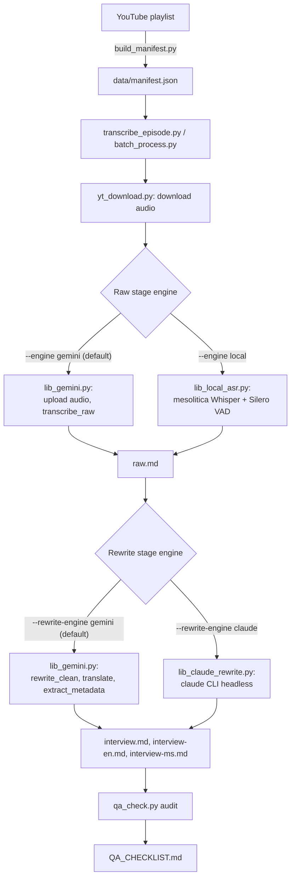

# Architecture

How an episode goes from a YouTube URL to four transcript files: the models and tools
in the stack, how to set it up and run it, and how the output gets verified.

This file describes the stack **as it currently stands**. Every failure I hit while
building it is in [ENGINEERING_LOG.md](ENGINEERING_LOG.md),
numbered `1.x` for the transcription stage and `2.x` for the rewrite stage. References
below of the form "1.17" point there.

## Pipeline



Each episode goes through two independent stages, and each stage can run on either
of two engines:

| Stage | Default engine | Fallback engine | Flag |
|---|---|---|---|
| Raw transcription | Gemini (audio in, transcript out) | Local ASR (`mesolitica/malaysian-whisper-medium-v2`) | `--engine local` |
| Rewrite, translate, metadata | Gemini (chunked text calls) | Claude CLI (`claude -p`, headless) | `--rewrite-engine claude` |

The two stages are split on purpose: a failure partway through the slow,
audio-dependent raw stage never loses work from the (comparatively fast) rewrite
stage, and the two stages turned out to need different fallbacks for different
reasons (see below).

## The stack

| Job | Tool | Why this one |
|---|---|---|
| Playlist and metadata | `yt-dlp` via `build_manifest.py` | Also the source of every episode description, which settles guest names (1.20) |
| Audio download | `yt-dlp` + `bgutil` PO-token server + Node | The only client/format combination YouTube still serves (see setup) |
| Raw transcription (default) | Gemini `gemini-3.7-flash` | Transcribes and diarizes in one pass; handles a 3.5hr episode inside the 65k output limit (1.4) |
| Raw transcription (fallback) | `mesolitica/malaysian-whisper-medium-v2` + Silero VAD | Malay-specific; runs offline when Gemini is unavailable or billing-blocked (1.2, 1.15) |
| Speaker labels, fallback path | `pyannote.audio` 3.1 + forced alignment | Local ASR has no diarization of its own. Unreliable on some episodes -- see Known limitations |
| Rewrite / translate / metadata (default) | Gemini, chunked text calls | |
| Rewrite / translate / metadata (fallback) | `claude` CLI, headless (`claude -p`) | Uses an existing Claude Code seat rather than an API key (2.1) |
| Ground truth for verification | YouTube auto-captions (`audio/<video_id>.ms.vtt`) | Free, already downloaded, and they cover the full runtime (1.11) |
| Second, independent recording | `@mediarakyat` re-uploads of the same episodes | Their captions are generated separately, so a finding can be confirmed without reusing the same caption run. They also supplied captions for two episodes that had none. They do not cover ep03-14 (1.16) |
| Timing sanity | `check_timestamp_drift.py` | Head-phrase match against captions (1.23) |
| Content-loss detection | `check_caption_coverage.py` | 4-gram coverage, starts from the audio (1.25) |
| Everything else | `qa_check.py` into `QA_CHECKLIST.md` | Runs every known failure signature; verdicts persist in `data/qa_reviewed.json` (1.21) |

Hardware: one RTX 2070 (8GB). A second GTX 970 in the same machine is too old for the
CUDA builds used here, so always set `CUDA_VISIBLE_DEVICES=0` (1.3).

## One-time setup

Requires Python 3, Node.js, ffmpeg, and a `GEMINI_API_KEY`. The local ASR fallback
additionally needs `HF_TOKEN` for pyannote.

YouTube blocks most `yt-dlp` client/format combinations behind PO tokens, SABR-only
streaming, or DRM. The working combination is the `web_embedded` client, a locally-run
PO-token server, and Node.js for JS challenge solving.

```bash
pip install -r requirements.txt

# Build the PO token server once
git clone https://github.com/Brainicism/bgutil-ytdlp-pot-provider ~/bgutil-ytdlp-pot-provider
cd ~/bgutil-ytdlp-pot-provider/server && npm ci && npx tsc

# ffmpeg is required to remux yt-dlp's raw DASH audio fragments into a valid
# container; without it, Gemini's Files API rejects the upload outright.
winget install Gyan.FFmpeg
```

`scripts/yt_download.py` starts the PO token server automatically if it isn't already
running, and passes `--ffmpeg-location` explicitly (falling back to the winget install
path if `ffmpeg` isn't on `PATH`).

Uploads must force the mime type to `audio/mp4`: the SDK auto-detects `.m4a` as
`video/m4a`, which Gemini's backend silently fails to process (no video track).
`scripts/lib_gemini.py`'s `upload_audio()` handles this.

**Environment variables on Windows.** `HF_TOKEN`, `SPEECHMATICS_API_KEY` and
`GEMINI_API_KEY` are persisted at User scope, but a fresh shell doesn't always
inherit them, and re-persisting appears to work then fails again next session. Read
them from the user environment inside the script, or set them per-run:

```powershell
$env:HF_TOKEN = [Environment]::GetEnvironmentVariable('HF_TOKEN','User')
```

## Running

```bash
# Refresh the episode manifest from the playlist (only episodes >= 1 hour)
python scripts/build_manifest.py

# Process one episode, or everything not yet done (oldest first)
python scripts/transcribe_episode.py <video_id>
python scripts/batch_process.py

# Same, but with either stage on its fallback engine
python scripts/batch_process.py --engine local
python scripts/batch_process.py --rewrite-engine claude

# Audit every episode for known failure signatures, writes QA_CHECKLIST.md
python scripts/qa_check.py
```

### Repair tools

For an episode that's missing content or badly mistimed. **Run the alignment first.**
Establish ground truth before you cut any audio. That is the lesson of 1.18 and 1.24,
and I wasted two transcription runs learning it.

```bash
# Where does each block's text ACTUALLY occur in the audio?
python scripts/align_blocks.py ep48
python scripts/block_origin_map.py ep48

# Replace only the damaged middle, keeping the verified head and tail verbatim
python scripts/splice_gap.py ep48 --clip-start 8500 --keep-until 8960 --gap-from 8960 --gap-to 11071 --tail-from 8966

# Speaker labels that appear in interview*.md but never in raw.md
python scripts/label_drift_audit.py
```

The full restoration recipe, including how speakers in newly-transcribed stretches get
named from the episode's existing verified labels, is 1.26.

## Cross-checks: what catches what

No single check is sufficient. Each one misses something another catches. The history
behind this table is 1.11, 1.14, 1.17, 1.23 and 1.25.

| Check | Catches | Blind to |
|---|---|---|
| `coverage` | A transcript ending well before the episode does | Loss backfilled by duplicate or displaced blocks, which leaves the timeline looking full |
| `content-loss` | Gaps between timestamps too large for the text at their start | The same backfill, plus loss papered over with `[silence]` markers (1.25) |
| `caption-coverage` | Audio whose speech has no counterpart anywhere in the transcript | Episodes whose wording diverges from the captions throughout, which report `inconclusive` rather than clean |
| `drift` | Blocks timestamped far from where they were actually spoken | Sparse or wrong-language captions. Isolated false phrase-locks still need adjudicating by hand |
| `duplicates` | The same block re-emitted at another timestamp | Near-duplicates differing by a word |
| `backward-jump` | Timestamps that decrease | Forward-only corruption |
| `round-timestamps` | Timing invented rather than measured, i.e. a fabricated outline (1.18) | A fabrication that copies plausible timings |
| `wall-of-text` | Turns merged into one undifferentiated block | Genuine long monologues, excluded on purpose by counting inline speaker markers |
| `truncated` | A rewrite disproportionately short against its raw transcript | Condensation that stays above the ratio |
| `language` | A mixed-language transcript silently rewritten to English only | |

`caption-coverage` runs in the opposite direction from the others. **It starts from the
audio and asks what the transcript is missing.** Every other check reads the transcript
and asks what looks odd there. Duplicated blocks, displaced blocks and `[silence]`
markers all fill the timeline, and none of them can fake a 4-gram match, which is how
this check caught ep48 (1.25).

Verdicts live in `data/qa_reviewed.json`, keyed by episode and signature name, so a
reviewed issue stays reviewed instead of being re-investigated every session (1.21).
**A wrong entry there does more harm than no entry at all.** It turns an open question
into a settled answer, so nobody checks again. Only suppress an issue on evidence from
outside the file being reviewed.

## Why a clean exit code isn't enough

This pipeline has produced eight distinct bugs that returned exit code 0 with no
visible error, while quietly corrupting or skipping output: a free-tier quota check
that never matched its target string, a transcript-wiping edge case in fragment
trimming, hallucinated runaway timestamps that satisfied a naive coverage check,
missing paragraph breaks that silently bypassed text chunking, an argument-parsing
bug that made a 17-episode batch process zero episodes, a continuation-loop
hallucination that duplicated whole passages under fabricated timestamps that stayed
within a plausible range (1.6), a retry wrapper that validated
nothing but the absence of an exception, letting a placeholder metadata stub through
as a "successful" result (2.1), and the same validate-nothing-but-the-
exception gap letting Claude silently condense a heavily disfluent chunk instead of
fully rewriting it (2.2). None of them raised an exception.

That's why `scripts/qa_check.py` exists. Run it after every batch, and read
`QA_CHECKLIST.md` rather than the exit code. It checks for all of
the failure signatures found so far: timestamp coverage against episode duration,
wall-of-text blocks with no paragraph breaks, duplicate blocks repeated at different
timestamps, rewrite files disproportionately short against their raw transcript,
leaked model reasoning in place of transcript content, inconsistent turn
formatting, timestamps that drop backward (1.16), content dropped from the middle
of an episode (1.17), and timing invented rather than measured (1.18). It also
cross-references `data/manifest.json` against the `episodes/` folder to flag
episodes that were never processed at all.

The checklist is only ever as good as the checks in it. I reported the corpus as 53/67
clean until I added 1.17 and 1.18, and then two of those "clean" episodes turned out to
be missing 41% and 80% of their content. Treat a clean row as "no *known* signature
fired", and not as verified.

Every output file's frontmatter also records which model actually produced it
(`model:`), and `qa_check.py` flags any file made by one of the fallback chain's
weakest, most degradation-prone models (`gemini-3.1-flash-lite` and the `gemini-2.5`
line) for a closer look, even when the other checks pass. This field is only
populated for episodes (re)processed after it was added: older episodes show no
model line in `QA_CHECKLIST.md` until reprocessed.

## Speaker naming convention

The 4 recurring cast members use short (first) names in `raw.md` -- `Rafizi`,
`Haziq`, `Farhan (Pa'an)`, `Iqbal` -- and their full names in all three
`interview*.md` rewrites (`Rafizi Ramli`, `Haziq`, `Farhan (Pa'an)`, `Iqbal`;
"Haziq" and "Iqbal" don't have a longer form in use anywhere in the corpus).
**I got this wrong once, and corrected it on 2026-08-26.** An earlier version of this
note claimed the short form applied "everywhere... including interview*.md", based on a
2026-08-24 archive-wide rename. That's not what the archive actually contains: as of
this date, 34 of the corpus's `interview.md` files use the full `Rafizi
Ramli:` label, and only a handful (all reprocessed after the redo-wipe bug
below) use the short form. Treat `raw.md` = short name, `interview*.md` =
full name as the real convention going forward; don't re-run a blanket
short-name substitution against `interview*.md` based on this doc's earlier
wording. Every other speaker (guests, one-off panelists) keeps their full
name in both.

**Local-ASR redo silently wipes previously-applied speaker names, confirmed
recurring, 2026-08-26:** any episode reprocessed via `--engine local` for an
unrelated reason (corruption fix, drift fix, filler-loop fix) gets a
completely fresh pyannote diarization pass with no memory of prior manual
naming -- it always emits new anonymous "Speaker N" labels, silently
reverting any naming work already done on that episode. First confirmed on
ep25 (a manual naming commit followed one day later by a "redo via local
ASR" commit that reset it back to generic labels), then found to affect the
majority of a 39-episode backlog re-identified this session, none of which
`qa_check.py` flags, since generic labels aren't a defect it checks for. No
permanent fix implemented: before assuming an episode's generic labels mean
it was never reviewed, check `git log -- <path>/raw.md` for a naming commit
followed by a later local-ASR-redo commit, and budget for redoing the
naming pass as a required last step after any such redo.

**A same-person self-intro quirk that can look like a second speaker,
confirmed on 5+ episodes:** Rafizi occasionally delivers the show's usual
third-person-style opening line himself ("...macam biasa bersama saudara
Rafizi Ramli...") instead of Haziq doing it, then continues straight into
first-person content in the same breath. Read as two different people from
the phrasing alone, this looks exactly like a diarization merge between an
announcer and Rafizi; it isn't. Confirmed via cross-checking who a "Speaker
N" cluster's later, unambiguous content belongs to (personal claims like
being personally sued, or reminiscing about a specific ministerial
portfolio) before concluding a cluster needs splitting. Seen on ep05, ep39,
ep40, ep44, and ep58.

**Two label-vs-real-person mismatches found and fixed before running this rename,
both confirmed by direct audio listening, not guessed from text alone**:
- ep30's raw `"Farhan"` label is a genuine third recurring panelist, not a
  mislabeled Haziq (an earlier session's working theory, based on a since-corrected
  Gemini redo that had wiped a prior manual correction): confirmed by his own
  words in the transcript ("memang like Haziq mentioned just now", explicitly
  distinguishing himself from Haziq) plus consistent panelist-level participation
  across the full 2.5-hour episode, not one-off guest content.
- ep39's raw `"Farhan Iqbal"` label (217 turns) was actually Haziq's voice:
  an isolated per-run Gemini diarization slip specific to this one episode, not
  a pattern affecting the other 10 episodes where `"Farhan Iqbal"` legitimately
  appears. Fixed to `"Haziq Azfar"` (later shortened to `Haziq` by the archive
  rename) before running the rename, so it wasn't caught in the blanket
  substitution. The real `"Iqbal"` in ep39 (85 turns) is a separate, correctly
  labeled recurring guest, confirmed distinct from Haziq by ear.

This confirms the standing risk noted elsewhere in this doc: per-run label
inconsistency in Gemini's diarization is real and episode-specific, not just a
theoretical concern; don't assume a mislabel found in one episode generalizes to
every other episode using the same label, and don't assume a same-named label
found correct in one episode generalizes either. Each case needs its own check.

## Retrying Gemini on a previously-failed episode

Landing on a weak fallback model (e.g. `gemini-3.5-flash`) doesn't always mean the
episode's content triggers `PROHIBITED_CONTENT` on every stronger model: that's
confirmed deterministic for ep13 (see above), but the fallback chain also advances on
plain free-tier quota exhaustion (20 requests/day per model) or a model being
temporarily unavailable, which a standalone single-episode retry (full quota, not
mid-batch) can sidestep entirely. Confirmed on ep53, 2026-08-25: a fresh single-episode
`--engine gemini` retry succeeded (via `gemini-3.6-flash` -> `gemini-3.1-pro-preview` ->
`gemini-3.5-flash` on quota/availability fallbacks, not a content block) and produced a
completely different, much smaller class of error than the original attempt's
~140,000-char repetition-loop degeneration: 14 duplicate blocks from a
continuation-loop hallucination (see `dedupe_raw.py`), not a repetition loop. Worth a
standalone retry before assuming `--engine local` is required, unless the episode has
already shown a *deterministic* content block on retry (ep13's case).

**New duplicate pattern found while fixing ep53's residual duplicates**: after
`dedupe_raw.py` resolved every duplicate group its caption cross-check could confirm,
6 groups remained unresolved (captions didn't cover those phrases). All 6 shared an
exact, systematic pattern: the same content appeared twice with identical MM:SS but a
different hour digit (e.g. `[1:38:29]` and `[2:38:29]`): a continuation-loop
hallucination that re-emitted an already-covered block but mislabeled its hour. Since
one of the 6 pairs was the episode's closing sign-off ("terima kasih... jumpa lagi
minggu depan"), and a sign-off can only be near the true end of a long episode (this
one is 3h0m), narrative logic alone (independent of captions) confirmed the later
timestamp (`2:xx:xx`) was correct in every pair and the earlier one (`1:xx:xx`) was the
fabricated duplicate: the opposite of a naive "keep the first occurrence" heuristic,
which would have been wrong here. Worth checking for this exact hour-shifted pattern
before falling back to manual case-by-case judgment on caption-unresolved duplicates.

**A hand-rolled fix caused its own bug here, worth remembering**: repairing those 6
duplicates via a one-off script that split the body on `"\n\n"` and rejoined the kept
blocks with a single `"\n"` silently collapsed every paragraph break in the whole file
into one undifferentiated block, caught immediately by `qa_check.py`'s wall-of-text
check, not silently shipped, but a reminder that block-splitting logic needs the exact
same separator on the way back out as the way in.

## Known limitations

- **Fixed, 2026-08-24**: episodes transcribed via `--engine local` previously had
  no speaker diarization at all: `raw.md` was one undifferentiated stream of
  text, and the rewrite stage had to infer who's speaking purely from context.
  **Confirmed as a real, not just theoretical, problem** before the fix: a
  Gemini audio spot-check on one episode's opening exchange found the
  model-inferred rewrite had folded a real Rafizi Ramli line into a generic
  "Podcast Host" turn: an actual misattributed quote. A cheaper alternative,
  asking Gemini for just a chronological speaker-change list (not a full
  transcript) to merge onto existing local-ASR text, was tried and
  abandoned: this show's speakers change every few seconds, so a speaker-only
  pass needs roughly as many continuation rounds as a full transcript would,
  with no real quota saving.

  **The actual fix**: `scripts/lib_diarization.py`, a pyannote.audio pipeline
  run as a separate acoustic pass on the same audio local ASR already
  transcribes: pure voice-embedding clustering, no LLM involved at all, so
  it's immune to every content-based failure mode found elsewhere in this doc
  (PROHIBITED_CONTENT blocks, fallback-model degradation, and the per-run
  label inconsistency confirmed directly on ep13/ep39, where the same real
  speaker got a different invented name in different Gemini attempts). Output
  is anonymous "Speaker N" labels (numbered by first appearance, consistent
  within an episode since they're real voice clusters). It still needs a
  manual naming pass afterward, same as Gemini's own generic labels do, just
  without the added risk of the label itself drifting between attempts.

  **Chunk-level labeling was itself a real bug, fixed 2026-08-24**: originally
  each up-to-28-second VAD chunk from `lib_local_asr.py` was labeled with
  whichever diarized speaker had the most time overlap with the *whole*
  chunk, so a short interjection from a second speaker inside a longer
  chunk was silently swallowed into the dominant speaker's line, with zero
  trace in the output. Confirmed as a real, not just theoretical, problem via
  direct audio listening on ep30: a 25-second span containing two short
  interjections from a third voice ("Farhan") produced only one Rafizi-Ramli
  line, the interjections nowhere in the transcript. Root cause was NOT
  pyannote's clustering (it correctly detects the second voice at the right
  moments); it was throwing away that resolution by labeling per chunk
  instead of per word.

  Considered and rejected: (1) NVIDIA NeMo / the `whisper-diarization`
  GitHub project's full pipeline: its diarization module still doesn't
  handle overlapping speech either (same gap as pyannote), and re-running ASR
  through `faster-whisper` would mean converting the existing
  `mesolitica/malaysian-whisper-medium-v2` checkpoint to CTranslate2 format,
  a bigger lift for no proven gain over what's already working. (2)
  `ctc-forced-aligner` (the PyPI package `whisper-diarization` itself uses for
  precise word timing): needs a native C++ extension that fails to build on
  this Windows/Python 3.14 setup (`error LNK2001: unresolved external symbol
  PyInit_align_ops`), no prebuilt wheel exists for this platform.

  **What shipped instead**: `scripts/lib_forced_align.py`, using torchaudio's
  official MMS forced-aligner (`torchaudio.pipelines.MMS_FA`): pure Python,
  no native extension, already an implicit dependency via pyannote.audio.
  Each VAD chunk is still transcribed once as a whole (preserves ASR
  quality/context), then the transcript is force-aligned word-by-word against
  that chunk's audio, and each word gets its own speaker label via
  `lib_diarization.label_for_range`. Consecutive same-speaker words are
  grouped back into lines. Numbers and punctuation-only tokens (e.g.
  "RM11,000") have no letters in the aligner's label set (a-z plus apostrophe)
  and get their timestamps interpolated from neighboring aligned words.
  **Needs torchaudio's CUDA build installed explicitly**: the default PyPI
  torchaudio wheel is CPU-only, version-mismatched against torch's own CUDA
  build, and only registers a CPU kernel for the `forced_align` op: moving
  the model to CUDA against that wheel fails outright, not just slower.
  Fixed via `pip install torchaudio==<ver>+cu130 --index-url
  https://download.pytorch.org/whl/cu130` (matching torch's own cu130 build).
  Confirmed on the ep13 redo: ~21s/chunk on the wrong (CPU) wheel vs.
  ~4.5s/chunk after installing the matching CUDA build, a real difference at
  full-episode scale (339 chunks), even though it's still slower than the
  pre-forced-alignment baseline (~2s/chunk) since alignment is genuine added
  work, just a cheap single feed-forward pass rather than autoregressive
  generation.

  **CTC's own length constraint can crash this outright**: forced alignment
  requires the target token sequence to be no longer than the audio's frame
  count. Violated directly on the ep13 redo when one ASR chunk degenerated
  into a repetition-loop hallucination (~140k chars repeated, producing an
  889-token target against a 114-frame emission): `RuntimeError: targets
  length is too long for CTC`, crashing the whole run partway through instead
  of just that one chunk. Fixed in `lib_forced_align.align_words`: on that
  RuntimeError, fall back to one span covering the whole chunk (same as the
  old chunk-level behavior) so the pathological chunk's garbage text still
  comes through and `qa_check.py`'s existing repetition-loop detector can
  flag it exactly as before, instead of the whole redo dying.

  **Residual limitation, not fully solved**: word-level attribution fixed the
  *invisibility* problem (a second speaker's words now reliably show up
  labeled differently), but pyannote's own turn-boundary placement is still
  off by a few hundred milliseconds on split-second interjections, so a word
  or two right at a speaker-change boundary can still land on the wrong
  label. This is close to the practical limit for any turn-based acoustic
  diarizer on genuinely fast back-and-forth speech, not something a
  different tool would cleanly fix, confirmed by testing both the old
  chunk-level and new word-level approaches side by side on the same ep30
  clip. Worth re-checking by ear on episodes with heavy rapid-fire banter,
  same as any diarization output. **Validated as a real net improvement, not
  just a synthetic-test win**: on ep13's full redo, a passage the old
  chunk-level approach had flattened entirely into one continuous "Rafizi
  Ramli" block turned out, on the repo owner's direct audio confirmation, to
  be genuine fast back-and-forth between Rafizi and Haziq, exactly the class
  of previously-invisible content this fix targets.

  Also fixed in the same pass, discovered while testing this:
  - The local ASR call didn't pin `language`/`task` in `generate_kwargs`, so
    this multilingual Whisper checkpoint's auto-detection occasionally
    misfired on short/atypical chunks and silently produced an English
    translation instead of a Malay transcription (confirmed directly on the
    same ep30 test clip). Now pinned to `language="ms", task="transcribe"`.
  - VAD chunking splits audio every ~28s regardless of speaker continuity, so
    one uninterrupted speaker turn spanning multiple chunks used to produce
    several separate output lines with no new information in the extra
    timestamps (confirmed on ep13: 442 lines collapsed to 131 after fixing
    this). `transcribe_raw_local` now merges consecutive same-speaker lines
    across chunk boundaries before writing `raw.md`.

  **ep13 naming pass done, 2026-08-24, redone after the above fixes**: sample
  clips extracted per speaker and confirmed by the repo owner by ear
  (`Speaker 1` = Rafizi Ramli; `Speaker 2` = Haziq Azfar) before applying the
  labels to
  `raw.md` and the three `interview*.md` rewrites: confirm-before-applying
  this way avoids guessing from turn count or content alone.

  Requires a Hugging Face token with access to 3 gated repos (accept terms
  for all three, or the pipeline 403s partway through loading):
  `pyannote/segmentation-3.0`, `pyannote/speaker-diarization-3.1`, and
  `pyannote/speaker-diarization-community-1` (a transitive dependency not
  listed on the model card). **Gated-access propagation lag confirmed
  directly**: the HuggingFace web UI and the `model_info()` API both reported
  access as granted well before the actual file-download (resolve) endpoint
  stopped 403ing; don't trust either of those as proof the pipeline will
  actually load; the only real test is trying the download.
- Local ASR proper-noun accuracy (names, unusual spellings) isn't verified against
  any reference dictionary yet: a manual correction pass is planned, guided by the
  repo owner rather than guessed at automatically. Candidate tooling for that pass:
  the `malaya` Python library's `dictionary.keyword_dbp()` and `dictionary.is_malay()`,
  which check a word against Dewan Bahasa dan Pustaka's PRPM reference (scraped, not a
  documented API, fine for occasional lookups during a correction pass, not for
  validating every word of every transcript at scale).
- Crosstalk-driven entity errors are possible in any Whisper-family transcription,
  local or cloud.
- Gemini's free-tier quota is unreliable for raw transcription on episodes longer
  than roughly an hour in a single call: use `--engine local` for those.
