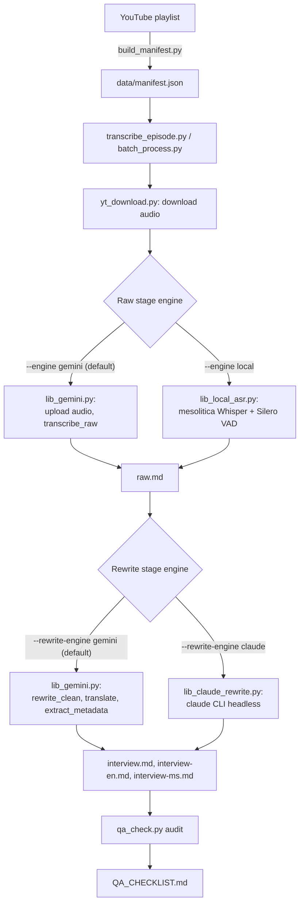

# Architecture

How an episode goes from a YouTube URL to four transcript files, which models were
tried along the way, and why the pipeline ended up with two fallback paths instead of
one straight line.

## Pipeline

Each episode goes through two independent stages, and each stage can run on either
of two engines:

| Stage | Default engine | Fallback engine | Flag |
|---|---|---|---|
| Raw transcription | Gemini (audio in, transcript out) | Local ASR (`mesolitica/malaysian-whisper-medium-v2`) | `--engine local` |
| Rewrite, translate, metadata | Gemini (chunked text calls) | Claude CLI (`claude -p`, headless) | `--rewrite-engine claude` |

The two stages are split on purpose: a failure partway through the slow,
audio-dependent raw stage never loses work from the (comparatively fast) rewrite
stage, and the two stages turned out to need different fallbacks for different
reasons (see below).

## Model evaluation history

### Raw transcription: which local ASR model

Five candidates were tested directly against real episode audio (a 13-minute clip,
plus two full episodes -- a plain interview and a heavy-crosstalk debate format):

| Model | Result |
|---|---|
| `mesolitica/malaysian-whisper-medium-v2` | **Selected.** No repetition-loop hallucinations on any test case. |
| `mesolitica/malaysian-distil-whisper-large-v3` | Repetition-loop hallucinations |
| `mesolitica/malaysian-whisper-small-v3` | Repetition-loop hallucinations |
| `openai/whisper-large-v3` (non-fine-tuned) | Repetition-loop hallucinations, plus entity errors at crosstalk moments (for example, hearing "Ampang" as "abang") |
| A malaysia-ai custom VQ/turbo model | Repetition-loop hallucinations |

The crosstalk entity errors showed up even on the flagship, non-fine-tuned
`whisper-large-v3` model, not just the smaller fine-tuned ones. That points to a
generic Whisper-family weakness at overlapping speech, not something specific to one
model or to Malay/English code-switching.

Local ASR's known limitation: no speaker diarization. Episodes transcribed this way
have `[MM:SS] text` turns with no speaker label, documented in each file's
frontmatter `note` field.

### Raw transcription: the Gemini model chain

`lib_gemini.py` tries models in order and advances to the next one when the current
model's free-tier daily quota (20 requests/day per model) is exhausted:

`gemini-3.6-flash` → `gemini-3.5-flash` → `gemini-3-flash-preview` → `gemini-3.1-flash-lite`

`gemini-3.7-flash` is deliberately excluded from the chain. It repeatedly returned
sustained `503 UNAVAILABLE` (high demand) since its launch -- a Google-side capacity
problem, not a quota problem, so falling back to it on a quota error would just waste
an attempt.

This chain handles *daily request-count* exhaustion well. It doesn't help with a
different quota dimension: *input tokens per minute*. A single raw-transcription call
sends an episode's entire audio as one context, and for a 2+ hour episode that's
enough volume to burn through the free tier's 250,000-input-tokens-per-minute-per-model
limit across all four chained models within a couple of retries -- leaving no further
fallback to advance to. That's the actual reason `--engine local` exists for the raw
stage: not a transcription-quality problem, a quota-shape problem specific to
long-form audio in a single call.

### Rewrite, translate, and metadata: choosing a fallback provider

The rewrite stage originally only used Gemini. When Gemini's account-level billing
was blocked (prepayment credits exhausted -- confirmed across multiple
independently-issued keys, tying the block to the underlying Cloud Billing account
rather than any one key or project), a fallback provider was needed here too.

- **Model:** `claude-sonnet-5`, chosen over `claude-opus-5` for cost (this stage runs
  four calls per episode -- one rewrite plus two translations plus metadata
  extraction -- across dozens of hour-plus episodes) and over `claude-haiku-4-5` to
  avoid losing nuance on mixed-language political content.
- **First implementation** called the Anthropic Messages API directly through the
  `anthropic` Python SDK. It turned out no standalone Anthropic API key was available
  for this project -- it runs under an enterprise Claude Code seat scoped to the
  Claude Code product, not a general-purpose API credit.
- **Rewritten** to shell out to the `claude` CLI in headless mode (`claude -p`)
  instead, which reuses that same enterprise login with no separate credential
  needed.
- **A real cost issue** surfaced during that rewrite. Without an explicit
  `--system-prompt` override and a full `--disallowedTools` list, each one-off CLI
  call reloaded Claude Code's entire default system prompt and tool schemas fresh --
  about 21,000 cache-creation tokens and $0.08 per call, even on a trivial request.
  Overriding both cut that to about 500 tokens and $0.0016 per call, roughly a 48x
  reduction with no effect on output quality for these pure text-generation calls.

## Why a clean exit code isn't enough

This pipeline has produced five distinct bugs that returned exit code 0 with no
visible error, while quietly corrupting or skipping output: a free-tier quota check
that never matched its target string, a transcript-wiping edge case in fragment
trimming, hallucinated runaway timestamps that satisfied a naive coverage check,
missing paragraph breaks that silently bypassed text chunking, and an argument-parsing
bug that made a 17-episode batch process zero episodes. None of them raised an
exception.

That's why `scripts/qa_check.py` exists, and why it's worth running (and reading
`QA_CHECKLIST.md`, not just the exit code) after every batch. It checks for all of
the failure signatures found so far: timestamp coverage against episode duration,
wall-of-text blocks with no paragraph breaks, rewrite files disproportionately short
against their raw transcript, leaked model reasoning in place of transcript content,
and inconsistent turn formatting. It also cross-references `data/manifest.json`
against the `episodes/` folder to flag episodes that were never processed at all.

## Known limitations

- Episodes transcribed via `--engine local` have no speaker diarization.
- Local ASR proper-noun accuracy (names, unusual spellings) isn't verified against
  any reference dictionary yet -- a manual correction pass is planned.
- Crosstalk-driven entity errors are possible in any Whisper-family transcription,
  local or cloud.
- Gemini's free-tier quota is unreliable for raw transcription on episodes longer
  than roughly an hour in a single call -- use `--engine local` for those.
