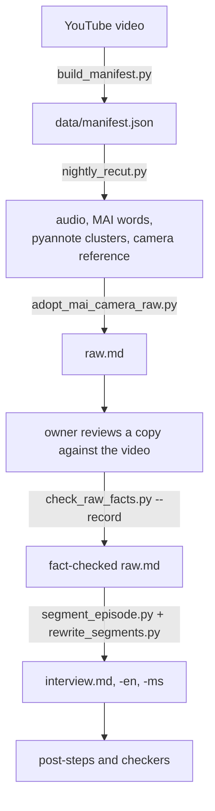

# Architecture

How an episode goes from a YouTube video to four transcript files, as the pipeline stands
now. [ENGINEERING_LOG.md](ENGINEERING_LOG.md) holds every failure found on the way and how
it was fixed; a reference such as "1.17" points there.

## Pipeline


```mermaid
flowchart TD
    A[YouTube video] -->|build_manifest.py| B[data/manifest.json]
    B -->|nightly_recut.py| C["audio, MAI words,<br/>pyannote clusters, camera reference"]
    C -->|adopt_mai_camera_raw.py| D[raw.md]
    D --> E[owner reviews a copy against the video]
    E -->|check_raw_facts.py --record| F[fact-checked raw.md]
    F -->|segment_episode.py + rewrite_segments.py| G[interview.md, -en, -ms]
    G --> H[post-steps and checkers]
```

1. **Words.** Microsoft's MAI-Transcribe-2 transcribes the audio in 30-minute chunks.
   It scores 3.39% word error on Malaysian podcast audio, the best measured
   ([MODEL_LANDSCAPE.md](MODEL_LANDSCAPE.md)).
2. **Speakers.** The show's camera cuts to whoever is talking. `camera_speakers.py` reads
   the video: LR-ASD checks that a visible mouth matches the audio, and YuNet with SFace
   say whose face it is. Where the camera cannot see, pyannote voice clusters and then the
   episode's own voices (`voice_witness.py`) fill in. A turn no evidence can name is
   `Speaker ?`.
3. **raw.md.** `adopt_mai_camera_raw.py` joins MAI's words to those labels and runs the
   whole cleaning standard in a fixed order (see [Adoption](#adoption)).
4. **Owner review.** The owner gets a separate copy of raw.md and corrects it while
   watching the video. The diff against the pipeline's copy measures the pipeline.
5. **Fact check.** `check_raw_facts.py` must pass on the reviewed raw.md before any
   interview file is written.
6. **Interview files.** raw.md is cut at the show's own chapter marks, and each segment is
   rewritten, measured and retried alone (see [Rewrite](#rewrite)).
7. **Checks.** The post-steps and checkers run, and the commit hook refuses a commit until
   their verdicts are read.

## The stack

| Job | Tool |
|---|---|
| Episode list and descriptions | `yt-dlp` via `build_manifest.py` |
| Audio and video download | `yt-dlp`, `web_embedded` client, `bgutil` PO-token server, Node.js |
| Words | MAI-Transcribe-2 on Azure (`transcribe_mai.py`) for the 75 episodes built so far; new episodes use local `openai/whisper-large-v3-turbo` (`local_asr_words.py`), written into `data/_mai_<vid>/` with an `engine.json` that `mai_camera_raw.py` reads for raw.md's `model:` |
| Speakers | camera (`camera_speakers.py`), pyannote 3.x clusters, `voice_witness.py` |
| Unknown guest faces | `guest_gallery.py`, `identify_person.py` with public photos |
| Rewrite and translation | GLM-5.3 on NVIDIA's free API, reasoning low (`rewrite_segments.py`) |
| Claim check on rewrites | Jev (`jev_claim_check.py`), a flag for a person, never a verdict |
| Timing and coverage reference | the episode's YouTube captions, `audio/<video_id>.ms.vtt` |

Hardware: one RTX 2070 (8 GB). The machine's second GPU, a GTX 970, is too old for these
CUDA builds, so every GPU script sets `CUDA_VISIBLE_DEVICES=0`. Only one GPU job runs at a
time: `nightly_recut.claim_the_gpu()` holds `data/_nightly/chain.pid`.

## Setup

Requires Python 3, Node.js and ffmpeg (`winget install Gyan.FFmpeg`). Environment
variables, at Windows User scope: `AZURE_SPEECH_KEY`, `AZURE_SPEECH_ENDPOINT`,
`NVIDIA_API_KEY`, `HF_TOKEN` (pyannote), `GEMINI_API_KEY` and `OPENROUTER_API_KEY`
(fallbacks), `TYPESAFE_API_KEY` (Jev). A fresh shell does not always inherit them:

```powershell
$env:HF_TOKEN = [Environment]::GetEnvironmentVariable('HF_TOKEN','User')
```

The Azure endpoint is `https://<resource>.cognitiveservices.azure.com`, not the
`services.ai.azure.com` host the portal's Foundry tab shows. The HF token needs accepted
terms on `pyannote/segmentation-3.0`, `pyannote/speaker-diarization-3.1` and
`pyannote/speaker-diarization-community-1`.

`requirements.txt` is not tracked (owner's decision 2026-09-18). Recreate it:

```
yt-dlp
yt-dlp-ejs
bgutil-ytdlp-pot-provider
google-genai
pyyaml
requests
torch
torchaudio          # install the CUDA build matching torch, not the PyPI default
transformers
soundfile
silero-vad
numpy
scipy
pyannote.audio
opencv-python       # YuNet and SFace ship inside OpenCV
scikit-learn
rapidfuzz
pyarrow
speechbrain
pyannoteai          # optional, hosted diarization
```

```bash
pip install -r requirements.txt
git clone https://github.com/Brainicism/bgutil-ytdlp-pot-provider ~/bgutil-ytdlp-pot-provider
cd ~/bgutil-ytdlp-pot-provider/server && npm ci && npx tsc
```

`yt_download.py` starts the PO-token server itself and retries once after 15 s, because a
cold server answers before it can issue a token.

## Running a new episode

```bash
python scripts/build_manifest.py --id=<video_id>      # a new episode is often not yet in the playlist
python scripts/transcribe_episode.py <video_id> --stage raw --engine local   # starting raw.md
python scripts/nightly_recut.py <tag> --hours 9       # audio, local Whisper-large-v3-turbo (owner, 2026-10-04), pyannote, camera; writes nothing to episodes/
python scripts/check_camera_reference.py <tag>        # refuses a reference blind to a real speaker
python scripts/adopt_mai_camera_raw.py <tag>          # dry run: build, gate, report
python scripts/adopt_mai_camera_raw.py <tag> --write
```

Then hand the owner a copy of raw.md to review against the video, and wait. After their
edit:

```bash
python scripts/compare_owner_edit.py <tag> <pipeline copy> <owner copy>   # score the pipeline
python scripts/install_owner_edit.py <tag> <owner copy> --write                  # stamp and install it as raw.md
python scripts/merge_same_speaker.py --episode=<tag> --raw-only --write
```

Then:

```bash
python scripts/check_raw_facts.py <tag>               # web-verify every name it lists
python scripts/check_raw_facts.py <tag> --record
python scripts/segment_episode.py <tag> --out data/_<tag>_segments.json
python scripts/rewrite_segments.py <tag> --condense --workdir data/_<tag>_final
python scripts/rewrite_segments.py <tag> --condense --workdir data/_<tag>_final --write
```

A Siri Forum BERSAMA episode (`epNN:forum`) differs in four places:

1. Add its video id to `common.FORUM_BERSAMA_VIDEO_IDS` and its cast to
   `rewrite_segments.FORUM_CAST`, both from the cover card.
2. Build a face gallery for the video from the cover card (`camera_speakers.py census`,
   `cluster`, `gallery`), then re-run `reference`. The shared gallery knows only podcast faces.
3. Pass `adopt_mai_camera_raw.py --current <local raw>`, and keep only the formal forum in
   raw.md, from the moderator's opening to the closing thanks.
4. Rewrite with `rewrite_segments.py <tag> --forum --stage mixed`. `--write` makes one
   `transcript.md`: Hansard-style, full length, mixed language.

Episode tags are ambiguous: both podcast eras have an ep01 to ep06, and the forum has an
ep01 and ep02. Write `ep01:forum`, `ep03:bakar` or
`ep03:berhenti`; `common.resolve_tag` refuses a bare tag that matches two.

## Adoption

`adopt_mai_camera_raw.py` runs these in order, prints every number, and stops if any step
refuses:

1. Build from MAI's words and the camera's labels (`mai_camera_raw.py`).
2. Gate: every recorded owner decision must survive (`check_owner_decisions.py`).
3. Drop turns that are only a vocalisation, then filler sounds inside sentences. `ha`,
   `eh`, `aa` and `oh` stay, because they carry meaning in Malay.
4. Fold a fragment the camera cannot see into the speaker around it.
5. Move a half-sentence to the speaker who finishes it (`move_hanging_words.py`).
6. Join adjacent blocks of the same speaker (`merge_same_speaker.py`), then the voice
   witness, then move and join again, because each join creates new neighbours.
7. Drop contentless backchannels inside another speaker's run
   (`drop_orphan_backchannels.py`, closed word list).
8. Apply the reviewed name maps (`fix_proper_nouns.py`, `fix_yb_honorific.py`) and restore
   any word the owner dictated (`check_owner_text.py`).

Owner rulings live in `data/speaker_adjudications.json` and `data/forced_labels.json`, and
the rebuild applies them last. The owner outranks the camera.

## Rewrite

`rewrite_segments.py` rewrites one segment at a time and keeps a segment only if it passes
every gate: length against the input, Malay word density (the English stage must lose it,
the Malay stage keep it), every figure present, the same speakers, and no timestamps or
headings. A passing segment is cached, so a re-run retries only the failures. `--write`
refuses until every segment of all three stages is accepted, then applies
`clean_interview.py`: newspaper copy, no grunts, one paragraph per speaker turn.

- `--condense` is the shipping mode since 2026-09-27: about half the spoken length.
- It refuses the mixed stage unless `data/raw_fact_checks.json` holds raw.md's current
  sha256.
- `--accept-figures N` (or `N:T` for try T) accepts a segment whose only failure is a
  missing figure, after a person reads the figure context: a self-correction, a false
  start, or a number written as a word.
- `names_dropped` is printed, not gated. Read it.

## After every rewrite

```bash
python scripts/rebuild_roster.py --write              # hosts and guests
python scripts/normalize_speaker_labels.py --write    # short-name labels
python scripts/build_episode_index.py                 # episode tables in both READMEs
python scripts/build_topic_index.py                   # TOPICS.md
python scripts/qa_check.py                            # then read QA_CHECKLIST.md
```

The metadata stage rewrites `hosts` and `guests` from scratch, so skipping these undoes work.

## Checks

A clean exit code proves nothing: eight bugs in this pipeline returned 0 while corrupting
output. Read each checker's report.

| Checker | Catches |
|---|---|
| `qa_check.py` | Every known failure signature, per episode, into `QA_CHECKLIST.md` |
| `check_raw_facts.py` | A YB garble, an unapplied name correction, any name or acronym not in the rosters |
| `check_names.py` | A person name in a published file that raw.md cannot source |
| `check_agencies.py` | An agency name that nearly matches `data/agency_roster.json`, or one raw.md cannot source |
| `check_slurs.py` | An insult in a published file that raw.md does not hold |
| `check_figures.py` | A published figure with no counterpart in raw.md |
| `check_published.py` | Placeholder labels and other defects in the files a reader sees |
| `check_cast.py` | A speaker in raw.md missing from `hosts` or `guests` |
| `check_overlap_boundaries.py` | A sentence torn across two speakers |
| `check_owner_decisions.py`, `check_owner_text.py` | An owner ruling a rebuild reverted |
| `check_stale_docs.py` | A document count that no longer matches the corpus |
| `guard_commit.py` (pre-commit hook) | A commit made while a queue is writing or a verdict is unread |

A clean `qa_check.py` row means no known signature fired. It does not mean the episode is
verified. Verdicts judged harmless persist in `data/qa_reviewed.json`; add one only on
evidence from outside the file under review.

## Speaker naming convention

The recurring cast have short labels in every file: `Rafizi`, `Haziq`, `Farhan (Pa'an)`,
`Iqbal`, `Wan Afiq`. Everyone else has their full name. The `hosts` and `guests` fields
carry the fullest form of each name.

`hosts` records who took part, not who got a label. A cast member counts as present on
dialogue evidence: being addressed directly, or someone referring to what they said earlier
in that episode. Those calls live in `PRESENT_UNLABELLED` in `rebuild_roster.py`, each with
its justifying line.

A label uses a person's real name even when the show uses a nickname: ep36's `Cincong` is
labelled `Lee Chean Chung`. The spoken words are never changed to match.

## Known limits

- **MAI.** Diarization fails above about 30 minutes, and on a busy gateway it does not fit
  the 120 s timeout, so the pipeline runs `--no-diarization` in 30-minute chunks. Leading
  digital silence makes a request return HTTP 500, so each chunk starts at its first sound.
  The bias-phrase list caps at 50 items.
- **The camera cannot see an off-frame speaker.** It shows the visible talking face. Short
  replies from someone off frame are why `drop_orphan_backchannels.py` removes contentless
  ones and labels the rest `Speaker ?`.
- **An unenrolled guest.** A face missing from the gallery makes the camera reference
  confidently wrong. `check_camera_reference.py` refuses such a reference, but for an
  already adopted episode it must be run against the pre-adoption raw.md.
- **Lowercase garbles.** `check_raw_facts.py` reads capitalised words only. It missed
  `reset` for Ridsect, `refund` for WeFund and `oi` for YB on ep65.
- **NVIDIA's free API returns HTTP 504 on long segments** (about 300 s). Gemini Flash is the
  fallback for a single segment.
- **The Gemini free tier cannot transcribe a three-hour episode** in one pass; its input
  limit is 250,000 tokens per minute. Use `--engine local` for a starting raw.md.
- **`corpus_status.py` reports every published file as stale.** It expects a `raw_sha:`
  stamp in the interview frontmatter, which no script writes yet.
- **In Git Bash, `kill <pid>` stops the shell job, not the Windows process.** Count Python
  processes with `Get-CimInstance Win32_Process -Filter "Name like 'python%'"`.
